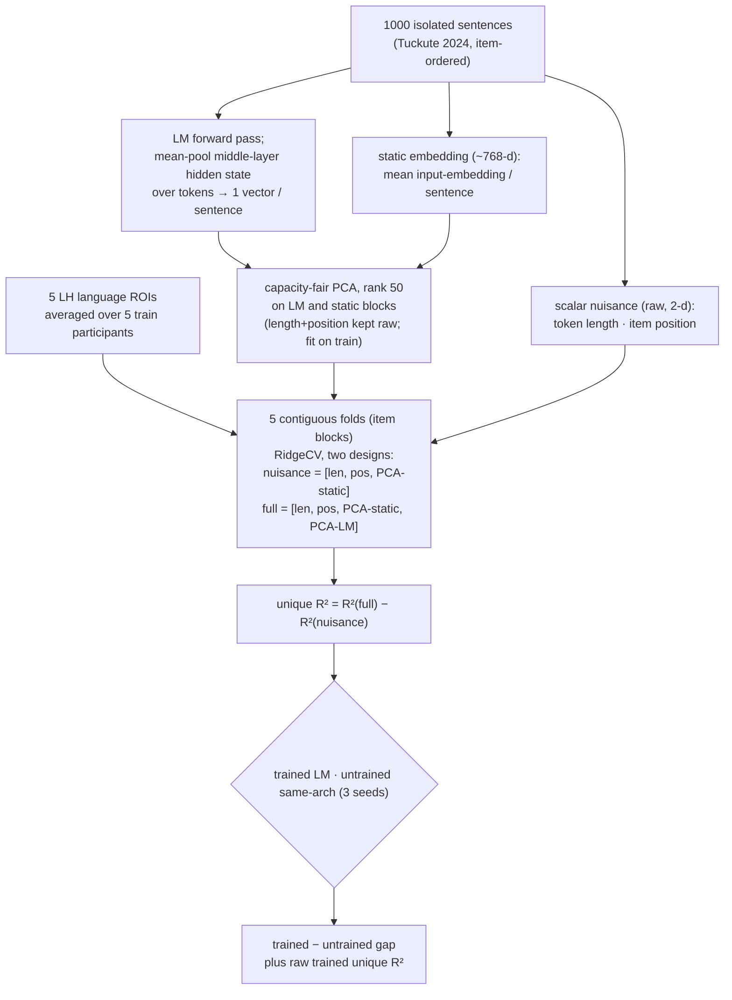

# Experiment — E002 real-data encoding feasibility on Tuckute 2024 (the A2 question)

**Created:** 2026-06-10 · **Status:** done — A2 PASS across 3 models (gpt2, gpt2-medium, Qwen2.5-0.5B)
**Direction:** Q0 measurement prerequisite; current interpretation is in the [canonical thesis manuscript](../manuscript/rewrite/main-rewrite.tex). · **Mode:** working
**Code:** `scripts/run_encoding_feasibility.py`, `scripts/data_adapters.py:load_tuckute`, `scripts/pilot_lib.py`
**Output:** `outputs/E002_tuckute_feasibility.json`
**New to the vocabulary?** Voxel/ROI, encoding model, unique R², noise ceiling, "% of ceiling", what Tuckute is → [`../07-concepts-primer.md`](../07-concepts-primer.md).

---

## Objective

Answer the charter's gating question on **real neural data** for the first time (E001 used synthetic fMRI and *could not* answer it by construction — L004):

> Does an LM's contextual middle-layer representation predict human language-network BOLD **beyond nuisance** (length, position, static embeddings), under the contiguous-split anti-confound protocol — and how large is that *unique* signal relative to an untrained-network control and the noise ceiling?

> [!IMPORTANT]
> **Ceiling correction (2026-07-13).** `NC-allroi-data.csv` stores correlation-scale ceilings. The mean across the five functional target ROIs is $r_{NC}=0.491$ and the corresponding mean variance ceiling is $r_{NC}^2=0.244$. Dividing unique $R^2$ by `0.491` was dimensionally invalid. All ceiling fractions are retired; raw unique $R^2$, trained-minus-untrained gaps, and the E002 verdict are unchanged.

This is **A2** (measured alignment is not primarily nuisance). If it fails, the thesis premise fails and we reframe to measurement rigor (charter kill condition).

## Claim tuple

- **Metric:** unique encoding R² = R²([length, position, PCA(static), PCA(context)]) − R²([length, position, PCA(static)]), contiguous 5-fold CV, capacity-fair PCA (rank 50).
- **Pass:** trained-model unique R² is positive AND materially exceeds the untrained-network control (random init, same architecture, ≥3 seeds). Report raw unique $R^2$; use the correlation ceiling only as descriptive reliability context.
- **Kill:** trained unique R² ≈ 0, or ≈ untrained control → A2 fails.

## Design (locked before running)

- **Data:** Tuckute 2024 (`data/tuckute2024/`), 1000 isolated baseline sentences × 5 LH language ROIs (`lang_LH_{AntTemp,IFG,IFGorb,MFG,PostTemp}`), averaged over the 5 train participants (UIDs 848/853/865/875/876, matching the paper's encoding fit). Rows ordered by `item_id` (deterministic, contiguous-split friendly).
- **Models:** `gpt2` (12L), `gpt2-medium` (24L), `Qwen/Qwen2.5-0.5B` (24L). Layers probed: a spread around the middle (the brain-alignment sweet spot, [Oota 2023](../literature/canonical/oota-2023_joint-linguistic-processing-brain-lms.md)).
- **Nuisance:** length + position (raw 2-D) and the mean **input-embedding** per sentence (static, non-contextual). Static and contextual blocks PCA-reduced to equal rank (50) per fold → capacity-fair partition (the L004 fix).
- **Control:** randomly-initialised model of the same architecture (Feghhi 2024 untrained-network control), ≥3 seeds, to show the signal is about *trained* language processing, not architecture + nuisance.
- **Anti-confound:** contiguous-block CV only (no shuffling); unique variance after nuisance subtraction is the only number claimed (L003).
- **Stop rule:** fixed model/layer grid; no training, no tuning. Pure measurement.

## System architecture (the measurement apparatus, visual + intuitive)

This is the first, simplest form of the apparatus the whole program reuses. It turns an *isolated sentence* and a *language model* into one number: how much the model's middle layer explains about the language network's response that length, position, and static word identity cannot. Because the stimuli are isolated sentences rather than a continuous story, there is no time series to model here — the temporal machinery (Lanczos resampling, FIR delays, held-out reliability) that the voxelwise run (E006) adds is *absent by design*, which is exactly what makes this the lower-bound-friendly screen. The diagram is the data flow; the walkthrough is why each stage exists.



**1. One stimulus, two feature streams.** Each sentence becomes two descriptions. The **LM stream** is the thing under test: the middle-layer hidden state, mean-pooled over the sentence's tokens into one vector. The **nuisance stream** is what we refuse to credit the model for — a 2-dimensional scalar block (token length, item position) kept raw, and the static embedding (the mean *input* embedding per sentence, ≈768-d): a "bag of word vectors with no context." If the contextual representation cannot beat that static bag, the alignment is about lexical identity, not language processing.

**2. No temporal pipeline — and that is the point.** Isolated sentences are scored as independent items, not as a BOLD time course, so there is nothing to resample to a TR grid and no hemodynamic lag to model with FIR delays. Removing the time series removes the temporal-autocorrelation inflation that contaminates naturalistic data, which makes a positive here *harder* to obtain, not easier — the honest direction for a screen. E006 reintroduces naturalistic stimuli and pays for it with the full temporal machinery.

**3. Capacity-fair PCA stops a dimension-count win.** The static-embedding block and the LM block are each reduced to the **same rank (50)**, fit on the training fold only; length and position are small and stay raw. This is the L004 fix: if the contextual features win, they win on content, not by carrying more columns into the regression than the static confound.

**4. The fit happens twice per fold, and the difference is the honest number.** Cross-validation uses **5 contiguous item blocks** — never shuffled, because shuffling would put near-duplicate items on both sides and leak the answer (L003). On each fold a RidgeCV is fit twice: on the **nuisance design** `[length, position, PCA(static)]`, and on the **full design** with `PCA(LM)` added. The **unique R²** is the difference — the variance context adds on top of everything length, position, and static identity already explain.

**5. Two arms, and the gap is the verdict.** The whole pipeline runs with the trained LM and again with a randomly-initialised same-architecture network (three seeds), through byte-identical nuisance and splits. The verdict statistic is the raw **trained − untrained gap**. The untrained arm isolates what *language training* adds over architecture and nuisance alone.

The voxelwise run (E006) is this same machine scaled up: per-word instead of per-sentence features, a continuous-story temporal pipeline, an expanded phone-tier nuisance, a held-out-story noise ceiling, and ~11k voxels instead of 5 ROIs. Its architecture section draws the full version.

## How to run

```bash
cd /home/centcom/data/brain-alignment
export HF_HOME=/home/centcom/data/hf-cache CUDA_VISIBLE_DEVICES=0 HF_HUB_OFFLINE=1
uv run python scripts/run_encoding_feasibility.py \
  --models gpt2 gpt2-medium Qwen/Qwen2.5-0.5B --untrained-seeds 0 1 2
```

## Results — GPT-2 (final, n=5 contiguous folds; untrained over 3 seeds)

| Model · layer | raw R² | nuisance R² | full R² | **unique R²** |
|---|---|---|---|---|
| gpt2 trained · L3 | +0.0158 | +0.0203 | +0.0299 | +0.0095 ± 0.0055 |
| gpt2 trained · L6 | +0.0252 | +0.0198 | +0.0372 | +0.0174 ± 0.0067 |
| **gpt2 trained · L7** | +0.0263 | +0.0199 | +0.0398 | **+0.0200 ± 0.0084** |
| gpt2 trained · L9 | +0.0229 | +0.0203 | +0.0389 | +0.0186 ± 0.0068 |
| gpt2 **untrained** · L7 (3 seeds) | ≈ −0.04 | ≈ −0.004 | ≈ −0.01 | **−0.010 (range −0.005…−0.014)** |

**GPT-2 verdict:** trained unique R² peaks at **+0.020 ± 0.008** (layer 7, mid-network); the untrained control is **negative at every layer and every seed**. Trained − untrained ≈ **+0.030**. The signal is real, mid-layer-peaked, and absent in random features — a clean **A2 pass for GPT-2 on real neural data**.

## Results — cross-model summary (best mid-layer; trained n=5 folds, untrained n=3 seeds)

| Model (layers) | best layer | trained unique R² | untrained unique R² | **trained − untrained** |
|---|---|---|---|---|
| gpt2 (12L) | L7 | +0.0200 ± 0.0084 | −0.0105 | **+0.0304** |
| gpt2-medium (24L) | L14 | +0.0187 ± 0.0050 | −0.0143 | **+0.0330** |
| Qwen2.5-0.5B (24L) | L12 | **+0.0362 ± 0.0102** | −0.0136 | **+0.0498** |

All three: trained unique R² **positive and mid-layer-peaked**; untrained controls **negative at every layer and seed**. Qwen2.5-0.5B (the most capable, most recent model) shows the strongest raw alignment in this comparison. Full per-layer numbers in `outputs/E002_tuckute_feasibility.json`.

## Interpretation

The headline E001 could never produce: on **real** language-network BOLD, a trained LM's mid-layer representation carries **positive unique contextual variance** that survives length/position/static-embedding subtraction under contiguous splits, while a same-architecture **untrained** network carries **none** (negative across 3 seeds, all models). This is exactly the Feghhi-style discrimination the protocol was built for, and it lands on the right side for every model. The effect is modest in raw $R^2$. The trained−untrained gap (+0.030 to +0.050) is the clean signal: it isolates what *language training* adds over architecture + nuisance.

**A2 verdict: PASS on Tuckute.** The alignment signal is real, not nuisance, on real neural data. The charter's gating kill condition is **not** triggered.

**What this licenses:** climbing to **Q2** of the R03 ladder (is the signal a *lever* we can move by training — i.e. can we brain-tune a small model and watch unique R² rise?). **What it does NOT license:** any A3 / distillation claim — that preserving the signal *buys* something practical is still untested. **Caveats:** (1) Tuckute is ROI-level (5 dims, coarse); the powered *voxelwise* verdict belongs to LeBel UTS03 (Q3, data now staged, adapter pending). (2) Isolated sentences make this a *lower-bound-friendly* test (no temporal-autocorrelation inflation) — a genuine plus for trusting the positive result.


## Retained load-bearing artifact

| Artifact | SHA-256 |
|---|---|
| `outputs/E002_tuckute_feasibility.json` | `ce45eb1786514a168e81248c426c472077a44245d8863ee5d0bbf6e4aacab44d` |

## Interpretation correction (2026-08-04) — model-specific static nuisance narrows the trained-minus-untrained claim

A thesis-wide examiner audit exposed a conflict between the recorded interpretation and the executed implementation.  The record previously described the trained and randomly initialized arms as passing through a byte-identical nuisance design.  In the retained runner, however, `run_model` constructs the static input-embedding nuisance from the model being evaluated.  The trained and randomly initialized arms therefore share the scalar nuisances, response matrix, folds, PCA rank, and estimator, but they do not share the same static embedding matrix.

This correction does not change the recorded trained-model unique-\(R^2\) values.  Those values still support the narrow measurement claim that the tested trained representations add held-out predictive information beyond their implemented scalar and model-specific static nuisance blocks.  The trained-minus-untrained gap no longer cleanly isolates learned contextual parameters while holding every nuisance feature fixed.  Its learned-parameter interpretation is therefore **unresolved under the executed E002 nuisance construction**.  A fixed-static-nuisance recomputation would be needed to restore that stronger interpretation; no such recomputation is reported here.

The E002 scientific disposition is consequently narrowed from an unconditional trained-versus-untrained control pass to: **controlled trained-model predictivity supported; learned-parameter attribution from the trained-minus-untrained gap unresolved under model-specific static nuisance residualization**.  No numerical result is changed.

## Related
- [`status.md`](../status.md) — the canonical status board
