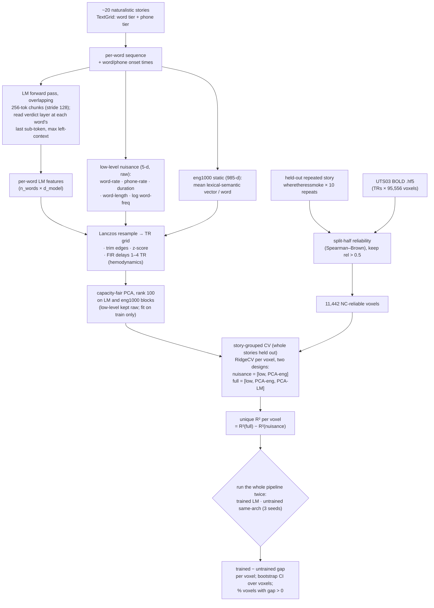

# Experiment — E006: LeBel UTS03 voxelwise A2-feasibility (powered substrate validation)

**Created:** 2026-06-11 · **Status:** COMPLETE (ran 2026-06-11) — A2 STRONG PASS at voxel scale (powered: trained−untrained gap +0.0207/+0.0277, 95–99% of 11,442 NC-reliable voxels positive); E007 lever-line structurally underpowered (MDE +0.013–0.015 ≫ the +0.003 effect) → E007 NOT built, rerouted to E005 · **Mode:** working
**Direction:** R03 Q0/A2 at *powered* (voxelwise) resolution — the prerequisite substrate for the LeBel lever re-test (E007) that confirms E004's fragile PARTIAL.
**Predecessors:** `E002` (A2 PASS on Tuckute, 5 ROIs) · `E004` (Tuckute lever = PARTIAL/fragile — routes here per its predeclared, power-limited rule)
**Code:** `scripts/lebel_adapter.py` (built, CPU+GPU-validated), `scripts/run_lebel_encoding.py` (TBD after oracle PASS), reuses `data/paper-repos/deep-fMRI-dataset/encoding/ridge_utils`
**Output:** `outputs/E006_lebel_feasibility.json`

---

## Why this exists (and why A2-only, not the lever)

E004 found a *fragile* brain-specific lever on Tuckute (Qwen co-trained-MSE − its permuted twin = +0.0032 [CI +0.0006,+0.0058], but fold 4 carries ~half; the absolute lever-vs-base CI includes 0). The 5-ROI screen (MDE≈+0.006) is underpowered for a +0.003 effect. Its predeclared rule routes to LeBel UTS03 voxelwise (~95k voxels, within-subject deep-sampling) for the powered confirmation.

**But a powered lever re-test is only meaningful if the substrate carries the signal at all.** E006 establishes that — the E002/A2 question at voxel scale: does a *trained* LM's middle-layer representation predict UTS03 BOLD *beyond nuisance*, under contiguous **story-level** splits, materially above an *untrained* control? This is pure measurement (no brain-tuning), cheaper, and a clean kill-gate: if it fails, LeBel is a dead substrate for our pipeline and E004's routing is moot (reframe per charter). If it passes, **E007** (the lever re-test: brain-tune Qwen co-trained-MSE at TR level, held-out-story unique R² vs its permuted twin) becomes worth the heavier TR-level training loop.

## Claim tuple (predeclared)

- **Metric:** voxelwise encoding R² (ridge, story-grouped CV), then **unique R²** = R²([nuisance, LM-features]) − R²([nuisance]), averaged over voxels and over the NC-reliable voxel subset; trained−untrained gap is the honest signal (L007). CC_norm-normalised where repeats permit.
- **Anti-confound (L003, naturalistic variant — nuisance expanded after oracle review):** contiguous **story-level** held-out CV (whole stories out — no within-story TR leakage; the time-series analogue of contiguous blocks, and the fix for bilgin-2026's TR-shuffle inflation). FIR delays 1–4 TRs (hemodynamics). Nuisance (all downsampled to TR + FIR-delayed identically, byte-identical across the trained/untrained contrast) = **word-rate** (words/TR) + **phoneme-rate** (phones/TR, from the TextGrid *phone* tier) + **mean word-duration** + **word-length** (phonemes & chars) + **log word-frequency** (static lexical scalar) + **static/non-contextual embedding** (mean input-embedding per word). The phone-tier rate/duration confounds are Feghhi's headline low-level features and load hard on auditory/STG voxels at voxel scale — omitting them would repeat the L012 hole (imageability/surprisal ate ⅓–⅔ of Tuckute's "unique" R²). **Surprisal stays OUT** (LM-derived → over-subtracts the construct; log-frequency is a *static* lexical scalar, distinct from surprisal, and IS subtracted).
- **Pass:** trained-LM unique R² > 0 AND materially exceeds the untrained-same-architecture control (≥3 seeds), on the NC-reliable voxels.
- **Kill:** trained ≈ untrained or ≈ 0 after nuisance → LeBel does not carry the signal for our pipeline at voxel scale.

## Design (LOCKED pending oracle review)

- **Subject/data:** UTS03, 84 stories on disk (`preprocessed_data/UTS03/*.hf5`, (TRs, 95556 voxels)); 84 TextGrids staged; `english1000sm.hf5` + `respdict.json` staged. Adapter validated: `ridge_utils` reuse for TextGrid→wordseq→Lanczos(window=3)→trim(feat[10:-5])→FIR(make_delayed 1..4); BOLD as-is (verified alignment, e.g. adollshouse 256→241=BOLD 241). LM word-features GPU-validated (697 words→768d, 0.2s, non-degenerate).
- **Stories used:** a fixed set of **~20 stories** (the LeBel "train" pool minus a held-out test set), leave-**N-stories**-out CV (e.g. 5 folds of 4 held-out stories) — keeps compute tractable while powered (each story ~150–300 TRs → thousands of TRs total, ≫ Tuckute's 1000 items × 5 ROIs). Story list pinned for reproducibility.
- **Models:** gpt2 (L7) + Qwen2.5-0.5B (L12), matching E002/E004; untrained same-arch control (≥3 seeds, the Feghhi control).
- **Encoding:** ridge per voxel (RidgeCV with a fixed alpha grid at first pass; banded/bootstrap-alpha is a refinement). Voxel chunks to bound memory over 95k voxels. Report mean-voxel R², **top-NC-voxel** R² (CC_norm>0.05, à la merlin-2026), and unique-over-nuisance.
- **NC / reliability + voxel selection (oracle fix — no double-dipping):** `wheretheressmoke.hf5` carries `individual_repeats` shape **(10, 291, 95556)** — 10 repeats of the canonical LeBel test story (verified on disk). **Hold `wheretheressmoke` OUT of the CV pool entirely**; compute per-voxel split-half reliability (Spearman–Brown corrected) from its 10 repeats; **select NC-reliable voxels (split-half reliability > 0.5, as-run) on THIS held-out story** (independent of the encoding fit → no Kriegeskorte double-dip); report unique R² as a fraction of that ceiling. `load_response` must gain explicit repeated-story handling before the runner.
- **Stories:** use a larger pinned set (toward all 84, compute-permitting) — not just 20 — to maximise power for the E007-MDE deliverable (oracle #6: don't leave power on the table for the question that actually matters).
- **Alignment guard (oracle fix):** assert `abs(len(feat) − len(BOLD)) ≤ 1` per story and log it (don't let `build_xy`'s `min()` silently mask a 1-TR slip). Do **not** reintroduce a global `position` regressor (it would encode story identity across concatenated stories) — rely on FIR + drift handling.
- **Compute:** LM feature extraction over the story set × {gpt2,Qwen} × {trained, 3×untrained} (~minutes/config, GPU); ridge over 95k voxels × CV (the heavy part, chunked). Est. ~1–3 h. GPUs 0/3 free.
- **Stop rule:** fixed story set, fixed layers (E002 peaks), fixed CV, fixed nuisance, fixed seed count. Pure measurement — no training, no tuning toward the outcome.

## System architecture (the measurement apparatus, visual + intuitive)

The whole experiment is one machine: it turns a *story the subject heard* and a *language model* into a single number — how much the model's middle layer explains about the subject's brain response that low-level structure cannot. Everything below is in service of making that one number honest. The diagram is the data flow; the walkthrough is why each stage exists.



**1. One stimulus, two feature streams.** Every story becomes two parallel descriptions of the same word sequence. The **LM stream** is the thing under test: each word's contextual representation, read from the model's middle layer. The **nuisance stream** is everything we want to *not* credit the model for — a 5-dimensional low-level block (how fast words and phonemes arrive, how long and frequent each word is) and the 985-dimensional eng1000 static block (a word's meaning *without context*, a fixed lookup). The intuition: if the LM only "aligns" because longer or rarer words happen to drive both the model and the brain, the nuisance stream already captures that, and the LM gets no credit for it.

**2. The temporal pipeline turns word-rate into brain-rate.** Words arrive several per second; the scanner samples the brain once every TR (≈2 s), and the blood-flow response (BOLD) is a slow, smeared echo of neural activity peaking ~5 s late. Three steps bridge that gap, and they are applied *identically* to every stream so nothing is advantaged: **Lanczos resampling** lands word-level features on the TR grid; **z-scoring** puts every feature on the same scale; and the **FIR delays (1–4 TRs)** hand the ridge model copies of each feature shifted forward in time, so it can line a word up with the lagged BOLD response it caused. FIR is applied within each story, never across the seam between two stories.

**3. Capacity-fair PCA stops a dimension-count win.** The LM block is ~768–896 dimensions; the eng1000 block is 985; the low-level block is 5. A wider block can absorb more variance just by having more knobs, regardless of content. So before the fit, the LM and eng1000 blocks are each reduced to the **same rank (100)**, fit on the training fold only. The low-level block is small and stays raw. This is the L004 fix: it guarantees that if the LM wins, it wins on *content*, not on carrying more columns into the regression.

**4. The noise ceiling is chosen on data the fit never sees.** A voxel that is pure noise can still be "explained" a little by chance, so we only score voxels that reliably repeat. Reliability is measured on a *separate* story (`wheretheressmoke`) the subject heard ten times: split-half agreement across those repeats, Spearman–Brown corrected, keep the 11,442 voxels above 0.5. Because that story is held entirely out of the encoding fit, selecting on it cannot inflate the score — the alternative (picking voxels on the same data you then score) is double-dipping and biases everything upward.

**5. The fit happens twice per fold, and the difference is the honest number.** Cross-validation holds out *whole stories* (no within-story timepoints leak across the train/test seam). On each fold a per-voxel ridge is fit twice: once on the **nuisance design** `[low, PCA(eng1000)]`, once on the **full design** `[low, PCA(eng1000), PCA(LM)]`. The **unique R²** is the difference — the variance the contextual LM adds *on top of* everything the nuisance already explains. A raw R² would conflate the two; the subtraction is what isolates context.

**6. Two arms, and the gap is the verdict.** The entire pipeline above runs twice: once with the trained LM, once with a randomly-initialised network of the *same architecture* (three seeds). Both arms see byte-identical nuisance, identical splits, identical PCA. The reported statistic is the **trained − untrained gap**, per voxel, with a bootstrap CI over voxels — because on naturalistic time series even an untrained net scores slightly positive (its random features inherit the stimulus's temporal structure), so the untrained arm defines the true zero. The gap is what *language training* buys, and nothing else.

The same six ideas define the apparatus the whole report set reuses; E002 is the simpler, isolated-sentence ancestor of this machine (no temporal pipeline, a coarser nuisance, ROI targets instead of voxels), and its own architecture section draws the reduced version.

## Decision rule (predeclared)

**The verdict statistic is the trained−untrained GAP** (not the trained absolute — on naturalistic timeseries an untrained net can score positive via rate/temporal structure even after nuisance; the gap is the normaliser-invariant signal, L007). Both arms pass through the *identical* expanded nuisance subtraction.

- **PASS (powered A2 holds) — IFF both:** (a) trained−untrained gap on NC-reliable voxels > 0 with bootstrap CI excluding 0; **and (b) the E007-lever MDE deliverable (below) is comfortably < +0.003.** → LeBel both carries the signal *and* can resolve the lever; **proceed to E007.**
- **PARTIAL / lever-line-underpowered (the oracle's "quiet kill" — watch for it):** gap > 0 (substrate carries signal) BUT the E007-lever MDE sits **above +0.003** even on the full story set. → A2 holds but LeBel cannot resolve the +0.003-scale lever; building the TR-level training loop (E007) would be structurally underpowered. Honest move: **do not build E007**; the lever line stops at "real signal, not cleanly optimizable/resolvable" and the thesis reframes toward measurement rigor / the trade-off-curve framing (charter).
- **KILL (substrate dead).** Trained ≈ untrained or ≈ 0 after the *expanded* nuisance. → LeBel cannot resolve our question at all; E004's PARTIAL cannot be confirmed. Reframe (charter).

**Predeclared E007 design (locked NOW to avoid garden-of-forking-paths):** if E006 PASSes, E007 brain-tunes Qwen co-trained-MSE (the E004 front-runner) at TR level; **PRIMARY specificity statistic = the PAIRED `arm − its-own-block-permuted-twin` contrast** (matched on fold/seed — the test that detected E004's effect; removes per-fold common-mode), with the absolute-vs-base as a *secondary descriptive only*; the unpaired `>perm95` is **retired** (it was E004's mis-specification). Block-permutation scheme + seed count + a perplexity-matched/gentler training regime (E004's LoRA degraded ppl ~2×) are part of that lock.

**Predeclared deliverable (oracle #6):** E006 must output an **empirical MDE for the E007 lever statistic**, computed from E006's fold-level variance of unique R² on the NC-reliable voxels. This is what licenses (or refuses) E007 — not the A2 gap alone.

## How to run

```bash
cd /home/centcom/data/brain-alignment
export HF_HOME=/home/centcom/data/hf-cache HF_HUB_OFFLINE=1
CUDA_VISIBLE_DEVICES=0 uv run python scripts/run_lebel_encoding.py --model gpt2 --untrained-seeds 0 1 2
CUDA_VISIBLE_DEVICES=3 uv run python scripts/run_lebel_encoding.py --model Qwen/Qwen2.5-0.5B --untrained-seeds 0 1 2
```

## Status

`lebel_adapter.py` built + validated (non-LM path CPU; LM-feature path GPU). `run_lebel_encoding.py` + the oracle review are the remaining work before a run. Scope deliberately A2-only (kill-gate); the lever re-test is E007, gated on this passing. The E004→E006 routing and the corrected paired-primary predeclaration are the load-bearing carry-forwards.

## Results (ran 2026-06-11; UTS03, 20 stories, 5 story-folds, 11442 NC-reliable voxels rel>0.5)

| Model · layer | trained unique R² | untrained unique R² | **trained−untrained GAP [95% CI]** | % voxels gap>0 | E007-lever MDE(80%) |
|---|---|---|---|---|---|
| gpt2 · L7 | +0.0038 | −0.0169 | **+0.0207 [+0.0205, +0.0209]** | 95% | +0.0129 |
| Qwen2.5-0.5B · L12 | +0.0103 | −0.0173 | **+0.0277 [+0.0274, +0.0280]** | 99% | +0.0150 |

Both ran ~9–10 min. Nuisance = low-level (word-rate, phoneme-rate, word-duration, word-length, log-freq) + eng1000 (985-d static), capacity-fair PCA(100) on LM & eng1000 blocks, low-level raw, FIR(1–4); BOLD aligned (assert passed). Voxels selected on the held-out `wheretheressmoke` 10 repeats (split-half reliability > 0.5) — no double-dipping.

## Interpretation

**A2 verdict: STRONG PASS at voxel scale.** A trained LM's mid-layer representation predicts UTS03 BOLD far above an untrained same-arch control after the full anti-confound (gap +0.021–0.028, CIs tight, 95–99% of reliable voxels positive). Qwen > gpt2 (the expected quality ordering). This is the powered confirmation E002's 5-ROI screen could only hint at, and it clears the Hadidi/Feghhi (2026) bar (untrained explains ~0 unique variance; the contextual residual is real). **The LeBel substrate is alive and carries the signal robustly — NOT the "substrate dead" kill.**

**Lever line (E007): hits the predeclared "quiet kill" — structurally underpowered for the +0.003 effect.** The empirical E007-lever MDE(80%) is +0.013 (gpt2) / +0.015 (Qwen) for the mean-over-voxels unique-R² statistic — ~4–5× the +0.003 brain-specific lever E004 found. *Caveat (honest):* this MDE is for the *unpaired* fold statistic; E004's effect surfaced only in the *paired* arm-vs-permuted contrast (common-mode removed), which could be better-powered — but confirming that would BE E007, and it is a gamble against a fragile +0.003.

**The decision (predeclared PARTIAL / lever-line-underpowered branch + the literature):** A2 holds powerfully, but the lever is too small/fragile for the crude statistic to resolve, and the literature (Hadidi/Feghhi 2026: residual ≤10% and "real but small"; our L011/L012: alignment co-varies with perplexity; lit-fork sweep leans B) all point the same way. **The honest, defensible, and arguably more novel contribution is to pivot the headline from "alignment-guided distillation wins" to a rigorous anti-confound characterization of the alignment signal and its rate–distortion trade-off against compression** — which E005 (alignment-guided vs perplexity-only KD at matched perplexity) tests directly and which is robust to the A/B framing (a big brain-term win = A; a small/null = the honest trade-off-curve result = B). **Recommendation: do not build the TR-level E007 lever loop; run E005 as the experiment that empirically settles the framing.** (Thesis-headline framing flagged for Erfan — his call as author.)

## Status / next

E006 = powered A2 PASS (recorded). Lever line (E007) not built (structurally underpowered + literature pressure). **Next = E005**, the matched-perplexity alignment-guided-vs-perplexity-only KD trade-off-curve experiment (the F1/Q3 headline), which decides the A/B framing on evidence. Ladder: Q0/A2 gains a powered voxelwise confirmation; Q2 stays 🟡 PARTIAL — **pending Erfan's confirmation**.

## Iteration log

| Date | Run / seed | Command / config | Result | Observation | Next |
|---|---|---|---|---|---|
| 2026-06-11 | design | — | adapter validated; design locked pending oracle | scoped A2-only (lever→E007) | oracle review → build runner → run |
| 2026-06-11 | oracle HOLD→resolved | — | 2 fatal fixes (phone-tier nuisance; held-out CC_norm voxel selection) + E007-MDE deliverable + paired-primary E007 lock | flagged the "quiet kill": lever line may be structurally underpowered if MDE > +0.003 | build runner → run |
| 2026-06-11 | FULL run | gpt2 + Qwen, 20 stories, 5 folds, rel>0.5 | **A2 STRONG PASS** (gap +0.021/+0.028, 95–99% voxels+); **E007-lever MDE +0.013/+0.015 → can't resolve +0.003** | substrate alive; lever line underpowered → pivot to E005 trade-off curve | design E005 (matched-ppl KD) |


## Related
- [`ladder.md`](../ladder.md) — the canonical status board
- [`map.md`](../map.md) — code system (Q/E/A/D/L) & journey map
