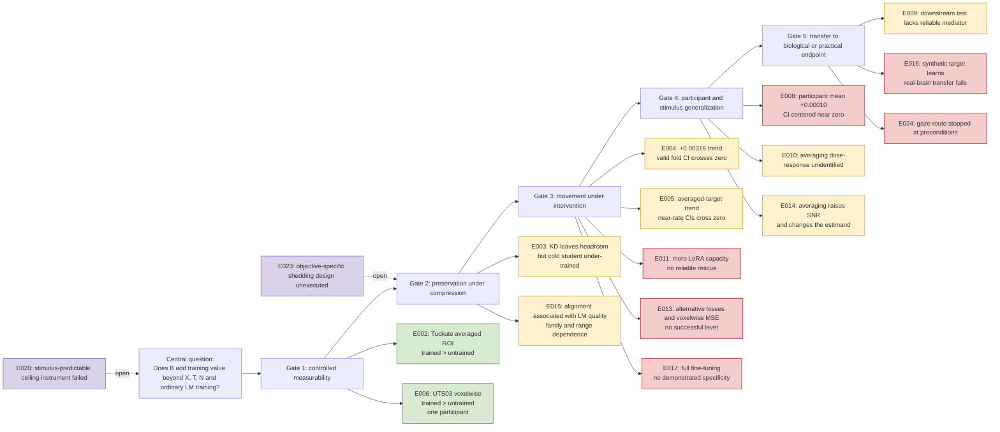

# Brutal executive verdict

> [!WARNING]
> The review text below is preserved from an external ChatGPT Pro response supplied by Erfan on 2026-07-14; trailing whitespace is normalized. It is provenance, not an authority for experimental results, manuscript conclusions, literature facts, or project status. Verify its claims against the E records, extended manuscript, and canonical literature notes.
> Source attachment SHA-256: `c5420e6ba891e8bd0282309e54d87ed7e63c754e532c32f45ee995c9b11ee668`.

**[Directly established here] The paper’s preferred positive thesis is not supported.** Controlled brain predictivity exists in selected settings, but the evidence does not show that brain measurements provide a reliable, participant-general training signal beyond language-model quality, text-correlated structure, and matched controls. The failures occur at the intervention, biological-generalization, and transfer gates, not at the initial measurement gate.

**Current top-AI-main-track verdict: no-go.** The manuscript is too broad, too thesis-like, and too dependent on a sequence of local nulls and corrected analyses. It does not yet have either:

1. a positive mechanism that survives strong controls, or
2. a formal boundary result strong enough to replace that mechanism.

**The strongest paper identity is C: methodological/falsification.**

The strongest defensible contribution is:

> **Brain alignment can be measurable and even optimizable on averaged or synthetic targets without transferring to individual-participant or recorded-brain alignment, showing that measurement, target fit, biological generalization, and endpoint utility are distinct evidential gates.**

The best alternative is **B: conditional boundary**, but only after adding an actual formal result with explicit assumptions. Identity A, a positive mechanism paper, is not credible on the present evidence.

The smallest useful next package is not another loss sweep. It is:

1. repair the statistical and target-control defects;
2. convert the E016 proxy-to-real failure into the paper’s second load-bearing result;
3. formalize when training-only brain data has zero Bayes value and when a deterministic brain proxy can still act as a finite-sample regularizer;
4. cut roughly two-thirds of the current experimental chronology.

Do not run more low-SNR fMRI MSE/LoRA variants before those steps.

---

# 1. Reconstruction of the actual argument

The manuscript correctly distinguishes five gates, although later sections sometimes slip back into treating them as one ladder.

## Plain-language reconstruction

**Gate 1 passes conditionally.** Trained representations predict held-out fMRI beyond the declared nuisance features and same-architecture untrained controls. This is an existence result for linearly accessible predictive structure. It is not evidence of shared mechanisms or useful supervision.

**Gate 2 is unresolved, not passed.** Compression leaves alignment headroom, but the largest losses occur in worse language models. E003 does not isolate compression-specific loss from under-training and language quality. E015 establishes that language quality is a necessary matching variable, not that alignment is reducible to quality.

**Gate 3 has no demonstrated reliable lever.** The apparent positive E004 and E005 intervals came from treating repeated seed-fold cells as independent. At the five-fold unit, the intervals cross zero and depend heavily on one fold. The high-(\lambda) result buys alignment by worsening perplexity.

**Gate 4 fails for the tested intervention.** The participant-level estimate is essentially zero:

[
\widehat{\Delta}_{\text{participant}}=0.00010,\qquad
95%,\mathrm{CI}=[-0.00037,0.00058].
]

The group-averaged and individual analyses do not disagree. They estimate different quantities.

**Gate 5 fails or stops at a prerequisite.** E009 lacks a reliable representation change whose utility could be tested. E024 lacks an informative natural-reading gaze signal and an adequate paragraph-disjoint evaluation substrate. E016 produces a strong synthetic-target improvement but a negative real-brain transfer contrast.

---

# 2. The strongest and weakest parts

## Strongest parts

### 2.1 The inference-unit corrections

**[Directly established here]** The manuscript caught and corrected its own most damaging error: treating seed-fold cells as independent replications. E004 and E005 lose their positive inferential status at the valid fold unit. This is scientifically valuable and should be foregrounded rather than buried as a correction history.

The correction is stronger than the original positive result because it demonstrates exactly how a plausible brain-training claim can be manufactured by pseudo-replication.

### 2.2 The participant-averaging distinction

**[Directly established here]** E008 and E014 jointly support a precise conclusion:

* individual responses contain measurable encoding signal;
* averaging improves response reliability and predictability;
* scoring the average is not equivalent to averaging participant-specific scores;
* a training effect on the average need not generalize across participants.

This is not “averaging is bad.” The early E010 claim that averaging *produces an artifact* was too strong. The later record correctly narrows it to an estimand change plus SNR gain.

### 2.3 The synthetic-proxy transfer failure

**[Directly established here]** E016 is the most underused result. A dense synthetic neural target can be learned strongly and consistently, yet that success does not transfer to the fixed real-brain endpoint. This is a clean illustration of proxy optimization failing an external validity gate.

The defensible version is narrow:

> TRIBE-target training improved prediction of the TRIBE target relative to KD and to the implemented projected-teacher target, but did not improve the fixed Tuckute real-brain alignment diagnostic across six training seeds.

Do not call the text-feature control “matched information.” It is dimension-matched only.

## Weakest links

### 2.4 The paper still resembles a lab notebook

The 41-page manuscript contains too many chronological branches, local rescue attempts, supersession stories, and failed instruments. A top-venue paper needs one question, two or three load-bearing results, and a formal frame. The current chronology signals exploration after nulls even when the individual decisions were defensible.

### 2.5 The intervention never passes a manipulation check at the relevant endpoint

The paper repeatedly asks whether a brain-induced representation change produces an external benefit, but in E008, E009, E013, and E017 the target-specific representation change is itself absent or unstable. A downstream null after a failed manipulation cannot identify whether successful alignment would be useful.

### 2.6 The controls remain incomplete

The Tuckute “unique” score is unique only beyond the declared nuisance set. Surprisal and imageability are deliberately omitted. That is defensible if stated literally, but not if the result is described as unique cognitive or neural information.

The E016 block-permuted target is not an exact derangement. Depending on seed, some original pairs remain, and unequal blocks create duplicate/missing rows. The control therefore cannot be called fully permuted or exactly marginal-preserving.

### 2.7 E008 still needs crossed inference

Participants share the same stimuli and folds. The manuscript reports participant-axis and fold-axis analyses separately, which is better than flat pseudo-replication, but it does not fully estimate crossed participant-by-stimulus uncertainty.

The smallest correction is to aggregate seeds within participant-fold cells and run either:

[
d_{pk}=\mu+\alpha_p+\beta_k+\epsilon_{pk},
]

with crossed random effects, or a multiway wild/cluster bootstrap over participants and stimulus folds. The current estimate will probably remain near zero, but the correct procedure should own the conclusion.

---

# 3. Condensed E001-E024 ledger

This is a status ledger rather than the requested full field-by-field ledger.

| ID   | Evidence class                 |                                            Valid unit | Verdict and role                                                                                       |
| ---- | ------------------------------ | ----------------------------------------------------: | ------------------------------------------------------------------------------------------------------ |
| E001 | Pipeline validation            |                                         Training seed | Synthetic plumbing works; no scientific brain-data claim.                                              |
| E002 | Measurement                    |          Five contiguous folds on one averaged target | Controlled alignment measurable for three trained models.                                              |
| E003 | Preservation                   |                      Fixed benchmark with folds/seeds | KD leaves headroom, but cold student is under-trained and quality-confounded.                          |
| E004 | Intervention                   |                                   Five stimulus folds | No valid-unit evidence of a lever; small effects remain possible.                                      |
| E005 | Intervention/trade-off         |                                   Five stimulus folds | Averaged-target near-rate trend; only high-(\lambda) arm clears zero while degrading perplexity.       |
| E006 | Measurement                    |                    One participant, five story blocks | Strong within-UTS03 trained-over-untrained result; no population inference.                            |
| E007 | Superseded/unexecuted          |                                                  None | Proposed voxelwise lever/MDE line; original voxel-based inference was retracted.                       |
| E008 | Biological generalization      |         Nine participants, with shared stimuli caveat | Participant-level mean near zero.                                                                      |
| E009 | Utility                        |               Eight training seeds on fixed endpoints | Bounded downstream null; mediator itself unstable.                                                     |
| E010 | Averaging sensitivity          |                                   Participant subsets | Nested trend confounded by identity; randomized subsets noisy and nonmonotone.                         |
| E011 | Capacity sensitivity           |                                     Nine participants | More LoRA rank/epochs do not rescue effect, but effective manipulation barely changes.                 |
| E012 | Deferred population test       |                          Three available participants | Correctly stopped because voxels/seeds cannot replace participant replication.                         |
| E013 | Objective/mechanism variants   | Nine ROI participants or one naturalistic participant | Contrastive ROI and voxelwise MSE do not establish a lever; voxelwise manipulation often worsens base. |
| E014 | Measurement of averaging       |                             Nine participants/subsets | Averaging legitimately raises SNR and changes target population.                                       |
| E015 | Quality confound               |         Six model families, not 22 independent models | Strong broad association; weak and uncertain inside the capable overlap range.                         |
| E016 | Synthetic proxy and transfer   |     Six training seeds on one fixed averaged endpoint | Synthetic target learns; real-brain transfer fails.                                                    |
| E017 | Full fine-tuning sensitivity   |                                    Three participants | Aggressive regime damages quality; gentle regime shows no demonstrated specificity.                    |
| E018 | Unused identifier              |                                                  None | No owning record in the snapshot.                                                                      |
| E019 | External reduced reproduction  |                           Small local participant set | Local Negi-style mechanism not reproduced; cannot refute the original work.                            |
| E020 | Failed ceiling instrument      |                            Six-participant diagnostic | Reference estimate too weak/leaky to identify a stimulus-predictable ceiling.                          |
| E021 | Cognitive-target control       |                                        Stimulus folds | Reading-time benefit reproduced by content-free temporal shape; exploratory due design evolution.      |
| E022 | Reduced speech reproduction    |                                           Three seeds | Gate not cleared; not a refutation of the full speech study.                                           |
| E023 | Identification design          |                                                  None | Defines objective-specific shedding estimand; decisive experiment not executed.                        |
| E024 | Failed-precondition LUPI route |                              Seven paragraph clusters | Gaze reliable but natural-reading target information and split substrate fail.                         |

---

# 4. Statistical and argument audit

## Claims that survive

**[Directly established here]**

* Trained LM features contain held-out linear predictive information beyond specified nuisances and untrained controls on Tuckute and UTS03.
* Participant averaging increases encoding predictability and changes the estimand.
* The tested participant-specific brain objective has a mean effect near zero.
* More adapter rank, contrastive ROI loss, tested voxelwise MSE, and tested full fine-tuning do not rescue that objective.
* A dense synthetic neural target can be optimized without improving a fixed recorded-brain endpoint.
* Practical payoff is not demonstrated.

## Claims that should be weakened

| Current tendency                           | Required wording                                                                                                |
| ------------------------------------------ | --------------------------------------------------------------------------------------------------------------- |
| “Artifact-resistant alignment estimand”    | “Alignment estimand resistant to the specified leakage and nuisance pathways.”                                  |
| “Alignment is coupled to quality”          | Retain, but distinguish broad cross-family association from uncertain within-capable-range association.         |
| “Averaging manufactures the gain”          | Replace with “the gain appears on an averaged target but does not estimate the mean individual effect.”         |
| “Strong-regime null”                       | Replace with “additional LoRA capacity at nearly the same effective operating point did not rescue the effect.” |
| “Matched-information text-feature control” | Replace with “dimension-matched projected teacher-feature control.”                                             |
| “Permuted target”                          | Replace with “block-permuted target control”; disclose residual original matches.                               |
| “External reproduction”                    | Use “reduced local mechanism check” unless the original positive is first reproduced.                           |
| “Brain data cannot add information”        | Never state. The current experiments provide bounded empirical certificates only.                               |

## Claims the manuscript underplays

1. **Correction as contribution.** The false-positive transition from 15 seed-fold cells to five folds is a concrete demonstration of why inference unit matters.
2. **Proxy transfer failure.** E016 is more useful than several extra loss variants.
3. **Manipulation-first logic.** A downstream test is uninterpretable when the intervention does not reliably move its proposed mediator.
4. **Control targets need matching beyond dimension.** Effective rank, smoothness, learnability, geometry, target entropy, and connection to the teacher all matter.

---

# 5. Figure and table audit

## Figures

| Item                                           | Decision                              | Reason                                                                                                                                                           |
| ---------------------------------------------- | ------------------------------------- | ---------------------------------------------------------------------------------------------------------------------------------------------------------------- |
| Figure 1, measurement-to-intervention pipeline | **Retain, redesign**                  | The arrow makes intervention look like a simple inversion of the encoding model. Add target construction, matched control, quality match, and external endpoint. |
| Figure 2, five gates                           | **Retain as the main framing figure** | This is the paper’s strongest organizing contribution. Add pass/partial/fail status and valid inference unit to each gate.                                       |
| Figure 3, unique variance                      | **Move to Methods or appendix**       | Useful definition, not a result. Explicitly show that cross-validated (R^2) can be negative.                                                                     |
| Figure 4, UTS03 bars                           | **Redesign or move to appendix**      | Bars hide story-fold heterogeneity and one-participant scope. Show five paired story-block gaps and a voxel-distribution inset.                                  |
| Figure 5, 22-model scatter                     | **Retain with changes**               | Replace “law” language with association. Show family clusters, capable-range fit, and cluster uncertainty.                                                       |
| Figure 6, retention gradient                   | **Delete from main paper**            | Duplicates Table 5 and the larger quality plot; the (r=-0.88) line uses five heterogeneous points.                                                               |
| Figure 7, intervention forest                  | **Retain, split into two panels**     | Fold-unit and participant-unit intervals should not share one undifferentiated display.                                                                          |
| Figure 8, synthetic transfer                   | **Promote after redesign**            | Use per-seed synthetic gains and per-seed real-brain transfer. Do not compare raw target (R^2) across target families as though they share difficulty.           |

There is also a snapshot consistency problem: the standalone image called `fig02_positioning` is not manuscript Figure 2, and the standalone quality/retention image numbering does not match the PDF numbering. Freeze a single figure manifest before submission.

## Tables

* **Table 1:** replace with an updated positioning matrix. Brain-tuning, privileged-information training, and “brain data beyond stimulus” are no longer empty literature cells.
* **Table 2:** retain. It is the best compact evidence map.
* **Tables 3 and 4:** appendix.
* **Table 5:** appendix; the cold-KD arm is too under-trained to carry a main-paper causal claim.
* **Experiment coverage table:** keep in the supplement, not the main paper.

---

# 6. State of the literature and novelty

## Measurement is not the novelty

Frozen-model brain encoding, layer effects, scale effects, nuisance confounds, temporal leakage, and the limits of prediction scores are already active and increasingly critical literatures. Hadidi et al. show that non-robust methods and overlooked confounds can produce spurious alignment; Jia’s L-PACT framework argues that prediction alone is insufficient for stronger representational claims. ([[Nature](https://www.nature.com/articles/s41467-026-72253-7)][1])

The manuscript’s controlled measurability result is therefore a prerequisite and validation result, not a headline contribution.

## Brain-guided training already exists

Brain-tuning has reported positive results in text and speech, including Negi et al., Moussa et al., and newer text-LM work. These studies differ in modality, target, trainable parameters, participant structure, split protocol, and quality controls. Their results do not prove that brain guidance works in compression, but they remove any novelty claim based merely on placing a neural loss into model training. ([[NeurIPS Proceedings](https://proceedings.neurips.cc/paper_files/paper/2025/hash/df311d51f4f1a3d0adc9d3f1725d0850-Abstract-Conference.html)][2])

Merlin, Moussa, and Toneva directly compare brain-tuned and stimulus-tuned models, so the broad question “does brain data add beyond exposure to the same stimulus?” is no longer untouched. The remaining opening is narrower: fixed-budget students, strong teacher/text controls, matched quality or matched information, valid biological inference, and transfer to a recorded or practical endpoint. ([[ACL Anthology](https://aclanthology.org/2026.conll-main.12/)][3])

## Higher temporal precision may change the boundary

Recent ECoG-tuning work reports gains over permuted, time-averaged, and model-derived controls, with full spatiotemporal neural targets outperforming temporally collapsed supervision. This is not directly comparable to sentence-level fMRI, but it is evidence that temporal precision and SNR can change whether the neural objective contains a usable training gradient. ([[ACL Anthology](https://aclanthology.org/2026.acl-long.1911/)][4])

That is the most credible positive mechanism left:

> Brain data may help when it contains reliable, task-relevant temporal or participant-specific variance that is not recoverable from the teacher/text controls, and when the auxiliary gradient reaches the student rather than being absorbed by a readout head.

## Compression remains a narrower opening

Compression studies show that alignment can change under pruning or quantization, but that is not the same estimand as neural-guided distillation. The current manuscript occupies a real but narrow intersection: fixed smaller student, brain auxiliary target, matched quality/control, biological inference, and transfer. ([[arXiv](https://arxiv.org/abs/2602.07547)][5])

## Synthetic targets

Meta’s TRIBE supplies dense stimulus-to-fMRI predictions and therefore removes part of the data-scarcity objection. It cannot, by itself, establish biological value because its output is stimulus-derived and optimized proxy fit may not transfer to recorded responses. E016 is directly relevant here. ([[Meta AI](https://ai.meta.com/research/publications/a-foundation-model-of-vision-audition-and-language-for-in-silico-neuroscience/)][6])

## Novelty classification

| Project leaf                                                | SOTA classification                                                                                            |
| ----------------------------------------------------------- | -------------------------------------------------------------------------------------------------------------- |
| Controlled LM-to-brain measurability                        | Already established; useful validation and stricter local control.                                             |
| KD reduces alignment                                        | Partly covered by compression work; KD-specific effect remains unidentified here.                              |
| Brain-guided language-model training                        | Already established broadly.                                                                                   |
| Brain-guided fixed-budget distillation with matched quality | Partially covered; still a narrow opening.                                                                     |
| Participant-averaged trend versus participant-level null    | Stronger control and different conclusion here; likely one of the paper’s more original results.               |
| Inference-unit correction of a positive brain-tuning result | Apparently useful and underemphasized.                                                                         |
| Synthetic neural target fit without recorded-brain transfer | Apparently novel as a controlled proxy-to-biological-endpoint failure.                                         |
| Universal impossibility of brain-guided training            | Not established.                                                                                               |
| Conditional no-value result                                 | Still open and attainable with explicit assumptions.                                                           |
| Five-gate falsification framework                           | Potentially publishable if presented as a reusable evaluation protocol rather than retrospective organization. |

---

# 7. Paper identity

| Identity                            | Current support                                                                     | Required evidence                                                                                               | Verdict              |
| ----------------------------------- | ----------------------------------------------------------------------------------- | --------------------------------------------------------------------------------------------------------------- | -------------------- |
| **A. Positive mechanism**           | Averaged-target trends and synthetic-target learning                                | Participant-general real-target effect beyond exact target and matched-information controls, then endpoint gain | **Reject now**       |
| **B. Conditional boundary**         | Empirical failures suggest necessary conditions                                     | Explicit theorem/proposition, testable assumptions, empirical certificates tied to each assumption              | **Best alternative** |
| **C. Methodological/falsification** | Five gates, pseudo-replication correction, participant null, proxy-transfer failure | Statistical/control repairs and sharper paper structure                                                         | **Recommend**        |

The paper should not present A and C as coequal possibilities. Reviewers will read that as refusal to accept the result.

---

# 8. Formalizing the information question

Let:

* (X): stimulus or text;
* (T): teacher outputs or representations;
* (B): neural measurement;
* (P): participant;
* (N): declared nuisances;
* (S): learned student state;
* (Y_{\mathrm{LM}}): ordinary language-model target;
* (Y): desired biological, behavioral, or task endpoint;
* (L_B): neural auxiliary loss.

## 8.1 Test-time information value

For loss (\ell), define the Bayes value of observing (B) in addition to (X,T,N):

[
V_B =
\inf_f \mathbb{E}!\left[\ell\bigl(Y,f(X,T,N)\bigr)\right]
---------------------------------------------------------

\inf_g \mathbb{E}!\left[\ell\bigl(Y,g(X,T,N,B)\bigr)\right].
]

By construction, (V_B\ge 0). Under log loss and access to (B) at prediction time:

[
V_B = I(Y;B\mid X,T,N).
]

That is not the manuscript’s setting because brain data is training-only.

## 8.2 Training-only value

Let (D_0) contain ordinary training information and (D_B) add neural measurements. For learning algorithm (A),

[
\Delta_B^{\mathrm{train}}(A)
============================

\mathbb{E}!\left[
R_Y\bigl(A(D_0)\bigr)
---------------------

R_Y\bigl(A(D_0,D_B)\bigr)
\right].
]

This value depends on the algorithm, hypothesis class, sample sizes, optimization, measurement noise, and endpoint. It is not a property of the joint distribution alone.

A brain-specific estimand must compare against a non-brain control (C) matched in training bandwidth and learnability:

[
\Delta_{\mathrm{specific}}
==========================

## \Delta_B^{\mathrm{train}}

\Delta_C^{\mathrm{train}}.
]

E016 does not yet identify this quantity because its projected-teacher control is not matched in effective rank, geometry, smoothness, or endpoint difficulty.

## 8.3 Conditional no-value proposition

**Proposition.** Suppose that, conditional on ordinary training data (D_0) and test input (X_{\mathrm{test}}),

[
Y_{\mathrm{test}}
\perp B_{\mathrm{train}}
\mid D_0,X_{\mathrm{test}}.
]

Then adding (B_{\mathrm{train}}) cannot improve Bayes-optimal prediction of (Y_{\mathrm{test}}) under any proper scoring rule.

**Reason.** The posterior predictive distribution of (Y_{\mathrm{test}}) is unchanged after conditioning on (B_{\mathrm{train}}), so the Bayes action is unchanged.

This is a genuine no-value result, but the conditional independence is an assumption, not something the current finite nulls prove.

### How to falsify the assumption

Estimate whether neural training data improves held-out prediction of (Y) beyond (D_0), using participant- and stimulus-held-out units and a flexible enough conditional model. A reliable positive falsifies the assumption.

## 8.4 Deterministic neural proxies

If

[
B=f(X,T,N),
]

then (B) adds no new sigma-algebra information to an unrestricted learner already observing (X,T,N). It can still help a finite, constrained learner by presenting the same information in an easier coordinate system or by changing optimization.

Therefore:

* a deterministic brain proxy can act as regularization;
* that does not establish new information from biology;
* the correct control is not merely the same output dimension;
* the control must match usable information and optimization difficulty.

## 8.5 Proxy optimization versus endpoint transfer

For a small gradient step,

[
\theta' =
\theta-\eta\left(\nabla L_{\mathrm{LM}}+
\lambda\nabla L_B\right).
]

The first-order endpoint-risk change attributable to the brain term is

[
\Delta R_Y
\approx
-\eta\lambda
\left\langle
\nabla R_Y,
\nabla L_B
\right\rangle.
]

Reducing (L_B) helps the endpoint only when the auxiliary gradient has positive alignment with the endpoint-improving gradient. E016 shows that the target can be learned without establishing this condition.

This yields a cheap decisive diagnostic: estimate held-out gradient or influence alignment before full training.

## 8.6 Participant averaging

A useful model is

[
B_p(X)=g(X)+u_p(X)+\epsilon_p(X),
]

where (g) is shared stimulus-locked response, (u_p) participant-specific response, and (\epsilon_p) measurement noise.

Averaging participants suppresses parts of (u_p+\epsilon_p) and emphasizes (g). Because ridge fitting and (R^2) are nonlinear,

[
\operatorname{score}!\left(\frac1P\sum_p B_p\right)
\neq
\frac1P\sum_p \operatorname{score}(B_p).
]

The group-average target may be scientifically valid, but it does not estimate population-average participant alignment.

## 8.7 Necessary conditions for useful brain supervision

Brain data can improve training only if all of the following hold in the relevant regime:

1. (B) contains endpoint-relevant information or a useful computational shortcut beyond the controls.
2. Reliability is high enough for that component to be estimated.
3. The component generalizes across the claimed participant and stimulus population.
4. The neural objective changes the student rather than only the auxiliary head.
5. Its gradient points toward the desired endpoint.
6. The result survives matched language quality and matched-information controls.
7. The inference units provide enough independent variation to distinguish the effect from noise.

The current experiments violate or fail to establish several of these conditions. That is a boundary statement, not universal impossibility.

---

# 9. Ranked forward paths

## Rank 1: repair the existing falsification claim

**Hypothesis:** The participant-level and transfer conclusions survive correct crossed inference and exact target controls.

**Work**

* Reanalyse E008 with crossed participant and stimulus-fold inference after averaging seeds within cells.
* Replace block permutation with an exact block derangement or phase-randomized control.
* Recompute every load-bearing contrast from raw result rows.
* Freeze a supersession map that identifies one primary analysis per question.
* Report multiplicity and design changes.

**Cost:** roughly 3 to 7 researcher-days if raw artifacts are intact; little or no new model training except exact-control reruns.

**Kill criterion:** any load-bearing sign or paper-level conclusion reverses, or the original raw result cannot be reproduced from retained artifacts.

**Publication value if null:** high. This is the foundation of identity C.

## Rank 2: repair E016 into a valid proxy-transfer experiment

**Hypothesis:** Synthetic neural-target learning fails to improve recorded-brain alignment even after fair controls.

**Required changes**

* exact target derangement;
* same declared student layer for synthetic training and real-brain evaluation, or a predeclared layer map;
* real-brain scoring separately for individual participants;
* participant-held-out inference where possible;
* non-brain control matched on effective rank, target reliability, smoothness, target entropy, learnability, and training loss scale;
* at least six seeds, preferably more if seeds remain the only unit.

**Earliest diagnostic:** compare effective rank, singular spectrum, baseline target predictability, and head-only learning curves for TRIBE and control targets.

**Kill criterion:** do not train until those diagnostics place the controls in a comparable learning regime.

**Positive outcome:** a synthetic neural representation provides a computational shortcut not reproduced by the matched control and transfers to recorded responses.

**Null outcome:** a stronger, publishable proxy-to-endpoint failure.

## Rank 3: reproduce one published positive before controlling it

**Hypothesis:** A published brain-tuning gain appears under its own protocol but shrinks under quality, exact-target, and valid-inference controls.

**Design**

1. Reproduce the original positive using its target, model, split, metric, and inference unit.
2. Only after reproduction, add matched quality and exact target controls.
3. Use participant-held-out and stimulus-held-out analyses.
4. Do not call a reduced local failure a refutation.

**Kill criterion:** if the original positive cannot be reproduced under its own protocol, stop. Report bounded non-reproduction; do not spend compute on the control phase.

**Cost:** medium to high, depending on data and code availability.

## Rank 4: write the boundary theorem and empirical certificates

Formalize:

* the conditional no-value proposition;
* deterministic-proxy versus computational-shortcut distinction;
* the gradient-transfer condition;
* participant-averaging estimand change;
* finite-sample certificates tied to measurable reliability and effect bounds.

**Kill criterion:** if the theorem reduces to a tautological conditional-independence statement without yielding testable conditions or experiment design, keep it as a proposition in Methods rather than making it the paper identity.

## Rank 5: a genuinely new positive-mechanism test

The most credible substrate is not another sentence-level averaged fMRI target. It is either:

* repeated within-participant fMRI with high reliability and participant-held-out evaluation; or
* ECoG/MEG with word-level temporal structure and a task-relevant target.

**Preconditions before full training**

1. reliability above a declared threshold;
2. measurable conditional signal beyond text, teacher, and nuisances;
3. target-control learning curves matched;
4. positive held-out gradient alignment with the desired endpoint;
5. at least three training seeds;
6. independent participants for biological claims.

**Kill criterion:** fail any precondition and stop before full model training.

## Rank 6: E023 objective-specific shedding

Only pursue this if compression remains central.

The decisive comparison is KD versus same-initialization ordinary LM training at matched achieved quality in a saturated regime. The cold, under-trained E003 student cannot answer it.

**Kill criterion:** if trajectories do not reach overlapping quality support, do not estimate objective-specific shedding.

---

# 10. Portfolios

## Minimum publishable, aimed at TMLR

* statistical and exact-control repair;
* focused five-gate paper;
* E008 participant result;
* corrected E016 proxy-transfer result;
* formal no-value proposition and gradient-transfer condition;
* code, raw result rows, frozen analysis scripts, and complete experiment disposition;
* four main figures at most.

This package remains valuable if every repaired estimate is null.

## Strong conference portfolio

Add to the minimum:

* corrected E016 with per-participant recorded-brain evaluation and a learning-matched non-brain control;
* one faithful published-positive reproduction followed by the five-gate controls;
* a predeclared external dataset or modality.

This is the minimum plausible route to ACL/EMNLP or a broad ML conference.

## Ambitious portfolio

Add:

* high-SNR repeated fMRI or temporally precise ECoG/MEG;
* participant-held-out biological endpoint;
* endpoint-gradient precheck;
* a formal boundary theorem that predicts the empirical success/failure regime.

Do not begin this portfolio until the cheap reliability and conditional-information gates pass.

---

# 11. Three reasoning lenses

## Elon: delete the false problem

The real goal is not to increase a brain score. It is to obtain training information that changes a desired endpoint beyond what ordinary training already provides.

Delete:

* further minor loss variants;
* more LoRA-rank sweeps;
* proxy-only endpoints;
* the assumption that fMRI must be the modality;
* the thesis chronology from the conference paper.

The smallest decisive test is:

> Train against a high-reliability biological target and a learning-matched non-brain target, then test their difference on held-out participants and an external endpoint.

The present project has spent too much effort optimizing an apparatus whose output repeatedly fails the transfer gate.

## Feynman: locate the broken mechanism

The proposed mechanism is:

1. brain data contains a useful distinction;
2. the auxiliary head can extract it;
3. its loss sends the distinction into the student;
4. the change generalizes to new stimuli and people;
5. the change improves another endpoint.

The evidence says:

* Step 1 holds for linear prediction in selected datasets.
* Step 2 often holds, especially for synthetic targets.
* Step 3 is unstable or absent for individual targets.
* Step 4 fails in E008 and is not established in E016.
* Step 5 is not demonstrated.

The likely break is between target prediction and student representation change, then again between representation change and external utility. The observation that discriminates these explanations is held-out gradient alignment plus a participant-general representation test.

## Naval: keep what compounds

The compounding asset is not one effect size. It is the evaluation harness:

* contiguous splits;
* fold-only preprocessing;
* nuisance subtraction;
* trained/untrained controls;
* exact target controls;
* quality matching;
* participant inference;
* transfer gate.

That protocol can audit future brain-tuning claims even if every current intervention remains null.

The highest information per unit effort is the crossed-inference and exact-control repair. The lowest-return work is another local optimizer variant.

## Synthesis

All three lenses agree:

* stop searching locally for a positive result;
* make the five-gate framework the paper;
* promote the participant and transfer failures;
* formalize the boundary;
* reopen the positive route only with a different information regime, not another setting of the same knob.

---

# 12. Reviewer objections and blockers

| Objection                                                        | Current answer                                                                                    | Remaining blocker                                                                    |
| ---------------------------------------------------------------- | ------------------------------------------------------------------------------------------------- | ------------------------------------------------------------------------------------ |
| “This is a collection of null experiments.”                      | The five-gate framework and two false-positive pathways can unify them.                           | Needs a shorter paper and formal predictions.                                        |
| “Weak fMRI data explain everything.”                             | The paper bounds the tested regime rather than claiming universality.                             | A high-SNR modality/repeated-data test is needed for a positive boundary comparison. |
| “The positive averaged result concerns a valid shared response.” | Correct; the paper should not call it an artifact.                                                | State the exact group-shared estimand.                                               |
| “Participant inference still shares stimuli.”                    | Participant and fold sensitivities are reported.                                                  | Crossed multiway inference remains needed.                                           |
| “The synthetic control is unfair.”                               | The manuscript already admits dimension matching is insufficient.                                 | Build a learnability- and rank-matched control.                                      |
| “The permutation is not clean.”                                  | The defect is documented in E016.                                                                 | Rerun exact derangements if the contrast is retained.                                |
| “You did not reproduce positive prior work.”                     | E019/E022 are explicitly bounded.                                                                 | A faithful reproduction is needed to challenge a published positive.                 |
| “Why should an AI venue care?”                                   | It is a lesson about auxiliary objectives, privileged targets, proxy optimization, and inference. | The current title and structure still read primarily as a neuroscience thesis.       |
| “Where are the raw artifacts?”                                   | The E records document provenance.                                                                | The upload lacks code, raw JSONs, checkpoints, licenses, and ethics materials.       |

The missing code and raw results prevent independent verification of arithmetic and implementation. The current audit can evaluate the recorded evidence but cannot reproduce the experiments.

---

# 13. Venue strategy

## Best fit: TMLR

TMLR is the best current fit because it is rolling, permits flexible length, and places greater weight on technical correctness than on subjective excitement. That matches a falsification and methods paper whose value survives a null. ([[Journal of Machine Learning Research](https://jmlr.org/tmlr/)][7])

Do not submit the 41-page thesis unchanged. Submit a focused methods paper with code and result artifacts.

## Backup 1: ACL or EMNLP 2027

ACL and EMNLP explicitly allow negative findings, reproduction studies, and analysis work, which makes them stronger fits than NeurIPS/ICML for the current identity. The paper would need a sharper NLP contribution: what neural privileged supervision adds to a fixed language-model student and how to identify false gains. ACL 2026 is closed; EMNLP 2026’s new ARR submission window is also closed. ([[ACL 2026](https://2026.aclweb.org/calls/main_conference_papers/)][8])

## Backup 2: AISTATS or UAI 2027

These become good fits only if identity B becomes real: a theorem or identifiable statistical boundary, plus experiments demonstrating its assumptions. Without that result, the paper is too application-heavy for AISTATS and not probabilistic enough for UAI. The 2026 cycles are closed. ([[AISTATS 2026](https://virtual.aistats.org/Conferences/2026/Dates)][9])

## Interdisciplinary option: Imaging Neuroscience

Imaging Neuroscience is a credible venue if the biological inference, response averaging, reliability, and evaluation protocol become the center of the contribution. It is less suitable if the paper remains chiefly about language-model compression. ([[MIT Press Direct](https://direct.mit.edu/imag/pages/guide_for_authors)][10])

## Poorer current fits

* **NeurIPS/ICML/ICLR:** no positive mechanism, new general learning result, or sufficiently strong theorem. The 2026 NeurIPS and ICML deadlines have passed. ([[NeurIPS](https://neurips.cc/Conferences/2026/CallForPapers)][11])
* **AAAI-27:** the abstract and paper deadlines are July 21 and July 28, 2026. That is technically available but scientifically the wrong move. Rushing now would freeze the control and artifact defects into the submission. ([[AAAI](https://aaai.org/conference/aaai/aaai-27/main-technical-track-call/)][12])
* **ICLR:** potentially suitable only after a positive mechanism or stronger formal representation-learning result. No verified official ICLR 2027 deadline was available in the checked official sources.

---

# 14. Recommended paper design

## Title

**When Brain Scores Fail as Training Signals: A Five-Gate Audit of Brain-Guided Language-Model Distillation**

Alternative:

**From Neural Predictivity to Training Utility: Testing the Missing Gates in Brain-Guided Distillation**

## Contribution structure

1. Define the five gates and the estimand for brain-specific training value.
2. Establish controlled measurability and quality dependence as prerequisites.
3. Show that averaged-target trends do not generalize to participant-level effects.
4. Show that synthetic-target learning does not transfer to recorded-brain alignment.
5. Formalize the no-value and computational-shortcut cases.
6. State the empirical boundary and conditions that would reopen the positive hypothesis.

## Main-paper figures

1. Five-gate evidence graph with valid inference units and outcomes.
2. Averaged target versus participant-specific effects.
3. Proxy-target fit versus recorded-brain transfer.
4. Boundary diagram: reliability, unique information, gradient engagement, generalization, transfer.

Move all model-by-model measurement tables, lambda sweeps, external reduced reproductions, and failed instruments to the appendix.

Delete Figure 6 and most chronological experiment narration.

---

# 15. Kill-gated 30/60/90-day plan

## Days 1-30: make the current result trustworthy

* reproduce all headline values from raw artifacts;
* run crossed E008 inference;
* replace or rerun inexact target permutations;
* audit E016 layers and target-control spectra;
* freeze E001-E024 disposition;
* publish code and raw result tables;
* rewrite the paper around identity C.

**Kill:** stop the manuscript if the raw artifacts cannot reproduce the load-bearing numbers. Do not patch prose around missing provenance.

## Days 31-60: strengthen the two central results

* run corrected E016 controls;
* score real-brain endpoints at participant level;
* implement a learning-matched non-brain target;
* attempt faithful reproduction of one positive prior study.

**Kill E016 positive branch:** any non-brain control reproduces the proxy gain, or proxy gain again fails recorded-brain transfer.

**Kill external-control branch:** original positive does not reproduce under its own protocol.

## Days 61-90: choose submission branch

* submit the corrected falsification paper to TMLR if the two central results survive;
* target ACL/EMNLP only if the external reproduction or corrected transfer result strengthens the NLP story;
* start the high-SNR positive experiment only if reliability, conditional-information, and gradient-alignment preconditions pass.

No high-SNR precondition pass means no new expensive modality experiment.

---

# 16. Revised abstract

Brain alignment measures whether a model representation predicts human neural responses to the same language stimuli. Such prediction establishes linearly accessible neural information under a specified dataset and readout, but it does not show that the score is a useful training objective. We test brain-guided language-model distillation through five separate gates: controlled measurability, preservation under compression, movement under intervention, biological generalization, and transfer beyond the optimized proxy. Trained language-model features predict held-out fMRI responses beyond specified nuisance features and same-architecture untrained controls. Alignment also declines under aggressive distillation, although much of this variation is entangled with language-model quality. Direct brain-targeted objectives produce small trends on participant-averaged responses but no reliable mean improvement across nine individual participants under the tested matched-control regimes. Increasing adapter capacity, changing the loss, and permitting full fine-tuning do not establish a target-specific gain. A dense synthetic neural target is readily learned, but its improvement does not transfer to a fixed recorded-fMRI alignment endpoint. These results do not imply that neural supervision is universally uninformative. They identify a bounded failure regime and show that neural predictivity, proxy learnability, participant generalization, and endpoint transfer are distinct claims requiring different controls and inference units. We provide a five-gate evaluation framework and state the information, reliability, optimization, and transfer conditions required for brain measurements to improve language-model training.

---

# 17. What remains incomplete

This response is an interim committee audit, not the full requested archival deliverable.

The following requested items are not yet complete:

* the full E001-E024 ledger with every requested field for each identifier;
* the paper-by-paper literature matrix with full citations, stable links, inference units, and exact comparison to this manuscript;
* the full novelty-and-coverage matrix at individual evidence-leaf level;
* a source-by-source search log and inclusion/exclusion record;
* a downloadable DOCX/PDF report and rendered claim-evidence graph;
* independent reproduction from code and raw result artifacts, which were not included in the upload snapshot.

The core verdict is unlikely to change: **the paper should become a falsification and evaluation-methods paper, not a positive brain-guided-distillation paper.**

[1]: https://www.nature.com/articles/s41467-026-72253-7 "https://www.nature.com/articles/s41467-026-72253-7"
[2]: https://proceedings.neurips.cc/paper_files/paper/2025/hash/df311d51f4f1a3d0adc9d3f1725d0850-Abstract-Conference.html "https://proceedings.neurips.cc/paper_files/paper/2025/hash/df311d51f4f1a3d0adc9d3f1725d0850-Abstract-Conference.html"
[3]: https://aclanthology.org/2026.conll-main.12/ "https://aclanthology.org/2026.conll-main.12/"
[4]: https://aclanthology.org/2026.acl-long.1911/ "https://aclanthology.org/2026.acl-long.1911/"
[5]: https://arxiv.org/abs/2602.07547 "https://arxiv.org/abs/2602.07547"
[6]: https://ai.meta.com/research/publications/a-foundation-model-of-vision-audition-and-language-for-in-silico-neuroscience/ "https://ai.meta.com/research/publications/a-foundation-model-of-vision-audition-and-language-for-in-silico-neuroscience/"
[7]: https://jmlr.org/tmlr/ "https://jmlr.org/tmlr/"
[8]: https://2026.aclweb.org/calls/main_conference_papers/ "https://2026.aclweb.org/calls/main_conference_papers/"
[9]: https://virtual.aistats.org/Conferences/2026/Dates "https://virtual.aistats.org/Conferences/2026/Dates"
[10]: https://direct.mit.edu/imag/pages/guide_for_authors "https://direct.mit.edu/imag/pages/guide_for_authors"
[11]: https://neurips.cc/Conferences/2026/CallForPapers "https://neurips.cc/Conferences/2026/CallForPapers"
[12]: https://aaai.org/conference/aaai/aaai-27/main-technical-track-call/ "https://aaai.org/conference/aaai/aaai-27/main-technical-track-call/"
