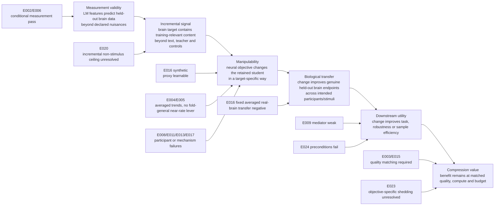

# Research audit of “From Brain Scores to Brain-Guided Distillation”

> [!WARNING]
> The review text below is preserved from an external ChatGPT Pro response supplied by Erfan on 2026-07-14; trailing whitespace is normalized and two literal `=======` lines are indented so Git does not treat them as conflict markers. It is provenance, not an authority for experimental results, manuscript conclusions, literature facts, or project status. Verify its claims against the E records, extended manuscript, and canonical literature notes.
> Source attachment SHA-256: `a01988b62e60066a14bfcccf6609c6b12684f64c10a5431cfb36611930327973`.


## Evidence labels

* **Directly established by supplied project evidence**
* **Verified external fact**
* **Mathematical consequence under stated assumptions**
* **Interpretation**
* **Proposal**
* **Speculation**
* **Cannot verify**

---

# 1. Corrected verdict

**Directly established by supplied project evidence.** The project has shown three things that matter:

1. Controlled LM-to-brain predictivity exists on the tested fMRI endpoints.
2. The tested real-fMRI objectives do not produce the predeclared participant-level gain.
3. A dense synthetic neural proxy can be learned without improving the fixed recorded-fMRI endpoint.

The evidence does **not** establish that human brain measurements are useless for training. It establishes failure of specific target constructions, objectives, models, datasets, and biological endpoints.

My earlier recommendation of a methodological or falsification identity remains directionally right, but I overstated several defects and underweighted the novelty problem. In particular:

* E008 already addressed participant and stimulus-block dependence on separate axes. A unified crossed model is not a missing prerequisite.
* E016 already disclosed its target-control, permutation, layer, and averaging limits.
* The project’s raw artifacts and scripts were absent from the upload, not absent from the repository.
* The five-gate framework cannot presently be called novel. Recent work, especially L-PACT, already separates predictive fit from stronger representational and mechanistic claims. ([arXiv][1])

**Interpretation.** The strongest current paper is not “brain alignment fails.” It is:

> Under fixed-budget language-model distillation, neural-target fit, participant-averaged alignment, participant-level alignment, and transfer to an independent recorded-brain endpoint can diverge sharply; the current experiments identify the intervention-to-biological-transfer link as the unresolved bottleneck.

That is scientifically defensible. It is not yet enough for a top AI conference because:

* the general evaluation framework may be preceded;
* the key synthetic-control comparison does not isolate brain-specific content;
* E016 biological transfer is evaluated on one participant-averaged endpoint;
* the paper has not yet applied its full test protocol prospectively to a faithfully reproduced external positive result.

The smallest high-information next step is **individual-participant evaluation of the saved E016 students**, followed by a **target-comparability audit**. Neither requires new model training if the saved model artifacts and individual Tuckute responses are available.

---

# 2. Corrections to my earlier audit

| Earlier criticism                                                        | Correct classification                                    | Corrected assessment                                                                                                                                                                                                                                                                   |
| ------------------------------------------------------------------------ | --------------------------------------------------------- | -------------------------------------------------------------------------------------------------------------------------------------------------------------------------------------------------------------------------------------------------------------------------------------- |
| E008 “still needs crossed inference”                                     | **Incorrect or overstated criticism**                     | E008 predeclared participant aggregation, fold-clustered inference, bootstrap checks, leave-one-fold-out analysis, train-versus-held-out participant comparisons, SNR checks, and null-stability analysis. A unified crossed model is optional and targets a broader joint population. |
| E008’s participant analysis ignored shared stimuli                       | **Incorrect or overstated criticism**                     | Shared-stimulus dependence was explicitly recognized and tested on the fold axis. The participant estimate is conditional on the tested stimulus set unless joint participant-and-stimulus generalization is claimed.                                                                  |
| E016’s block permutation defect was newly identified                     | **Already disclosed limitation**                          | The record and manuscript state that `block_permute` is not a complete derangement and treat it as a sensitivity control.                                                                                                                                                              |
| E016’s text-feature control was falsely described as matched information | **Already disclosed limitation**                          | The manuscript now calls it dimension-matched and explicitly lists rank, geometry, and difficulty differences.                                                                                                                                                                         |
| E016’s layer mismatch was an undocumented defect                         | **Already disclosed limitation**                          | Synthetic training uses layer 6 and real-brain evaluation layer 7. The limitation is disclosed.                                                                                                                                                                                        |
| E016’s averaged endpoint was hidden                                      | **Already disclosed limitation**                          | The endpoint is explicitly described as five-participant and five-ROI averaged.                                                                                                                                                                                                        |
| Exact permutation must be rerun before using E016                        | **Optional strengthening**                                | It is necessary only if a real-versus-permuted contrast becomes load-bearing. H1 and the principal TRIBE-versus-text-feature transfer comparison do not depend on an exact derangement.                                                                                                |
| The project lacked raw artifacts, scripts, or provenance                 | **Upload or packaging problem**                           | The supplied evidence records list scripts, raw outputs, hashes, independent recomputes, and audit artifacts. I lacked access to the repository itself. That is not evidence of missing provenance.                                                                                    |
| Figure 2 was inconsistent with its uploaded image                        | **Upload or packaging problem**                           | The apparent conflict can be explained by an auxiliary positioning graphic being included in the upload manifest. It is not currently a manuscript defect.                                                                                                                             |
| The manuscript resembles a lab notebook                                  | **Confirmed scientific problem for conference packaging** | The thesis appropriately records failed branches. A conference paper cannot give all branches equal narrative weight. This is a packaging problem, not a flaw in the experiment archive.                                                                                               |
| The intervention has no manipulation check                               | **Incorrect as a global criticism**                       | E016 has a strong synthetic-target manipulation check. E009 lacks a reliable biological mediator; some E013/E017 branches fail their manipulation checks. The criticism applies locally, not globally.                                                                                 |
| The nuisance set is incomplete                                           | **Already disclosed limitation**                          | The score is incremental beyond the declared nuisance set, not beyond all stimulus-derived variables. This threatens broad cognitive interpretations, not the literal held-out incremental-prediction claim.                                                                           |
| E016 is the paper’s strongest underused result                           | **Retain as interpretation**                              | It is still one of the strongest project results, provided it is described as fixed-endpoint transfer failure rather than participant or population failure.                                                                                                                           |
| The inference-unit correction is itself a novel contribution             | **Novelty not established**                               | It is scientifically important, but pseudo-replication and unit-of-analysis errors are well known. Its value must come from a domain-specific protocol or external demonstration, not novelty of the statistical principle.                                                            |
| The five-gate framework is novel and publishable                         | **Retract**                                               | L-PACT and related validity frameworks substantially overlap with the idea that prediction, relational structure, mechanism, reliability, and control must be separated. Novelty requires a systematic comparison. ([arXiv][1])                                                        |
| Current evidence is no-go for NeurIPS/ICML/ICLR main tracks              | **Retain provisionally**                                  | The project lacks either a positive mechanism, a nontrivial theorem, or a validated general protocol applied to external positives.                                                                                                                                                    |
| Identity C is the strongest current identity                             | **Retain, with lower confidence**                         | It remains the best-supported identity, but the framework itself cannot carry the paper unless paired with a distinctive empirical result.                                                                                                                                             |
| “Averaging manufactures a gain”                                          | **Narrow substantially**                                  | Averaging legitimately raises SNR and changes the target. The tested averaged-target intervention trend does not estimate the mean individual effect. Averaging itself is not an artifact.                                                                                             |
| E016 needs a stronger non-brain control before any claim                 | **Narrow**                                                | H1 and fixed-endpoint H4 are already answerable. A stronger control is required for H2-H3, especially brain-specificity.                                                                                                                                                               |

---

# Part I. Claim and evidence audit

## 3. Claim ledger

The table covers paper-relevant claims. A separate disposition ledger for all E identifiers follows.

### C01. The encoding pipeline can recover a planted relationship

| Field                   | Audit                                                                                |
| ----------------------- | ------------------------------------------------------------------------------------ |
| Owning record           | E001                                                                                 |
| Dataset                 | Synthetic features and synthetic fMRI-like targets                                   |
| Intervention/comparison | Known planted mapping                                                                |
| Outcome                 | Recovery by the encoding pipeline                                                    |
| Estimand                | Performance on the constructed data-generating relation                              |
| Estimator               | Cross-validated encoding pipeline                                                    |
| Inference unit          | Synthetic samples                                                                    |
| Assumptions             | The synthetic generator and code exercise the relevant implementation path           |
| Controls                | Experimenter-known ground truth                                                      |
| Result                  | Planted relation recovered                                                           |
| Directly establishes    | Basic implementation validity                                                        |
| Does not establish      | Real-neural validity, nuisance sufficiency, biological transfer, useful intervention |
| Manuscript location     | Appendix B.1                                                                         |
| Wording calibration     | Calibrated                                                                           |
| Nearest literature      | Standard simulation or positive-control practice                                     |
| Disposition             | **Retain in supplement only**                                                        |

### C02. Trained LMs predict the averaged Tuckute response beyond declared nuisances and untrained controls

| Field                   | Audit                                                                                                                                   |
| ----------------------- | --------------------------------------------------------------------------------------------------------------------------------------- |
| Owning record           | E002                                                                                                                                    |
| Dataset/participants    | 1,000 Tuckute sentences; five left-hemisphere language ROIs; responses averaged over five participants                                  |
| Independent variable    | Trained versus same-architecture untrained LM features                                                                                  |
| Outcome                 | Held-out semipartial unique (R^2)                                                                                                       |
| Estimand                | Incremental linear predictive value of contextual features beyond length, position, and static embeddings on the fixed averaged target  |
| Estimator               | Five contiguous folds; fold-only PCA; ridge full-minus-nuisance (R^2)                                                                   |
| Inference unit          | Five held-out stimulus blocks for this fixed endpoint                                                                                   |
| Identifying assumptions | Contiguous folds block relevant leakage; declared nuisance model removes named alternatives; untrained controls are capacity-comparable |
| Controls                | Nuisance-only readout; untrained networks                                                                                               |
| Main result             | GPT-2 gap (+0.030), GPT-2-medium (+0.033), Qwen2.5-0.5B (+0.050)                                                                        |
| Directly establishes    | Controlled measurability on one participant-averaged benchmark                                                                          |
| Does not establish      | Mechanistic similarity, population prevalence, useful supervision, uniqueness beyond unmodelled nuisances                               |
| Manuscript location     | Section 4.1, Table 3                                                                                                                    |
| Wording calibration     | Calibrated in current manuscript                                                                                                        |
| Nearest literature      | Large LM-to-language-network encoding literature                                                                                        |
| Disposition             | **Retain, narrow to benchmark-conditional measurability**                                                                               |

The manuscript correctly avoids dividing variance-scale unique (R^2) by the correlation-scale noise ceiling.

### C03. The trained-over-untrained measurement survives on naturalistic voxelwise data for UTS03

| Field                | Audit                                                                                                                |
| -------------------- | -------------------------------------------------------------------------------------------------------------------- |
| Owning record        | E006                                                                                                                 |
| Dataset/participants | LeBel naturalistic listening, UTS03, 20 stories, 11,442 independently reliability-selected voxels                    |
| Independent variable | Trained versus untrained GPT-2 or Qwen representation                                                                |
| Outcome              | Story-held-out unique (R^2)                                                                                          |
| Estimand             | Mean trained-minus-untrained incremental prediction on the fixed UTS03 endpoint                                      |
| Estimator            | Whole-story folds; temporal alignment; fold-only preprocessing; nuisance subtraction                                 |
| Inference unit       | UTS03 is the biological unit; story blocks are sensitivity units                                                     |
| Assumptions          | Reliability selection is independent of evaluated stories; nuisance model and story splits block stated alternatives |
| Controls             | Same-architecture untrained model; temporal and acoustic/lexical nuisance features                                   |
| Main result          | GPT-2 (+0.0207), Qwen (+0.0277); 95% and 99% of selected voxels positive; 5/5 story-block means positive             |
| Directly establishes | Within-participant existence across naturalistic stories                                                             |
| Does not establish   | Participant-population effect or an independent five-story confidence interval                                       |
| Manuscript location  | Section 4.1, Table 4, Figure 4                                                                                       |
| Wording calibration  | Calibrated after retraction of voxel bootstrap                                                                       |
| Nearest literature   | Naturalistic language encoding with story-level splits                                                               |
| Disposition          | **Retain as complementary within-person evidence**                                                                   |

The original voxel bootstrap and E007 MDE were correctly retracted.

### C04. Ordinary KD leaves alignment headroom

| Field                | Audit                                                                                                     |
| -------------------- | --------------------------------------------------------------------------------------------------------- |
| Owning record        | E003                                                                                                      |
| Dataset              | Averaged Tuckute ROI target                                                                               |
| Independent variable | Teacher, pretrained student, cold KD, warm KD, LM fine-tuning, DistilGPT-2, untrained floor               |
| Outcome              | Unique (R^2) and held-out perplexity                                                                      |
| Estimand             | Teacher-to-student alignment gap and floor-anchored retention                                             |
| Estimator            | Fixed layers; contiguous folds; ridge encoding                                                            |
| Inference unit       | Stimulus folds and training runs, conditional on one target                                               |
| Assumptions          | Fixed layer comparisons are meaningful; quality and initialization arms bracket plausible counterfactuals |
| Controls             | Cold/warm initialization; LM fine-tuning; untrained floor                                                 |
| Main result          | Cold KD gap (+0.0181); retention (0.37,[0.14,0.58]); cold PPL about 477                                   |
| Directly establishes | A poorly performing cold KD student lies below its teacher                                                |
| Does not establish   | Objective-specific shedding at matched quality or a recoverable brain-specific component                  |
| Manuscript location  | Section 4.2, Figure 6                                                                                     |
| Wording calibration  | Calibrated                                                                                                |
| Nearest literature   | Compression and representational-retention studies                                                        |
| Disposition          | **Retain as motivation, not central causal evidence**                                                     |

The objective-specific dissociations are marginal and construction-sensitive, and the cold arm is strongly under-trained.

### C05. Language-model quality is a major matching variable for alignment

| Field                | Audit                                                                                                                      |
| -------------------- | -------------------------------------------------------------------------------------------------------------------------- |
| Owning record        | E015                                                                                                                       |
| Dataset/models       | 22 decoder LMs, six named families, averaged Tuckute endpoint                                                              |
| Independent variable | Tokenizer-independent bits per byte                                                                                        |
| Outcome              | Controlled mid-layer unique (R^2)                                                                                          |
| Estimand             | Cross-model association between quality and alignment                                                                      |
| Estimator            | Pearson correlations, Fisher intervals, leave-family-out and partial-correlation analyses                                  |
| Inference unit       | Model families or training lineages, not 22 fully independent models                                                       |
| Assumptions          | Bits per byte is comparable across tokenizers; model set samples a meaningful quality range                                |
| Controls             | Family sensitivity; capable and overlap bands; parameter-count adjustment                                                  |
| Main result          | Full-range (r\approx-0.78); capable band (r\approx-0.50), CI includes zero; overlap band (r\approx-0.48), CI includes zero |
| Directly establishes | Quality is a credible broad-range confound                                                                                 |
| Does not establish   | Quality fully determines alignment or causes it within capable models                                                      |
| Manuscript location  | Section 4.2, Figure 5, Appendix C.5                                                                                        |
| Wording calibration  | Current manuscript is calibrated                                                                                           |
| Nearest literature   | Scale and brain-predictivity studies                                                                                       |
| Disposition          | **Retain as a design requirement**                                                                                         |

The partial correlation remains negative, but quality, scale, family, architecture, and training data are not separately identified.

### C06. The first averaged-target brain loss does not establish a fold-general lever

| Field                | Audit                                                                                                                                 |
| -------------------- | ------------------------------------------------------------------------------------------------------------------------------------- |
| Owning record        | E004                                                                                                                                  |
| Dataset              | Averaged Tuckute ROI target                                                                                                           |
| Intervention         | Real-target MSE versus block-permuted-target twin during KD                                                                           |
| Outcome              | Held-out unique (R^2)                                                                                                                 |
| Estimand             | Mean real-minus-control effect over held-out stimulus blocks                                                                          |
| Estimator            | Seeds averaged within each of five folds; fold (t)-interval                                                                           |
| Inference unit       | Five stimulus folds                                                                                                                   |
| Assumptions          | Fold aggregation captures stimulus-block sensitivity; paired target control isolates correspondence under the implemented permutation |
| Controls             | Identical training regime; block-permuted target; held-out PPL                                                                        |
| Main result          | (+0.00316), CI ([-0.00227,+0.00858]); leave-fold-4-out (+0.0014)                                                                      |
| Directly establishes | No demonstrated fold-level effect; small effects remain compatible                                                                    |
| Does not establish   | Exact zero or participant generalization                                                                                              |
| Manuscript location  | Section 4.3                                                                                                                           |
| Wording calibration  | Calibrated after supersession                                                                                                         |
| Nearest literature   | Brain-tuning intervention papers                                                                                                      |
| Disposition          | **Retain as statistical caution or appendix result**                                                                                  |

### C07. An averaged-target improvement is small near matched quality and costly at high weight

| Field                | Audit                                                                                                                                          |
| -------------------- | ---------------------------------------------------------------------------------------------------------------------------------------------- |
| Owning record        | E005                                                                                                                                           |
| Dataset              | Five-participant-averaged Tuckute ROI target                                                                                                   |
| Intervention         | Brain-guided KD across (\lambda), against a block-permuted twin                                                                                |
| Outcome              | Unique (R^2) and PPL                                                                                                                           |
| Estimand             | Real-minus-control alignment difference at each operating point                                                                                |
| Estimator            | Five seed-averaged stimulus-fold contrasts                                                                                                     |
| Inference unit       | Stimulus folds on one averaged target                                                                                                          |
| Controls             | Matched training regime, target control, PPL                                                                                                   |
| Main result          | Initial (+0.0081), fold CI ([-0.0030,+0.0193]); only (\lambda=30) has positive fold CI, (+0.0060,[+0.0002,+0.0119]), with PPL 67.4 versus 51.5 |
| Directly establishes | A high-weight regime can trade language quality for alignment on the averaged target                                                           |
| Does not establish   | A free frontier shift or participant-general benefit                                                                                           |
| Manuscript location  | Section 4.3, Appendix C.4                                                                                                                      |
| Wording calibration  | Calibrated                                                                                                                                     |
| Nearest literature   | Auxiliary-loss and rate-quality trade-off work                                                                                                 |
| Disposition          | **Retain as context; do not headline**                                                                                                         |

### C08. The tested real-target objective has a near-zero mean participant-specific effect

| Field                | Audit                                                                                                                                                                                      |
| -------------------- | ------------------------------------------------------------------------------------------------------------------------------------------------------------------------------------------ |
| Owning record        | E008                                                                                                                                                                                       |
| Dataset/participants | Tuckute individual ROI responses; nine complete participants                                                                                                                               |
| Intervention         | Qwen KD plus real participant target versus the mean of five block-permuted-target twins                                                                                                   |
| Outcome              | Held-out participant-specific unique (R^2) contrast                                                                                                                                        |
| Estimand             | Mean participant-level real-minus-control effect under the tested objective, model, stimuli, and training regime                                                                           |
| Estimator            | Aggregate paired seed-fold contrasts within participant; participant (t)-interval; fold-clustered sensitivity; bootstraps; LOFO                                                            |
| Inference unit       | Participants for biological variation; folds for stimulus-block sensitivity                                                                                                                |
| Assumptions          | Participants are exchangeable for the intended biological population; five blocks are an adequate sensitivity sample for these stimuli; permutation average is a valid implemented control |
| Controls             | Five target permutations; identical regime; train-versus-held-out participant split; SNR and null-stability checks                                                                         |
| Main result          | Participant mean (+0.00010), CI ([-0.00037,+0.00058]), 5/9 positive; fold mean (+0.00026), CI ([-0.0004,+0.0009]); every LOFO analysis fails to establish a positive effect                |
| Directly establishes | The predeclared (+0.003) mean participant effect is absent under this regime; effects around zero or below roughly (10^{-3}) remain possible                                               |
| Does not establish   | Universal participant-level failure across modalities, objectives, models, or stimuli                                                                                                      |
| Manuscript location  | Section 4.3, Appendix C.3                                                                                                                                                                  |
| Wording calibration  | Mostly calibrated; older E-record use of “artifact” should defer to current estimand-change wording                                                                                        |
| Nearest literature   | Participant-specific brain-tuning studies                                                                                                                                                  |
| Disposition          | **Retain as a central result**                                                                                                                                                             |

### C09. Extra LoRA capacity at the same effective operating point does not rescue E008

| Field                | Audit                                                                                                                                         |
| -------------------- | --------------------------------------------------------------------------------------------------------------------------------------------- |
| Owning record        | E011                                                                                                                                          |
| Dataset/participants | Same nine Tuckute participants                                                                                                                |
| Intervention         | Rank 64, six epochs versus E008’s lighter LoRA regime                                                                                         |
| Outcome              | Participant-specific real-minus-permuted unique (R^2)                                                                                         |
| Estimand             | Mean participant effect under the higher-capacity implementation                                                                              |
| Estimator            | Participant aggregation plus fold and LOFO sensitivities                                                                                      |
| Inference unit       | Nine participants                                                                                                                             |
| Main result          | (+0.00043), CI ([-0.0005,+0.0013]); one participant gives 79% of the sum; leave that participant out and the mean returns to about (+0.00010) |
| Directly establishes | More adapter parameters and epochs do not change the result at the attained operating point                                                   |
| Does not establish   | Failure of every stronger manipulation                                                                                                        |
| Manuscript location  | Section 4.4                                                                                                                                   |
| Wording calibration  | Calibrated in manuscript; older “strong regime” title is broader than the final result                                                        |
| Disposition          | **Retain as sensitivity evidence**                                                                                                            |


### C10. A contrastive ROI objective does not rescue the participant-level effect

| Field                | Audit                                                                 |
| -------------------- | --------------------------------------------------------------------- |
| Owning record        | E013b                                                                 |
| Dataset/participants | Nine participant-specific Tuckute ROI targets                         |
| Intervention         | Symmetric contrastive objective versus matched controls               |
| Outcome              | Held-out unique (R^2) contrast                                        |
| Estimand             | Mean participant-specific contrastive real-minus-control effect       |
| Estimator            | Participant aggregation and matched-PPL sensitivity                   |
| Inference unit       | Nine participants                                                     |
| Main result          | (-0.00019), CI ([-0.0008,+0.0005]), 4/9 positive                      |
| Directly establishes | No rescue with this contrastive loss on a five-dimensional ROI target |
| Does not establish   | Failure of contrastive learning on high-dimensional neural data       |
| Manuscript location  | Section 4.4                                                           |
| Wording calibration  | Calibrated                                                            |
| Disposition          | **Appendix or one sensitivity panel**                                 |

### C11. Voxelwise MSE fails to create an improving representation on UTS03

| Field                | Audit                                                                                                                                 |
| -------------------- | ------------------------------------------------------------------------------------------------------------------------------------- |
| Owning record        | E013 voxelwise branch                                                                                                                 |
| Dataset/participants | LeBel naturalistic fMRI, principally UTS03                                                                                            |
| Intervention         | Voxelwise real-target MSE versus permuted target across weights                                                                       |
| Outcome              | Held-out-story unique (R^2)                                                                                                           |
| Estimand             | Real-target gain over base and control on UTS03                                                                                       |
| Estimator            | Story-held-out encoding                                                                                                               |
| Inference unit       | UTS03; training seeds quantify optimization variability                                                                               |
| Main result          | Base about (0.0187); (\lambda=1): (0.0183), gap (-0.0009); (\lambda=3): (0.0086), gap (-0.0049); (\lambda=6): (0.0130), gap (-0.0039) |
| Directly establishes | The tested voxelwise MSE route does not take hold on this participant                                                                 |
| Does not establish   | A participant-population or modality-wide null                                                                                        |
| Manuscript location  | Section 4.4                                                                                                                           |
| Wording calibration  | Calibrated                                                                                                                            |
| Disposition          | **Retain as a mechanism failure, not population evidence**                                                                            |

### C12. Full fine-tuning does not reveal a clear target-specific gain in the three-participant probe

| Field                | Audit                                                                                                                             |
| -------------------- | --------------------------------------------------------------------------------------------------------------------------------- |
| Owning record        | E017                                                                                                                              |
| Dataset/participants | LeBel UTS01, UTS02, UTS03                                                                                                         |
| Intervention         | Aggressive and gentler full fine-tuning; real versus permuted neural target                                                       |
| Outcome              | Held-out alignment and PPL                                                                                                        |
| Estimand             | Within-participant target-specific effect under full fine-tuning                                                                  |
| Estimator            | Three seeds per participant; descriptive subject and cell summaries                                                               |
| Inference unit       | Three participants for biological scope; not nine participant-by-seed cells                                                       |
| Main result          | Aggressive run PPL worsens (1.63\times); gentle per-subject means (+0.0005,-0.0001,+0.0006); nine-cell descriptive mean (+0.0003) |
| Directly establishes | No strong existence signal in this small probe                                                                                    |
| Does not establish   | Population-level null                                                                                                             |
| Manuscript location  | Section 4.4, Appendix C.6                                                                                                         |
| Wording calibration  | Calibrated if called an existence probe                                                                                           |
| Disposition          | **Appendix**                                                                                                                      |

### C13. The tested intervention does not establish out-of-domain LM benefit

| Field                | Audit                                                                                                                        |
| -------------------- | ---------------------------------------------------------------------------------------------------------------------------- |
| Owning record        | E009                                                                                                                         |
| Dataset              | Fixed OOD text sets; eight training seeds                                                                                    |
| Intervention         | Brain-guided student versus matched-PPL and target-control students                                                          |
| Outcome              | OOD perplexity                                                                                                               |
| Estimand             | OOD payoff attributable to the brain-specific representation contrast                                                        |
| Estimator            | Paired seed contrasts                                                                                                        |
| Inference unit       | Training seeds for fixed datasets                                                                                            |
| Main result          | Representation fulcrum mean (+0.011), median (+0.0042), dominated by one seed; no OOD contrast exceeds the corresponding MDE |
| Directly establishes | No detected OOD-PPL payoff in a regime with an unreliable mediator                                                           |
| Does not establish   | Utility of a successful brain-specific manipulation                                                                          |
| Manuscript location  | Section 4.5                                                                                                                  |
| Wording calibration  | Calibrated as bounded null                                                                                                   |
| Disposition          | **Retain briefly to enforce mediator-first logic**                                                                           |

### C14. Participant averaging legitimately raises the encoding score and changes the target

| Field                | Audit                                                                                             |
| -------------------- | ------------------------------------------------------------------------------------------------- |
| Owning record        | E014                                                                                              |
| Dataset/participants | Nine individual Tuckute targets and random participant averages                                   |
| Independent variable | Number of participants averaged                                                                   |
| Outcome              | Encoding unique (R^2) with a fixed Qwen representation                                            |
| Estimand             | Predictability of constructed individual or group-average targets                                 |
| Estimator            | Fixed encoding pipeline                                                                           |
| Inference unit       | Participant targets and constructed participant subsets                                           |
| Main result          | Individual mean (+0.0069), 7/9 positive; (k=1,2,3,5,9): (+0.0039,+0.0162,+0.0324,+0.0444,+0.0702) |
| Directly establishes | Averaging increases SNR and shifts the estimand toward shared response                            |
| Does not establish   | That averaging creates false signal or causes an intervention gain                                |
| Manuscript location  | Section 4.3, Appendix B.3                                                                         |
| Wording calibration  | Current manuscript calibrated                                                                     |
| Disposition          | **Retain as the conceptual explanation of E005 versus E008**                                      |

### C15. Participant count does not identify a monotone intervention dose response

| Field                | Audit                                                                                            |
| -------------------- | ------------------------------------------------------------------------------------------------ |
| Owning record        | E010/E010b                                                                                       |
| Dataset              | Constructed participant-average Tuckute targets                                                  |
| Independent variable | Number and identity of participants averaged                                                     |
| Outcome              | Real-minus-control intervention gap                                                              |
| Estimand             | Contrast on each constructed group target                                                        |
| Estimator            | Nested subsets followed by random-subset analysis                                                |
| Inference unit       | Constructed participant subsets                                                                  |
| Main result          | Nested curve appears to rise then reverse; random-subset distributions are noisy and overlapping |
| Directly establishes | No identified monotone count effect                                                              |
| Does not establish   | No benefit from averaging under every construction                                               |
| Manuscript location  | Section 4.3, Appendix B.2                                                                        |
| Wording calibration  | Calibrated after supersession                                                                    |
| Disposition          | **Appendix diagnostic**                                                                          |

### C16. The synthetic TRIBE target is learnable under the Phase-3 training regime

| Field                | Audit                                                                                            |
| -------------------- | ------------------------------------------------------------------------------------------------ |
| Owning record        | E016                                                                                             |
| Dataset              | 95,999 WikiText training sentences, 1,999 held out                                               |
| Intervention         | GPT-2-medium to GPT-2 KD with TRIBE MSE target                                                   |
| Outcome              | Held-out prediction (R^2) of the TRIBE target                                                    |
| Estimand             | Gain in target prediction caused by adding the synthetic target objective                        |
| Estimator            | Six paired training seeds                                                                        |
| Inference unit       | Training seeds for one fixed corpus and target generator                                         |
| Controls             | KD-only; block-permuted target; PPL guard                                                        |
| Main result          | TRIBE versus KD (+0.078298); versus block-permuted (+0.074807); all six seed directions positive |
| Directly establishes | The student and auxiliary head can exploit the stimulus-target correspondence                    |
| Does not establish   | Biological specificity or transfer                                                               |
| Manuscript location  | Section 4.6, Figure 8A, Appendix B.4                                                             |
| Wording calibration  | Calibrated                                                                                       |
| Nearest literature   | Predicted neural representations such as TRIBE                                                   |
| Disposition          | **Retain as a prerequisite result**                                                              |

### C17. TRIBE’s synthetic-endpoint gain exceeds the prepared text-feature control’s gain

| Field                | Audit                                                                                                       |
| -------------------- | ----------------------------------------------------------------------------------------------------------- |
| Owning record        | E016                                                                                                        |
| Controls             | Gaussian-projected teacher hidden-state target, same nominal output width and training harness              |
| Outcome              | Within-target held-out (R^2) gains                                                                          |
| Estimand             | Difference between each target family’s improvement over its own KD baseline                                |
| Estimator            | Six paired training seeds                                                                                   |
| Inference unit       | Seeds                                                                                                       |
| Main result          | TRIBE gain (+0.078298); text-feature gain (+0.000903); difference (+0.077395), all six positive             |
| Directly establishes | TRIBE beats this one sentence-local projected teacher-state control on their respective synthetic endpoints |
| Does not establish   | Greater information, brain specificity, or superiority to a learning-matched non-brain target               |
| Manuscript location  | Section 4.6, Figure 8A                                                                                      |
| Wording calibration  | Current manuscript is properly narrowed                                                                     |
| Disposition          | **Retain, but do not use as a brain-specific result**                                                       |

The target spaces differ in effective rank, geometry, smoothness, and baseline difficulty. In particular, the KD baseline’s own-target (R^2) is about (0.912) for text features and (0.595) for TRIBE.

### C18. Synthetic-target optimization does not improve the fixed averaged Tuckute endpoint

| Field                | Audit                                                                                                             |
| -------------------- | ----------------------------------------------------------------------------------------------------------------- |
| Owning record        | E016                                                                                                              |
| Dataset/participants | Tuckute condition B, 1,000 sentences, five ROIs averaged over five participants                                   |
| Intervention         | Saved TRIBE-guided and text-feature-guided students                                                               |
| Outcome              | Common held-out Tuckute unique (R^2)                                                                              |
| Estimand             | Difference in real-brain alignment gain between the TRIBE and text-feature branches, relative to common KD models |
| Estimator            | Six paired training seeds; contiguous folds inside each endpoint score                                            |
| Inference unit       | Training seeds for one fixed averaged endpoint                                                                    |
| Main result          | (-0.001213), normal CI ([-0.001846,-0.000580]); all six margins negative; exact sign (p=0.03125)                  |
| Directly establishes | No transfer to this fixed participant-averaged Tuckute diagnostic                                                 |
| Does not establish   | Participant-level, population-level, same-layer, voxelwise, or downstream transfer failure                        |
| Manuscript location  | Section 4.6, Figure 8B                                                                                            |
| Wording calibration  | Calibrated if “fixed diagnostic” remains explicit                                                                 |
| Disposition          | **Retain as a central result**                                                                                    |

The different readout layer limits conclusions about where the learned geometry changed. It does not invalidate the operational statement that these saved students failed on the declared external endpoint.

### C19. The imperfect block permutation is only a sensitivity result in E016

| Field                | Audit                                                                                     |
| -------------------- | ----------------------------------------------------------------------------------------- |
| Owning record        | E016                                                                                      |
| Independent variable | Block-permuted target pairings                                                            |
| Main issue           | 0–30% of rows remain fixed; one duplicated and one omitted row occur in five of six seeds |
| Directly establishes | A rough correspondence-disruption sensitivity                                             |
| Does not establish   | Exact randomization-null validity                                                         |
| Wording calibration  | Explicitly disclosed                                                                      |
| Disposition          | **Keep non-load-bearing or rerun exact control**                                          |

### C20. Natural-reading gaze fails the preconditions for the intended LUPI test

| Field                | Audit                                                                                                                                                              |
| -------------------- | ------------------------------------------------------------------------------------------------------------------------------------------------------------------ |
| Owning record        | E024                                                                                                                                                               |
| Dataset/participants | ZuCo, 300 sentences, 12 participants, seven paragraph groups                                                                                                       |
| Independent variable | Natural versus task-directed reading signals                                                                                                                       |
| Outcome              | Label predictiveness and split stability                                                                                                                           |
| Estimand             | Whether training-only gaze contains portable label information under grouped evaluation                                                                            |
| Estimator            | Linear/nonlinear probes; permutation tests; paragraph-disjoint split diagnostics                                                                                   |
| Inference unit       | Paragraph groups for transfer                                                                                                                                      |
| Main result          | Natural reading balanced accuracy (0.202) versus chance (0.200), (p=0.35); task-directed (0.295) versus (0.100), (p=0.003); test sizes 8–161 across grouped splits |
| Directly establishes | The chosen gaze-first substrate does not support the planned intervention                                                                                          |
| Does not establish   | A LUPI null or an EEG result                                                                                                                                       |
| Manuscript location  | Section 4.5, Appendix B.9                                                                                                                                          |
| Wording calibration  | Calibrated                                                                                                                                                         |
| Disposition          | **Retain only as precondition methodology**                                                                                                                        |

### C21. The empirical participant-residual ceiling instrument did not close the ceiling

| Field                | Audit                                                                                                                                                      |
| -------------------- | ---------------------------------------------------------------------------------------------------------------------------------------------------------- |
| Owning record        | E020                                                                                                                                                       |
| Dataset/participants | Denizenslab story 11, six participants                                                                                                                     |
| Comparison           | LM alignment with total, shared, and residual response                                                                                                     |
| Outcome              | Per-vertex correlations and trained-minus-untrained residual gap                                                                                           |
| Estimand             | Alignment with participant residual after estimated shared response                                                                                        |
| Main result          | Shared (+0.176), total (+0.108), residual (+0.090); reference reliability (0.33), residual reliability (0.174); strongest controlled residual gap (-0.018) |
| Directly establishes | The apparent residual is vulnerable to reference error, leakage, and autocorrelation                                                                       |
| Does not establish   | A universal stimulus-predictability ceiling                                                                                                                |
| Manuscript location  | Section 4.6, Appendix B.6                                                                                                                                  |
| Wording calibration  | Calibrated                                                                                                                                                 |
| Disposition          | **Appendix failed instrument**                                                                                                                             |

### C22. A reading-time auxiliary advantage can be reproduced by signal shape

| Field                | Audit                                                                                                   |
| -------------------- | ------------------------------------------------------------------------------------------------------- |
| Owning record        | E021                                                                                                    |
| Intervention         | Reading-time target versus phase-randomized shape-matched target                                        |
| Outcome              | Learning-curve or auxiliary-training advantage                                                          |
| Estimand             | Content-specific advantage beyond temporal/marginal shape                                               |
| Main result          | Phase-randomized control reproduces the apparent advantage; residual-minus-shape contrast includes zero |
| Directly establishes | The implemented gain is not cognition-specific                                                          |
| Does not establish   | All reading-time supervision is useless                                                                 |
| Manuscript location  | Section 5.6, Appendix B.7                                                                               |
| Disposition          | **Potentially useful supporting example; not central**                                                  |

### C23. Reduced local implementations do not reproduce two prior mechanisms

| Field                | Audit                                                                                                    |
| -------------------- | -------------------------------------------------------------------------------------------------------- |
| Owning records       | E019 and E022                                                                                            |
| Studies              | Negi-style text objective; Moussa-style speech objective                                                 |
| Main results         | E019: no local target-specific gain; E022 phoneme gain (+0.52[-0.36,+1.40]), below predeclared (+2) gate |
| Directly establishes | Those mechanisms do not transfer to the implemented reduced settings                                     |
| Does not establish   | Refutation of the original studies                                                                       |
| Wording calibration  | Current manuscript is calibrated                                                                         |
| Disposition          | **Appendix unless one becomes a faithful reproduction**                                                  |

E019’s architecture, dataset, metric, and schedule differ materially from Negi et al.; E022 is a reduced single-participant setup.

### C24. Objective-specific alignment shedding remains unidentified

| Field                | Audit                                                                                                 |
| -------------------- | ----------------------------------------------------------------------------------------------------- |
| Owning record        | E023                                                                                                  |
| Design               | Matched-quality KD versus ordinary fine-tuning in a flat alignment-quality regime                     |
| Executed component   | Analysis-only slope gate                                                                              |
| Main result          | One low-quality Pythia pair passes a pilot flatness screen; no decisive high-quality Qwen pair passes |
| Directly establishes | Feasibility information for a pilot                                                                   |
| Does not establish   | Objective-specific KD shedding                                                                        |
| Manuscript location  | Appendix B.10                                                                                         |
| Disposition          | **Unresolved design; do not present as scientific result**                                            |

---

## 4. Complete E001-E024 disposition

| ID   | Status                          | Evidence role                                               |
| ---- | ------------------------------- | ----------------------------------------------------------- |
| E001 | Complete engineering validation | Code-path positive control only                             |
| E002 | Complete                        | Averaged-ROI measurement                                    |
| E003 | Complete                        | Quality-entangled KD headroom                               |
| E004 | Complete and reanalysed         | Fold-limited intervention null                              |
| E005 | Complete and reanalysed         | Averaged-target trend and quality trade-off                 |
| E006 | Complete and corrected          | UTS03 naturalistic measurement                              |
| E007 | Intentionally unused            | Invalid power calculation never promoted                    |
| E008 | Complete                        | Participant-level intervention result                       |
| E009 | Complete                        | Downstream null with unreliable mediator                    |
| E010 | Complete with E010b             | Averaging intervention diagnostic                           |
| E011 | Complete                        | Extra-capacity sensitivity at same effective point          |
| E012 | Deferred/unrun                  | Intended three-participant voxelwise population study       |
| E013 | Complete for tested branches    | Contrastive ROI null and voxelwise mechanism failure        |
| E014 | Complete                        | SNR and estimand change under averaging                     |
| E015 | Complete and corrected          | Quality-alignment association                               |
| E016 | Complete and audited            | Synthetic learnability plus fixed-endpoint transfer failure |
| E017 | Complete                        | Full-fine-tuning existence probe                            |
| E018 | Intentionally unused            | No scientific content                                       |
| E019 | Complete                        | Reduced local Negi-style mechanism check                    |
| E020 | Complete failed instrument      | Residual-ceiling diagnostic                                 |
| E021 | Complete                        | Signal-shape control for reading-time result                |
| E022 | Complete pilot                  | Reduced Moussa-style non-reproduction                       |
| E023 | Design plus analysis gate       | Objective-specific shedding unresolved                      |
| E024 | Complete at precondition gate   | Gaze LUPI intervention correctly stopped                    |

The current manuscript accounts for unused, deferred, stopped, and superseded identifiers.

---

# 5. Directed argument graph



## Edge audit

| Edge                                                           | Logical status                      | Direct test                                                                                                                          | Result                                                                                                     | Scope                                                                              |
| -------------------------------------------------------------- | ----------------------------------- | ------------------------------------------------------------------------------------------------------------------------------------ | ---------------------------------------------------------------------------------------------------------- | ---------------------------------------------------------------------------------- |
| Measurement validity (\rightarrow) incremental training signal | **Logically assumed, not implied**  | E020 partly attacks stimulus-derived versus residual information; E016 compares one synthetic proxy with one teacher-feature control | **Unresolved**                                                                                             | E020: one story/six participants; E016: one synthetic target construction          |
| Incremental signal (\rightarrow) manipulability                | Empirical                           | E004, E005, E008, E011, E013, E016, E017                                                                                             | **Mixed**: synthetic proxy is manipulable; recorded targets do not show a reliable participant-level lever | Averaged targets, individual Tuckute participants, one to three LeBel participants |
| Manipulability (\rightarrow) biological transfer               | Empirical                           | E016                                                                                                                                 | **Fails on fixed averaged endpoint**                                                                       | Six seeds, one averaged Tuckute endpoint                                           |
| Manipulability (\rightarrow) downstream utility                | Empirical but requires mediator     | E009                                                                                                                                 | **Unresolved** because the mediator is unreliable                                                          | Eight seeds, fixed OOD text sets                                                   |
| Biological transfer (\rightarrow) downstream utility           | Mostly assumed                      | No experiment has both a validated participant-general biological effect and a downstream test                                       | **Open**                                                                                                   | None                                                                               |
| Downstream utility (\rightarrow) compression value             | Requires matched budget and quality | E009 and E023 partly address it                                                                                                      | **Open**                                                                                                   | Fixed students and unexecuted matched-quality identification design                |
| Measurable alignment (\rightarrow) mechanism similarity        | Invalid logical leap                | Not tested                                                                                                                           | **Rejected as an inference**                                                                               | General                                                                            |
| Averaged-target gain (\rightarrow) mean individual gain        | Invalid without assumptions         | E008/E014 distinguish the estimands                                                                                                  | **Does not hold here**                                                                                     | Nine Tuckute participants                                                          |
| Synthetic-target fit (\rightarrow) real-brain transfer         | Empirical                           | E016                                                                                                                                 | **Fails on fixed endpoint**                                                                                | Six seeds over averaged Tuckute                                                    |
| Similar PPL (\rightarrow) similar hidden representation        | Invalid logical leap                | E015 capable-band variability and intervention studies                                                                               | **Not established**                                                                                        | Models and tested interventions                                                    |

---

# Part II. Literature and novelty review

## 6. Search strategy

### Sources searched

* Official proceedings and primary paper repositories for NeurIPS, ICML, ICLR, ACL, EMNLP, CoNLL, AISTATS, UAI and JMLR.
* Official OpenReview pages where available.
* Primary arXiv or bioRxiv manuscripts when no proceedings version was accessible.
* Official research pages from Meta, Microsoft and other originating institutions for new work.
* Official conference calls for venue scope and deadlines.

### Search query families

Representative searches included:

```text
"brain-informed fine-tuning language model fMRI"
"brain-tuning language model fMRI downstream"
"ECoG tuning language model neural supervision"
"MEG supervised language model training brain"
"synthetic brain target language model training"
"predicted fMRI representation auxiliary loss language model"
"brain alignment pruning quantization compression language model"
"distillation brain alignment compression"
"participant averaged fMRI participant specific encoding target"
"shuffled permuted neural target control brain tuning"
"temporal leakage neural encoding language models"
"learning using privileged information deterministic auxiliary target"
"generalized distillation privileged information"
"Blackwell sufficiency value of information machine learning"
"conditional mutual information generalization learning algorithm"
"gradient conflict negative transfer auxiliary task"
```

### Inclusion rules

A work was included when it supplied at least one of:

* biological signals used to alter model training;
* an independent biological-transfer test after training;
* compression or model-quality analysis of neural alignment;
* a direct methodological critique of neural encoding;
* a formal result relevant to training-only auxiliary information;
* evidence about participant averaging, target controls, or gradient conflict.

### Exclusion rules

Excluded from load-bearing comparison:

* papers that only report representation similarity with no held-out prediction;
* abstract-only summaries when the full method could not be inspected;
* non-primary reviews used as substitutes for original results;
* unpublished claims with no stable manuscript;
* generic auxiliary-learning work lacking a clear connection to the information question, except for foundational theory.

**Cannot verify.** I did not locate a modern language-model study using MEG as the sole brain-derived training objective beyond the older fMRI/MEG work of Schwartz et al. This is a bounded search result, not proof of absence.

---

## 7. Empirical literature matrix

| Work                                                                                                 | Venue/year                 | Signal/data                                           | Intervention                                          | Controls                                                                                                     | Inference unit                             | Biological transfer                                   | Downstream test                                               | Relation to this manuscript                                                                                                                                                                           |
| ---------------------------------------------------------------------------------------------------- | -------------------------- | ----------------------------------------------------- | ----------------------------------------------------- | ------------------------------------------------------------------------------------------------------------ | ------------------------------------------ | ----------------------------------------------------- | ------------------------------------------------------------- | ----------------------------------------------------------------------------------------------------------------------------------------------------------------------------------------------------- |
| Schwartz, Toneva & Wehbe, “Inducing brain-relevant bias in natural language processing models”       | NeurIPS 2019               | fMRI and MEG language responses                       | Fine-tune BERT with brain-related objective           | Base model and participant transfer comparisons                                                              | Participants and tasks, depending analysis | Tests transfer across participants and brain datasets | NLP behavior retained or tested                               | Clearly precedes the idea of using neural data to shape language representations. ([NeurIPS Proceedings][2])                                                                                          |
| Negi et al., “Brain-Informed Fine-Tuning for Improved Multilingual Understanding in Language Models” | NeurIPS 2025               | Bilingual fMRI                                        | Full model brain-informed fine-tuning                 | Includes shuffled/TR controls in parts of the encoding analysis; quality matching is not the central control | Participant-specific analyses              | Reports encoding gains                                | Reports multilingual downstream gains                         | Strong novelty threat to any generic brain-tuning claim. The current manuscript differs through compression, matched-quality logic and negative participant result. ([OpenReview][3])                 |
| Moussa & Toneva, “Brain-tuning Improves Generalizability and Efficiency of Speech Models”            | NeurIPS 2025               | Multi-participant speech fMRI                         | Brain-tune speech representations                     | Pretrained and neural-control comparisons                                                                    | Participants and datasets                  | Reports transfer to unseen neural data                | Phoneme, sentence and data-efficiency outcomes                | Strong positive counterexample outside text KD. The modality, temporal resolution and task differ materially. ([NeurIPS Proceedings][4])                                                              |
| Bilgin et al., “Brain-Informed Language Model Training”                                              | ICLR 2026                  | Brain-derived language supervision                    | Brain-informed LM training                            | **Cannot verify full control structure from accessible source**                                              | **Cannot verify**                          | **Cannot verify fully**                               | Reports language-model improvements in the available abstract | Threatens broad novelty. Full methodological comparison requires the paper text. ([OpenReview][5])                                                                                                    |
| Merlin, Moussa & Toneva, “What Brain Data Adds to Language Model Training”                           | CoNLL 2026                 | Brain and stimulus-derived targets                    | Brain tuning, stimulus tuning and joint tuning        | Direct brain-versus-stimulus comparison                                                                      | Depends on supplied datasets               | Evaluates neural alignment                            | Broad downstream evaluation                                   | Directly precedes the question of whether brain supervision adds beyond exposure to the same stimuli. The remaining gap must be narrower than that question. ([ACL Anthology][6])                     |
| Zhang et al., ECoG-guided language-model tuning                                                      | ACL 2026                   | ECoG, nine participants, naturalistic podcast         | Spatiotemporal neural objective                       | Permuted, temporally averaged, large-LM and LM-derived controls                                              | Participants and temporal samples          | Reports held-out neural gains                         | Language performance maintained or improved                   | Strong evidence that high temporal precision and target structure can change the feasibility boundary. It weakens any fMRI-based universal negative claim. ([ACL Anthology][7])                       |
| d’Ascoli et al., TRIBE v2                                                                            | ICLR 2026                  | Predicted cortical fMRI from video, audio and text    | Foundation neural encoder, not LM brain tuning itself | Cross-dataset and modality evaluation                                                                        | Datasets/participants in source tasks      | Predicts neural responses                             | No direct LM compression test                                 | Supplies E016’s synthetic target. A TRIBE target remains stimulus-derived and does not by itself establish recorded-brain value. ([AI Meta][8])                                                       |
| Oota et al., alignment under model scale and compression                                             | 2026 preprint              | fMRI encoding across scaled, pruned and quantized LMs | Pruning and quantization, not neural-guided training  | Model size, method and quality comparisons                                                                   | Models and datasets                        | Encoding only                                         | No downstream neural-guided training                          | Partially precedes compression analysis; KD-specific objective shedding and biological transfer remain open. ([arXiv][9])                                                                             |
| Hadidi et al., methodological confounds in brain-language alignment                                  | Nature Communications 2026 | Neural encoding datasets                              | Method audit, no training intervention                | Split, position, word-rate and feature controls                                                              | Datasets and model analyses                | Encoding validity only                                | None                                                          | Supports the manuscript’s insistence on contiguous splits and nuisance controls. ([Nature][10])                                                                                                       |
| Jia, L-PACT                                                                                          | 2026 preprint              | Language-model neural prediction analyses             | Layered validity framework                            | Predictive, relational, mechanism-stripping and reliability controls                                         | Models/datasets                            | No brain-guided training intervention                 | None                                                          | The strongest novelty threat to the five-gate framework. The manuscript must differentiate intervention, biological-transfer and compression gates, not claim generic staged validation. ([arXiv][1]) |
| Klerke et al., gaze-informed sentence compression                                                    | 2016                       | Eye tracking                                          | Gaze features in sentence compression                 | Text baselines                                                                                               | Readers and sentences                      | No biological endpoint after training                 | Sentence compression                                          | Precedes use of human reading signals to improve NLP. ([ACL Anthology][11])                                                                                                                           |
| Strzyz et al., gaze as auxiliary supervision for parsing                                             | 2019                       | Gaze                                                  | Training-only auxiliary objective                     | Text-only baselines                                                                                          | Sentences/readers                          | No recorded-brain transfer                            | Dependency parsing                                            | Precedes train-only human-signal supervision.                                                                                                                                                         |
| Deng et al., gaze-enhanced language-model tuning                                                     | ACL 2024                   | Gaze                                                  | Gaze-informed fine-tuning                             | Text baselines                                                                                               | Dataset-specific                           | No biological-transfer gate                           | NLP tasks                                                     | Further weakens novelty of cognitive-signal auxiliary training. ([ACL Anthology][12])                                                                                                                 |
| Microsoft, task-fMRI-informed reasoning model work                                                   | 2026 preprint              | Task fMRI during reasoning                            | Neural-guided representation training                 | Model/task controls in preprint                                                                              | Participants/tasks                         | Reports neural relation                               | Reports accuracy changes                                      | A recent positive mechanism claim. It is not peer-reviewed in the located source and needs full-text comparison. ([Microsoft][13])                                                                    |

---

## 8. Theoretical literature matrix

| Theory                                             | Primary source                    | Result relevant here                                                                                              | Relation                                                                                                                                     |
| -------------------------------------------------- | --------------------------------- | ----------------------------------------------------------------------------------------------------------------- | -------------------------------------------------------------------------------------------------------------------------------------------- |
| Learning using privileged information              | Vapnik & Izmailov, JMLR 2015      | Train-only information may alter rates when it supplies a useful privileged description                           | Brain data can help without being present at test, but benefit requires structural assumptions. ([Journal of Machine Learning Research][14]) |
| Generalized distillation                           | Lopez-Paz et al., ICLR 2016       | Distillation and LUPI can be viewed as learning from soft or privileged targets                                   | Direct theoretical precedent for teacher plus brain supervision. ([leon.bottou.org][15])                                                     |
| Statistical value of soft labels                   | Menon et al., ICML 2021           | Teacher probabilities can reduce estimation variance under stated conditions                                      | Shows redundant targets may help finite learners even without new test-time information. ([Proceedings of Machine Learning Research][16])    |
| Privileged information with strong baselines/noise | Collier et al., ICML 2022         | Benefits depend on noise, access pattern and baseline construction                                                | Supports matched-control and reliability requirements. ([Proceedings of Machine Learning Research][17])                                      |
| Conditions for useful privileged information       | Ortiz-Jimenez et al., ICML 2023   | PI can improve generalization under structural relationships between views/tasks                                  | Relevant to the “what must break” boundary. ([Proceedings of Machine Learning Research][18])                                                 |
| Blackwell comparison of experiments                | Blackwell tradition; Crémer proof | One information structure is universally more valuable exactly when it Blackwell-dominates another                | Gives a decision-theoretic language for test-time information value, not directly algorithm-specific training value. ([ScienceDirect][19])   |
| Conditional mutual information generalization      | Steinke & Zakynthinou, COLT 2020  | CMI can control expected generalization under algorithmic assumptions                                             | Does not imply that adding a high-MI brain target improves the task. ([Proceedings of Machine Learning Research][20])                        |
| Gradient conflict mitigation                       | PCGrad, NeurIPS 2020              | Projects conflicting task gradients to improve multi-task optimization                                            | Establishes gradient conflict as a useful diagnostic, not a complete theory of transfer. ([NeurIPS Proceedings][21])                         |
| Conflict-averse gradient descent                   | CAGrad, NeurIPS 2021              | Optimizes a trade-off between average loss and worst local task improvement                                       | Relevant to auxiliary objective design, not proof of endpoint transfer. ([NeurIPS Proceedings][22])                                          |
| Negative transfer beyond local gradient conflict   | ForkMerge, NeurIPS 2023           | Validation-based task branching/merging addresses transfer failures not fully captured by instantaneous gradients | Supports the conclusion that local gradient agreement is neither necessary nor sufficient. ([NeurIPS Proceedings][23])                       |
| Mechanisms of distillation                         | Wu et al., ICML 2024              | Distillation can alter optimization and representation through mechanisms beyond label information                | Relevant to deterministic-proxy and optimization-path value. ([Proceedings of Machine Learning Research][24])                                |

---

## 9. Novelty matrix

| Candidate contribution                                                | Status                                                                                 | Reason                                                                                                             |
| --------------------------------------------------------------------- | -------------------------------------------------------------------------------------- | ------------------------------------------------------------------------------------------------------------------ |
| Brain-guided fine-tuning of an LM                                     | **Clearly preceded**                                                                   | Schwartz, Negi, Bilgin and others                                                                                  |
| Brain supervision improves downstream NLP                             | **Clearly preceded as a claim**                                                        | Negi, Moussa, Merlin and recent ECoG work                                                                          |
| Compare brain supervision with stimulus-only supervision              | **Clearly preceded**                                                                   | Merlin et al. directly compare them                                                                                |
| Train on a synthetic neural representation                            | **Partially preceded**                                                                 | Neural foundation models and synthetic targets exist; this particular KD-to-recorded-fMRI transfer test may be new |
| Brain alignment changes under compression                             | **Partially preceded**                                                                 | Pruning and quantization work exist; KD-specific identification is less covered                                    |
| Fixed smaller student with brain auxiliary loss                       | **Partially preceded**                                                                 | Distillation and brain tuning exist separately and sometimes jointly; exact budget/control package matters         |
| Match language quality when attributing brain-specific gains          | **Potentially novel as a domain-specific control package, not as a general principle** | Quality confounding is known, but systematic use in brain-guided LM compression may be uncommon                    |
| Participant-average gain versus participant-level null                | **Potentially novel in this exact intervention setting**                               | Averaging effects are known, but the explicit contrast within brain-guided KD may be distinctive                   |
| Synthetic neural target fits but fails a fixed recorded-fMRI endpoint | **Potentially novel**                                                                  | No directly comparable published result was located                                                                |
| Five-gate framework                                                   | **Novelty not established**                                                            | L-PACT and existing validity hierarchies overlap substantially                                                     |
| Universal impossibility of brain-guided training                      | **Contradicted by prior positive studies and unsupported here**                        | ECoG, fMRI and speech studies report positive regimes                                                              |
| Conditional no-value theorem                                          | **Standard unless strengthened**                                                       | Conditional independence, Blackwell sufficiency and deterministic redundancy are established ideas                 |
| Objective-specific KD shedding at matched quality                     | **Novelty plausible but experiment unexecuted**                                        | E023 remains a design                                                                                              |

## Strongest novelty threats

1. **Merlin, Moussa and Toneva** threaten the broad claim that prior work has not separated brain information from stimulus-only training. ([ACL Anthology][6])
2. **L-PACT** threatens novelty of a staged validity framework. ([arXiv][1])
3. **Negi et al.** threaten any generic “first brain-informed LM training” claim. ([OpenReview][3])
4. **Moussa and Toneva** threaten a general claim that biological supervision cannot transfer or improve efficiency. ([NeurIPS Proceedings][4])
5. **ACL 2026 ECoG tuning** threatens any conclusion drawn from low-temporal-resolution fMRI as a modality-wide boundary. ([ACL Anthology][7])
6. **Oota et al.** threaten novelty of studying neural alignment under compression, although not necessarily KD-specific intervention. ([arXiv][9])

## Exact remaining gap

**Interpretation.** The narrow gap supported by the search is:

> A controlled test of whether brain-derived supervision adds value in a fixed-budget smaller language model when language quality, ordinary teacher supervision, target learnability, participant variation and transfer to an independently recorded biological endpoint are separated.

The current project covers most pieces but not all in one identified experiment:

* E008 covers participant-level real-target intervention but not a successful manipulation.
* E016 covers successful synthetic-target manipulation and a fixed recorded-brain endpoint but not participant-level transfer or a learning-matched non-brain target.
* E023 defines compression-specific attribution but does not execute it.
* E009 tests downstream performance without a reliable mediator.

This gap is **potentially novel**, not established as novel until the closest positive studies are compared in full at the level of controls, participants and endpoints.

---

# Part III. Formalizing incremental training value

## 10. Setup

Let:

* (X): stimulus or text;
* (B_i): measured brain signal for participant (i);
* (\bar B = m^{-1}\sum_{i=1}^m B_i): participant-averaged target;
* (\widehat B=f(X)): synthetic or predicted neural target;
* (C): non-brain auxiliary control;
* (T): ordinary teacher or task supervision;
* (Y_{\mathrm{bio}}): held-out genuine biological endpoint;
* (Y_{\mathrm{task}}): downstream task endpoint;
* (D): finite training sample;
* (\mathcal H): hypothesis class;
* (A): training and optimization algorithm;
* (h_A(D,S)): predictor produced by (A) using auxiliary supervision (S).

Let (R_Y(h)=\mathbb E[\ell(Y,h(X))]).

## 10.1 Test-time information value

Define

[
V_{\mathrm{test}}(B)
====================

## \inf_{g}\mathbb E[\ell(Y,g(X,T))]

\inf_{q}\mathbb E[\ell(Y,q(X,T,B))].
]

Under log loss and unrestricted conditional-density prediction,

[
V_{\mathrm{test}}(B)=I(Y;B\mid X,T).
]

This concerns access to (B) at test time. It is not the project’s primary setting.

## 10.2 Training-only statistical value

For fixed (A,\mathcal H,n),

[
V_{\mathrm{train}}(S;A,\mathcal H,n)
====================================

\mathbb E
\left[
R_Y(h_A(D,T))
-------------

R_Y(h_A(D,T,S))
\right].
]

The expectation may range over sampled training data, participants, stimuli, optimization randomness and test draws. This quantity is algorithm- and sample-size-dependent.

A brain-specific comparison is

[
V_{\mathrm{specific}}
=====================

## V_{\mathrm{train}}(B)

V_{\mathrm{train}}(C),
]

where (C) should be matched for every non-biological property relevant to learning.

## 10.3 Finite-sample or inductive-bias value

Even when (S) supplies no new sigma-algebra beyond (X,T), it can change:

* effective hypothesis class;
* regularization;
* representation basis;
* estimation variance;
* optimization trajectory;
* implicit bias.

This is not test-time information value.

## 10.4 Optimization-path value

For a fixed dataset,

[
V_{\mathrm{opt}}(S)
===================

## R_Y(h_{A_0}(D,T))

R_Y(h_{A_S}(D,T,S)),
]

where the algorithms differ through their objective or path, even if the attainable function class is unchanged.

## 10.5 Biological-transfer value

[
V_{\mathrm{bio}}(S)
===================

\mathbb E!
\left[
R_{Y_{\mathrm{bio}}}(h_A(D,T))
------------------------------

R_{Y_{\mathrm{bio}}}(h_A(D,T,S))
\right].
]

The expectation must specify new seeds, stimuli, participants and acquisition conditions. E016 currently averages only over seeds.

## 10.6 Downstream-task value

[
V_{\mathrm{task}}(S)
====================

\mathbb E!
\left[
R_{Y_{\mathrm{task}}}(h_A(D,T))
-------------------------------

R_{Y_{\mathrm{task}}}(h_A(D,T,S))
\right].
]

This can be positive even if (V_{\mathrm{bio}}\le 0), and vice versa.

## 10.7 Compression value

For a constraint set

[
\mathcal F(q,c,b)
=================

\left{
h:
Q(h)\le q,,
\mathrm{Compute}(h)\le c,,
\mathrm{Budget}(h)\le b
\right},
]

define

[
V_{\mathrm{comp}}(S)
====================

\inf_{h\in\mathcal F(q,c,b)}
R_Y(h\mid T)
------------

\inf_{h\in\mathcal F(q,c,b)}
R_Y(h\mid T,S).
]

The quality bound (q), compute (c), model budget (b), training data and optimization budget must be common. E003 does not identify this value because its models occupy different quality regimes.

---

## 11. Proposition A: Bayes no-value under conditional independence

### Statement

Assume the ordinary training information is (D_0), brain training data are (B_D), and the test pair is ((X_*,Y_*)). If

[
Y_*
\perp B_D
\mid D_0,X_*,
]

then adding (B_D) does not change the Bayes-optimal predictive distribution for (Y_*). Under any strictly proper scoring rule, the Bayes risk is unchanged.

### Status

**Mathematical consequence under stated assumptions.** This is standard and close to tautological. It is not a novel theorem.

### Proof sketch

Conditional independence gives

[
p(y_*\mid D_0,X_*,B_D)
======================

p(y_*\mid D_0,X_*).
]

The Bayes action under a proper scoring rule depends only on this posterior predictive distribution. Therefore the optimal action and risk are identical with and without (B_D).

### When the assumption fails

Brain data can help when it reveals:

* an unknown task parameter;
* a useful latent representation;
* participant or environment structure shared with future data;
* a regularizer that changes finite-sample estimation;
* an optimization path unavailable to the ordinary learner.

### Falsifiable prediction

A sufficiently expressive learner supplied with (D_0) should receive no reproducible held-out benefit from (B_D).

### Project mapping

* E024 tests a prerequisite for conditional dependence between natural-reading gaze and the task label.
* E009 is not a clean test because the putative representation mediator is unstable.
* A faithful LUPI study with learning curves could test this proposition empirically but not prove the conditional independence.

---

## 12. Proposition B: deterministic-proxy redundancy for an unrestricted learner

### Statement

Suppose

[
\widehat B=f(X)
]

for a known measurable function (f). Then

[
\sigma(X,\widehat B)=\sigma(X),
]

and for every target (Y),

[
I(Y;\widehat B\mid X)=0.
]

Thus an unrestricted Bayes learner with (X) and knowledge of (f) obtains no additional test-time information from (\widehat B).

### Status

**Mathematical consequence under stated assumptions.** Standard sigma-algebra redundancy and a special case of Blackwell equivalence. ([ScienceDirect][19])

### Proof

Because (\widehat B=f(X)), every event measurable with respect to (\widehat B) is already measurable with respect to (X). Adding (\widehat B) cannot refine the information partition induced by (X). Conditional mutual information is therefore zero.

### What it does not say

It does not say that training on (\widehat B) cannot help a finite neural network. It says no new observable information has been added to an unrestricted learner.

### Falsifiable prediction

A gain from (\widehat B) should be reproducible by a non-biological transformation of (X) that matches the useful representation or optimization properties.

### Project mapping

E016’s stronger-control question is exactly this prediction. TRIBE is a deterministic stimulus-derived proxy in the training setup. A gain over a weak teacher-feature control does not isolate its biological origin.

---

## 13. Counterexample: a deterministic proxy can help a finite learner

### Construction

Let (\theta) be uniformly distributed on ({1,\ldots,d}). For each example,

[
X\sim \mathcal N(0,I_d),
\qquad
Y=X_\theta+\varepsilon,
\qquad
\varepsilon\sim\mathcal N(0,\sigma^2).
]

Define the auxiliary target

[
\widehat B=f_\theta(X)=X_\theta.
]

For a learner that does not know (\theta), ordinary labels (Y) are noisy observations of one unknown coordinate. Identifying (\theta) may require enough labeled samples to distinguish (d) correlated empirical candidates.

If the learner receives (\widehat B) during training, it can identify the relevant coordinate almost immediately and fit the correct one-dimensional predictor.

### Why this is not a contradiction

For fixed (\theta), (\widehat B) is deterministic in (X). But the learner does not know the function (f_\theta). Auxiliary labels reveal which member of the function family is relevant.

### Status

**Mathematical consequence under stated construction.** The general principle is standard in privileged-information and distillation theory. The example is adapted for this audit, not claimed as a new theorem. ([Journal of Machine Learning Research][14])

### Empirical prediction

A useful deterministic proxy should reduce sample complexity most strongly in low-data regimes, and its benefit should shrink when:

* the base learner is larger;
* ordinary labels become abundant;
* the same representation is supplied as a non-brain control.

### Project mapping

* E016 should include target-specific sample-complexity curves.
* E024 planned this logic but failed its signal and split prerequisites.

---

## 14. Proposition D: conditions under which a deterministic training proxy cannot help a specified learner

### Statement 1: algorithmic invariance

If, for every dataset (D),

[
h_A(D,T,\widehat B)=h_A(D,T),
]

then (V_{\mathrm{train}}(\widehat B)=0).

This is definitional, but operationally useful.

### Statement 2: unique primary optimum preserved

Suppose:

1. the primary empirical objective (L_T(\theta)) has a unique global minimizer (\theta^\star);
2. the algorithm reaches global minima;
3. the auxiliary loss satisfies
   [
   \theta^\star\in\arg\min_\theta L_{\widehat B}(\theta);
   ]
4. the combined objective is
   [
   L_T(\theta)+\lambda L_{\widehat B}(\theta),\qquad \lambda\ge0.
   ]

Then (\theta^\star) remains the unique combined minimizer, and the auxiliary target cannot change the learned predictor.

### Proof

For all (\theta\ne\theta^\star),

[
L_T(\theta)>L_T(\theta^\star)
]

and

[
L_{\widehat B}(\theta)\ge L_{\widehat B}(\theta^\star).
]

Adding the inequalities yields strict superiority of (\theta^\star).

### Statement 3: auxiliary-head isolation

Partition parameters as (\theta=(\phi,w)), where (\phi) is the retained student and (w) an auxiliary head. If

[
\nabla_\phi L_{\widehat B}(\phi,w)=0
]

throughout training, the auxiliary loss cannot affect the retained student.

### Status

**Mathematical consequence under stated assumptions.** These are elementary sufficient conditions, not new results.

### Counterexamples

* Multiple primary minima permit the auxiliary loss to select a different representation.
* Nonconvex optimization can change the basin even when the global optimum is unchanged.
* A nonzero but noisy auxiliary gradient can help through regularization.

### Falsifiable prediction

Measure:

* retained-student parameter drift;
* representation CKA or subspace change;
* auxiliary gradient norm on retained parameters;
* target loss attributable to the head alone.

### Project mapping

E016 confirms target fit but should separate head-only fit from retained-student change. E011 shows that more adapter capacity did not change the attained representation enough to move the endpoint.

---

## 15. Participant averaging counterexample

Let

[
B_i(X)=g(X)+a_i q(X)+\epsilon_i(X),
]

where:

[
\mathbb E[a_i]=0,
\qquad
\epsilon_i\perp g,q,
]

and participants are averaged:

[
\bar B_m(X)
===========

g(X)+\bar a_m q(X)+\bar\epsilon_m(X).
]

As (m\to\infty),

[
\bar a_m\to0,
\qquad
\bar\epsilon_m\to0,
]

so (\bar B_m\to g).

Consider an intervention that improves prediction of (g) by (\delta_g>0) but worsens prediction of (q) by (\delta_q<0). It can produce a clear gain on (\bar B_m), while the average participant gain is

[
\mathbb E_i[\Delta_i]
=====================

\delta_g+\mathbb E[a_i^2]\delta_q.
]

Choose

[
\delta_q=-\frac{\delta_g}{\mathbb E[a_i^2]},
]

and the mean individual effect is exactly zero while the averaged-target effect approaches (\delta_g>0).

### Status

**Mathematical consequence under stated construction.** This is an explicit counterexample, not a universal model of fMRI.

### Empirical prediction

An averaged-target gain that reflects only (g) should:

* correlate with inter-participant shared response;
* weaken on participant residuals;
* fail to generalize to the mean individual endpoint.

### Project mapping

E005, E008, E014 and E020 are consistent with this pattern, but they do not identify the exact decomposition.

---

## 16. Conditions under which improvement on (\bar B) implies improvement on new individuals

Suppose a new participant obeys

[
B_i(X)=\alpha_i \bar B(X)+\eta_i(X),
]

with:

1. (\alpha_i>0);
2. (\eta_i) mean-zero;
3. (\eta_i) independent of every candidate model representation;
4. the intervention changes only prediction of (\bar B);
5. evaluation uses squared error on the same scale.

Then for predictors (h_0,h_1),

[
\mathbb E|B_i-h_j|^2
====================

\mathbb E|\alpha_i\bar B-h_j|^2
+
\mathbb E|\eta_i|^2.
]

If the model output is scaled appropriately for (\alpha_i), improvement on (\bar B) implies improvement for every participant with (\alpha_i>0).

### Plausibility for fMRI

**Interpretation.** These assumptions are strong:

* participant maps can differ spatially and functionally;
* measurement noise is heterogeneous;
* participant-specific response may correlate with stimulus dimensions represented by the model;
* ROI averaging can suppress meaningful heterogeneity;
* (R^2) is nonlinear and sensitive to scale and noise.

E014 directly shows that averaged and individual targets differ in reliability and estimand. The sufficient conditions are therefore not credible without empirical validation.

### Falsifiable prediction

Estimate whether individual response maps are approximately positive scalar transforms of the group target after alignment. Test residual predictability from model features. If participant residuals are structured, the implication fails.

---

## 17. Gradient alignment

For one gradient step,

[
\theta^+
========

\theta-\eta\left(
\nabla L_T(\theta)+
\lambda\nabla L_B(\theta)
\right).
]

Let (R(\theta)) be the endpoint risk. A first-order expansion gives

[
R(\theta^+)-R(\theta)
\approx
-\eta
\left\langle
\nabla R(\theta),
\nabla L_T(\theta)
\right\rangle
-------------

\eta\lambda
\left\langle
\nabla R(\theta),
\nabla L_B(\theta)
\right\rangle.
]

### Local result

Under sufficiently small (\eta) and smooth (R):

* (\langle\nabla R,\nabla L_B\rangle>0) is sufficient for a first-order endpoint improvement attributable to the auxiliary term.
* A negative inner product predicts first-order harm.

### Is it necessary?

No.

#### Counterexample: local conflict can help final transfer

Suppose momentum or the primary objective would overshoot a narrow good basin. An auxiliary gradient opposing the current endpoint gradient can act as a brake, yielding a better final point after multiple steps. The first step looks conflicting, but the path is beneficial.

A one-dimensional construction is:

[
R(\theta)=(\theta-1)^2,
]

with an optimizer state that would move from (\theta=0) to (\theta=3). An auxiliary term opposing that local motion can place the final iterate near (1), despite local conflict with the immediate primary update.

### Is it sufficient for final transfer?

No.

#### Counterexample: local agreement fails

Again let

[
R(\theta)=(\theta-1)^2,\qquad \theta_0=0.
]

An auxiliary gradient points toward (1), so local alignment is positive. With an excessive step, the update lands at (\theta=3), increasing risk from (1) to (4).

In high dimensions, agreement can also act only in an auxiliary head or in a representation direction irrelevant to the external endpoint.

### Status

**Mathematical consequence under local smoothness assumptions.** The distinction between local conflict and final negative transfer is established in multi-task optimization literature. PCGrad and CAGrad treat conflict as a useful local object; ForkMerge provides evidence that negative transfer cannot be reduced to that object alone. ([NeurIPS Proceedings][21])

### Empirical prediction

Use gradient alignment only as an early diagnostic. It should be paired with:

* retained-student movement;
* target fit;
* validation endpoint trajectory;
* multi-checkpoint influence or ablation analysis.

### Project mapping

E016 could compute gradient alignment between the TRIBE loss and the real-brain readout surrogate at checkpoints. A negative result would explain the transfer failure; a positive result would not overturn it.

---

# Part IV. Precise adjudication of E008 and E016

# 18. E008

## 18.1 Exact estimand

For participant (p), fold (k), training seed (s), and target-control replicate (r), define a paired contrast

[
d_{pksr}
========

## A^{\mathrm{real}}_{pks}

A^{\mathrm{perm}(r)}_{pks}.
]

The primary participant summary is approximately

[
\bar d_p
========

\frac{1}{K}
\sum_{k=1}^{K}
\left[
\frac{1}{S}\sum_s
\left(
A^{\mathrm{real}}_{pks}
-----------------------

\frac{1}{R}\sum_r A^{\mathrm{perm}(r)}_{pks}
\right)
\right].
]

The biological estimand is

[
\mu_P
=====

\mathbb E_P[\bar d_P],
]

conditional on:

* the Tuckute stimulus set and its fold construction;
* the Qwen teacher/student pair;
* the declared LoRA regime and (\lambda);
* the ROI target construction;
* the implemented control distribution.

The estimate is

[
\widehat\mu_P
=============

\frac1{9}\sum_{p=1}^{9}\bar d_p.
]

## 18.2 What population the participant analysis supports

**Directly established by supplied project evidence.**

The participant-axis analysis supports inference over biological variation among participants exchangeable with the nine complete Tuckute participants, **conditional on the tested stimulus sample and experimental regime**.

It does not by itself support:

* a broad stimulus population;
* other scanners or tasks;
* other neural targets;
* other optimization regimes;
* all humans.

The participant mean is

[
+0.00010,\qquad
95%,\mathrm{CI}=[-0.00037,+0.00058].
]

The predeclared (+0.003) effect lies far outside this interval.

## 18.3 What population the fold analysis supports

The fold-clustered estimate averages participants and training randomness within each of five held-out stimulus blocks. It estimates sensitivity to which Tuckute block is held out, conditional on the nine participants.

The result is

[
+0.00026,\qquad
95%,\mathrm{CI}=[-0.0004,+0.0009].
]

Because the five folds reuse overlapping training data, they are not five independent draws from a clean stimulus superpopulation. They are a conservative block-sensitivity analysis.

The leave-one-fold-out checks test whether one block is carrying a positive result. They do not create five new experiments.

## 18.4 Train versus held-out participants

The four participants whose data contributed to the earlier averaged target have mean effect approximately (-0.00010); the five held-out participants have approximately (+0.00026). Both intervals include zero.

This addresses one specific leakage or adaptation concern:

> The participant-level result is not explained by restricting evaluation to the participants used in constructing the earlier averaged benchmark.

It is not a formal domain-generalization test because the model was retrained participant by participant.

## 18.5 SNR and null stability

The modest SNR rank correlation and collapse after removing the highest-SNR participants argue against a stable positive effect hidden solely by noisy participants. They do not prove that reliability is irrelevant.

The spread among target-permutation controls being much larger than the headline mean also indicates that the observed mean is small relative to control instability.

## 18.6 Would a unified crossed model change the estimand?

Yes.

A model such as

[
d_{pk}
======

\mu+u_p+v_k+w_{pk},
]

with

[
u_p\sim\mathcal N(0,\sigma_P^2),\qquad
v_k\sim\mathcal N(0,\sigma_K^2),
]

targets a joint participant-and-stimulus estimand:

[
\mu_{P,X}
=========

\mathbb E_{P,X}[d(P,X)].
]

This is broader than the participant-primary estimand conditional on the observed stimuli.

Possible extensions include:

[
d_{pks}
 =======

\mu+u_p+v_k+(uv)*{pk}+e*{pks},
]

but with nine participants and five folds, variance-component estimation would be fragile. Seeds should not be treated as biological or stimulus replications; they can be averaged within participant-fold cells or included as a computational random effect.

A two-way cluster bootstrap would resample participants and stimulus blocks. With only five blocks and overlapping training sets, its nominal calibration is uncertain.

## 18.7 Is a unified crossed model required?

**Interpretation.** No, not for the current claim:

> The mean participant-specific effect is near zero for the tested Tuckute regime, and the result is not driven by a held-out block.

The existing participant-primary analysis plus fold sensitivities directly addresses that claim.

A crossed model is:

* **optional strengthening** for a claim about joint new-participant/new-stimulus generalization;
* **unjustified as a mandatory replacement** if the paper keeps the participant-primary estimand;
* **potentially misleading** if a mixed model’s asymptotic standard errors are overtrusted with five blocks.

## 18.8 What result could change the conclusion?

A crossed analysis would materially alter the conclusion only if it showed one of:

1. a lower confidence bound above zero and above a predeclared smallest effect of interest;
2. a large participant-by-fold interaction indicating that the current grand mean hides a stable conditional positive subgroup;
3. a participant-general positive effect confined to independently held-out stimulus blocks;
4. a sign reversal caused by weighting participants or blocks according to the intended population.

Given the participant estimate and fold estimate are both close to zero, such a reversal is unlikely but cannot be ruled out without the cell-level data.

## E008 verdict

**Directly established by supplied project evidence.**

> Under the tested participant-specific Tuckute ROI objective, the across-participant mean real-minus-control effect is tightly bounded below the predeclared (+0.003) effect, and no fold, held-out-participant or SNR sensitivity establishes a reliable positive result.

No new crossed analysis is scientifically necessary unless the paper expands its target population.

---

# 19. E016 hypotheses

## H1. The synthetic target is learnable

### Existing evidence

* TRIBE versus KD: (+0.078298).
* TRIBE versus block-permuted target: (+0.074807).
* Six seed directions are positive.
* PPL differences are below the declared tolerance.

### Missing evidence

For the narrow claim “the target is learnable,” little is missing. A head-only decomposition would clarify whether the retained student changed.

### Appropriate control

KD-only is sufficient for total learnability. An exact permutation is useful for correspondence-specific learnability but is not required for the total gain claim.

### Estimand and unit

[
\Delta_{\mathrm{learn}}
=======================

\mathbb E_s[
R^2_{\mathrm{target}}(h_s^{\mathrm{TRIBE}})
-------------------------------------------

R^2_{\mathrm{target}}(h_s^{\mathrm{KD}})
].
]

Unit: training seed for this fixed target/corpus.

### Cheapest decisive analysis

Compare:

* head-only fit on frozen KD representations;
* head plus student fit;
* retained-student CKA or representation drift;
* held-out target learning curves.

### Kill criterion

If nearly all target improvement is recoverable by retraining only the auxiliary head on unchanged KD representations, do not claim that TRIBE reshapes the student.

### Meaning

* Positive retained-student movement: a genuine optimization channel exists.
* Head-only positive: the target is predictable but may not shape the language model.

## H2. TRIBE is more learnable than a non-brain auxiliary target

### Existing evidence

TRIBE’s within-target gain is much larger than the prepared sentence-local teacher-feature target’s gain.

### Missing evidence

The endpoints are not comparably difficult. The controls differ in rank, spectrum and baseline (R^2).

### Appropriate control

A non-brain target matched on:

* output dimension;
* effective rank;
* covariance spectrum;
* baseline predictability;
* gradient scale;
* target normalization;
* smoothness;
* head-only learning curve;
* sample complexity.

### Estimand

[
\Delta_{\mathrm{relative}}
==========================

\left(
R^2_{\mathrm{TRIBE}}^{\mathrm{TRIBE\ train}}
--------------------------------------------

R^2_{\mathrm{TRIBE}}^{\mathrm{KD}}
\right)
-------

\left(
R^2_C^{C\mathrm{\ train}}
-------------------------

R^2_C^{\mathrm{KD}}
\right).
]

### Unit

Paired training seeds.

### Cheapest decisive analysis

Run the target-comparability audit before training a new control.

### Kill criterion

If the current contrast is explained by baseline saturation or spectral differences, remove H2 as a contribution.

### Meaning

* Positive after learning matching: TRIBE has an unusually useful auxiliary geometry.
* Null after matching: the synthetic advantage was target-difficulty artefact.

## H3. The advantage is brain-specific

### Existing evidence

None sufficient.

TRIBE is generated by a brain-prediction model, but in this application it is a deterministic function of the stimulus. The current text-feature control does not match usable information.

### Appropriate controls

At least one of:

1. a teacher-derived target recolored to TRIBE’s spectrum and rank;
2. a stimulus model trained to imitate TRIBE’s target geometry without biological training;
3. a synthetic target generated from an otherwise identical architecture trained on non-brain objectives;
4. a matched target with identical covariance and baseline learnability but randomized biological basis.

### Estimand

[
\Delta_{\mathrm{brain}}
=======================

## V_{\mathrm{train}}(\widehat B)

V_{\mathrm{train}}(C_{\mathrm{matched}}).
]

### Unit

Training seeds, followed by participants for any biological claim.

### Cheapest decisive analysis

Construct a covariance- and learnability-matched teacher-feature target without retraining the main students, where possible, to check whether the current target statistics can explain the gain.

### Kill criterion

Any non-brain control with matched learning properties reproduces both the synthetic gain and any biological transfer.

### Meaning

* Positive: some feature of the biologically trained proxy matters.
* Negative: TRIBE is useful, if at all, as a representation-engineering target, not because it is brain-derived.

## H4. Optimization transfers to participant-averaged genuine brain data

### Existing evidence

Negative on the fixed Tuckute endpoint:

[
\Delta_{\mathrm{TRIBE-textfeat}}
================================

-0.001213,
\quad
95%,\mathrm{CI}
===============

[-0.001846,-0.000580].
]

All six margins are negative. PCA ranks 25, 50 and 100 do not reverse the sign.

### Which limitations threaten this claim?

* **Layer mismatch:** limits the mechanistic claim that layer-6 geometry failed to transfer. It does not invalidate a predeclared model-level external diagnostic at layer 7.
* **Averaging:** limits biological scope to the shared averaged endpoint. It does not invalidate the endpoint itself.
* **Text-feature mismatch:** prevents attributing the negative difference to brain content versus control content, but the direct TRIBE-versus-KD contrast is also negative.
* **Imperfect permutation:** irrelevant to the main TRIBE-versus-KD and TRIBE-versus-text-feature common-endpoint results.

### Cheapest decisive analysis

Score all relevant layers, with layer 7 primary and layer 6 secondary, using the saved students. Correct for the layer family or predeclare a small layer set.

### Kill criterion

If a same-layer evaluation yields a clear positive result and layer 7 is uniquely negative, narrow the current claim to layer-specific transfer failure.

### Meaning

* Positive same-layer result: the current failure partly reflects readout-layer mismatch.
* Negative across layers: stronger fixed-endpoint transfer failure.

## H5. Optimization transfers across individual participants

### Existing evidence

None. The current target is participant-averaged.

### Can the saved models be tested without retraining?

**Proposal.** Yes, provided the repository contains:

* saved KD, TRIBE and text-feature students for all six seeds;
* participant-specific Tuckute ROI arrays;
* the existing evaluator can accept participant-specific targets.

The project evidence indicates saved model artifacts and an individual-participant Tuckute substrate exist. The exact availability of all model directories cannot be verified from the upload alone.

### Preregistered design

#### Population and endpoints

Use all complete individual Tuckute participants. Exclude only participants with predeclared missing ROI coverage, matching E008 rules.

#### Primary model contrast

For participant (p) and seed (s),

[
d_{ps}
======

\left[
A_{p,s}^{\mathrm{TRIBE}}
------------------------

A_{p,s}^{\mathrm{KD}}
\right]
-------

\left[
A_{p,s}^{\mathrm{textfeat}}
---------------------------

A_{p,s}^{\mathrm{KD}}
\right]
 =======

## A_{p,s}^{\mathrm{TRIBE}}

A_{p,s}^{\mathrm{textfeat}}.
]

Because corresponding KD weights are byte-identical by seed, the final equality is valid for the paired branch.

Secondary contrasts:

[
d_{ps}^{T-KD}
=============

A_{p,s}^{\mathrm{TRIBE}}-A_{p,s}^{\mathrm{KD}},
]

[
d_{ps}^{C-KD}
=============

A_{p,s}^{\mathrm{textfeat}}-A_{p,s}^{\mathrm{KD}}.
]

#### Primary layer

Layer 7, preserving the existing fixed endpoint.

#### Secondary layer analysis

Layer 6, because it is the synthetic training layer. Treat it as a predeclared mechanistic sensitivity, not a replacement selected after seeing results.

A broader layer sweep should use simultaneous confidence bands or a max-statistic correction.

#### Encoding protocol

* same five contiguous folds;
* PCA, scaling and ridge hyperparameters fit only on training folds;
* same static and scalar nuisances;
* same fixed nuisance reference model across all arms;
* no target-dependent layer selection;
* report raw unique (R^2).

#### Aggregation and inference

1. Average seed effects within each participant for the biological primary analysis:
   [
   \bar d_p=\frac16\sum_s d_{ps}.
   ]
2. Participant (t)-interval and exact sign test.
3. Report median and participant distribution.
4. Leave-one-participant-out.
5. Fold-clustered sensitivity after averaging seeds and participants within fold.
6. Train-participant versus previously held-out-participant summaries, if the same partition applies.
7. Do not flatten participant-by-seed cells.

#### Positive criterion

The lower participant-level 95% confidence bound must be:

* above zero;
* above a predeclared smallest effect of interest;
* positive in a majority of participants;
* not dependent on one participant or fold;
* not accompanied by a meaningful language-quality difference.

#### Negative criterion

A participant interval excluding the smallest effect of interest, with no stable positive subgroup, extends the current transfer failure from the group endpoint to the tested participant cohort.

#### Kill criterion

Stop the positive E016 branch if:

* the participant mean is nonpositive;
* a nominal positive depends on one participant or one fold;
* layer 6 alone is positive after an uncorrected layer search;
* the text-feature arm performs similarly;
* quality or artifact identity is unmatched.

## H6. Biological transfer improves downstream utility or compression

### Existing evidence

None from E016.

### Appropriate design

Proceed only if H4 or H5 is positive. Then compare TRIBE, matched non-brain control and KD-only at common:

* language quality;
* model budget;
* training compute;
* evaluation compute.

Outcomes should be predeclared based on the hypothesized biological mechanism, not a broad benchmark search.

### Kill criterion

No downstream experiment until a biological transfer mediator is established.

---

# 20. Target-comparability audit

## Properties to measure

For each target matrix (Y\in\mathbb R^{n\times d}), after identical train-only centering and scaling:

### Variance and scale

* per-dimension variance;
* total variance (\operatorname{tr}(\Sigma_Y));
* loss magnitude before training;
* normalized loss magnitude after standardization.

### Rank and spectral structure

* numerical rank;
* participation-ratio effective rank:
  [
  r_{\mathrm{eff}}
  ================

  \frac{\left(\sum_j\lambda_j\right)^2}
  {\sum_j\lambda_j^2};
  ]
* spectral decay;
* condition number after thresholding;
* cumulative variance curves;
* anisotropy.

### Entropy or compressibility

For a Gaussian approximation:

[
H_G(Y)
======

\frac12\log\det(2\pi e\Sigma_Y).
]

Because the targets may be non-Gaussian, also report:

* quantized code length;
* PCA reconstruction curves;
* nearest-neighbour entropy estimates if stable.

### Geometry

* normalized Gram matrix;
* CKA between targets;
* pairwise-distance distribution;
* local-neighbour overlap;
* clustering and manifold dimension.

### Smoothness and dependence

* sentence-order autocorrelation;
* target distance versus lexical or semantic distance;
* target change under paraphrase;
* low-frequency spectral power;
* block smoothness.

### Predictability

Predict target from:

* (X) lexical features;
* teacher hidden states;
* teacher logits;
* static embeddings;
* nuisances;
* a simple non-neural semantic encoder.

Use identical train/held-out splits.

### Baseline learnability

* head-only fit on frozen KD student;
* head plus LoRA fit;
* training and held-out learning curves;
* sample-complexity curves;
* generalization gap;
* sensitivity to target dimension.

### Optimization

* gradient norm on retained student;
* gradient norm on auxiliary head;
* cosine with KD gradient;
* update-to-weight ratio;
* representation drift;
* endpoint gradient diagnostic.

## What should be matched?

To isolate brain-specific content, match:

* nominal dimension;
* marginal variance and normalization;
* effective rank and spectral decay;
* baseline head-only predictability;
* target learning curve;
* gradient norm and loss scale;
* smoothness or autocorrelation;
* train/held-out sample counts;
* target missingness and preprocessing;
* student, teacher, optimizer and compute.

## What should remain different?

The only intended difference should be the information or geometry attributable to biological training:

* which distinctions among stimuli are emphasized;
* relations learned from neural-response data rather than ordinary text objectives;
* participant or cortical structure, where applicable.

Matching away every geometric feature would also remove possible mechanisms. The control battery should therefore include two levels:

1. **Optimization-matched control:** same rank, spectrum, scale and learnability.
2. **Content-matched ablation:** preserves target statistics but destroys biological correspondence.

## Stronger non-brain control construction

One practical construction is:

1. take teacher hidden states (T(X));
2. whiten them:
   [
   Z_T=T\Sigma_T^{-1/2};
   ]
3. map them into a target with TRIBE’s empirical spectrum:
   [
   C(X)=Z_T U_B\Lambda_B^{1/2};
   ]
4. add calibrated noise or smoothing so that:

   * KD baseline (R^2);
   * head-only learning curve;
   * gradient norm;
   * effective rank

   match TRIBE within predeclared tolerances.

This control intentionally preserves ordinary teacher information while matching the target’s optimization geometry.

It is not “information matched” in an information-theoretic sense, but it is far stronger than nominal dimension matching.

---

# Part V. Future work ranked by information gain

## 21. Ranking

| Rank | Work                                                         |        Information gain |        Cost |           Risk of uninterpretable outcome | Can change central claim? |    Top-conference value |
| ---: | ------------------------------------------------------------ | ----------------------: | ----------: | ----------------------------------------: | ------------------------: | ----------------------: |
|    1 | Individual-participant E016 transfer                         |               Very high |         Low |                             Low to medium |                       Yes |                    High |
|    2 | E016 target-comparability diagnostics                        |               Very high |         Low |                                       Low |                       Yes |                    High |
|    3 | Stronger learning-matched non-brain control                  |                    High |      Medium |                                    Medium |                       Yes |                    High |
|    4 | Formal theory tied to measurable regimes                     |          Medium to high |      Medium |                      High if tautological |                       Yes | High only if nontrivial |
|    5 | Faithful reproduction of one positive brain-tuning result    |                    High |        High |                            Medium to high |                       Yes |                    High |
|    6 | Prospective application of the protocol to an external study |                    High | Medium/high |                                    Medium |                       Yes |                    High |
|    7 | Exact permutation repair                                     | Low unless load-bearing |  Low/medium |                                       Low |                Usually no |                     Low |
|    8 | Unified crossed E008 model                                   |                     Low |         Low |                     Medium due five folds |                  Unlikely |                     Low |
|    9 | Higher-SNR ECoG/MEG or repeated fMRI                         |               Very high |   Very high |                                      High |                       Yes |   Very high if positive |
|   10 | Additional compression experiments                           |                  Medium |        High | High until matched-quality support exists |                  Possibly |                  Medium |
|   11 | More local loss, rank or (\lambda) sweeps                    |                     Low |      Medium |                                      High |                        No |                Very low |

---

## 22. Experiment specifications

## 22.1 Individual-participant E016 transfer

* **Hypothesis:** TRIBE-guided students improve individual-participant Tuckute alignment relative to text-feature and KD controls.
* **Estimand:** (\mathbb E_P[A_P^{TRIBE}-A_P^{textfeat}]).
* **Estimator:** six-seed mean within each participant, then participant mean.
* **Inference unit:** participants.
* **Controls:** text-feature, common KD, fixed layer, identical nuisance and folds.
* **Seeds/participants:** six existing seeds; all complete individual participants, likely nine.
* **Uncertainty:** participant (t)-interval, sign test, LOPO; fold sensitivity separately.
* **Positive criterion:** participant lower CI (>0) and above SESOI, stable across participants/folds.
* **Kill criterion:** nonpositive participant mean or dependence on one unit.
* **Cost:** low if artifacts exist; mainly scoring.
* **Paper identity:** methodological/falsification or positive mechanism.

## 22.2 Target-comparability diagnostics

* **Hypothesis:** The TRIBE synthetic gain cannot be fully explained by rank, spectrum, baseline difficulty or gradient scale.
* **Estimand:** differences in target properties and conditional gain after matching them.
* **Estimator:** spectral statistics, learning curves, gradient statistics and regression or matching analyses.
* **Inference unit:** target dimensions are not independent scientific units; uncertainty comes from training seeds and bootstrap over stimuli where appropriate.
* **Controls:** current text-feature target; whitened/recolored target; head-only baseline.
* **Seeds:** reuse six; no new full training initially.
* **Uncertainty:** stimulus bootstrap for target statistics; seed intervals for training diagnostics.
* **Positive criterion:** TRIBE remains exceptional after matching known learning properties.
* **Kill criterion:** a small set of target statistics predicts the full gain.
* **Cost:** low.
* **Paper identity:** methodological/falsification.

## 22.3 Stronger non-brain control

* **Hypothesis:** TRIBE supplies a useful auxiliary geometry beyond a learning-matched teacher target.
* **Estimand:** difference-in-differences on synthetic target learning and real-brain transfer.
* **Estimator:** paired six-seed contrasts.
* **Inference unit:** seeds for synthetic and fixed-endpoint claims; participants for biological claims.
* **Controls:** spectrum/rank/learnability-matched teacher target; KD-only.
* **Seeds:** at least six to match E016.
* **Uncertainty:** paired seed interval and exact sign test; participant inference if individual endpoint is used.
* **Positive criterion:** TRIBE beats the matched control on a common biological endpoint, not just on separate target (R^2) scales.
* **Kill criterion:** control matches TRIBE’s synthetic or biological effect.
* **Cost:** medium.
* **Paper identity:** positive mechanism or falsification.

## 22.4 Exact permutation repair

* **Hypothesis:** The correspondence-specific synthetic gain survives an exact target derangement.
* **Estimand:** TRIBE-target minus exactly deranged-target gain.
* **Estimator:** paired seed contrast.
* **Inference unit:** seeds.
* **Controls:** exact block derangement preserving all rows exactly once, or circular shifts with no fixed matches.
* **Seeds:** six.
* **Uncertainty:** paired interval and sign test.
* **Positive criterion:** effect remains close to current (+0.074807).
* **Kill criterion:** effect collapses materially.
* **Cost:** medium if retraining required.
* **Paper identity:** only needed when permutation contrast is load-bearing.

**Decision:** Do not run by default. H1 is already supported against KD; H4 is supported by common-endpoint comparisons not dependent on permutation.

## 22.5 Unified crossed E008 analysis

* **Hypothesis:** The near-zero effect persists under a joint participant-and-stimulus estimand.
* **Estimand:** (\mathbb E_{P,X}[d(P,X)]).
* **Estimator:** crossed random-intercept model on seed-averaged participant-fold cells:
  [
  d_{pk}=\mu+u_p+v_k+w_{pk}.
  ]
* **Inference unit:** participants and folds.
* **Controls:** same as E008.
* **Uncertainty:** parametric bootstrap or restricted-likelihood interval; report small-(K) sensitivity.
* **Positive criterion:** lower joint CI above zero and SESOI.
* **Kill criterion:** singular fit, unstable variance components or disagreement driven by model assumptions.
* **Cost:** low.
* **Paper identity:** optional statistical supplement.

**Decision:** Low priority. It is not a repair of a missing analysis.

## 22.6 Faithful reproduction of one positive paper

* **Hypothesis:** A reported positive effect reproduces under its original protocol and can then be tested with this project’s controls.
* **Estimand:** original primary effect first; only then effect change under quality and target controls.
* **Estimator:** match original paper exactly.
* **Inference unit:** original biological and task unit.
* **Controls:** none added until reproduction succeeds; then matched quality, exact target control, participant inference.
* **Seeds/participants:** original or stronger requirements.
* **Uncertainty:** original primary test plus independent predeclared control comparison.
* **Positive criterion:** reproduce original effect within a plausible interval, then observe whether it survives controls.
* **Kill criterion:** failure to reproduce under faithful code/data/protocol.
* **Cost:** high.
* **Paper identity:** methodological/falsification.
* **Best candidate:** a text/fMRI result closer to the project than the reduced E019/E022 settings.

## 22.7 Prospective external protocol application

* **Hypothesis:** The project’s gates distinguish a genuine positive from proxy or inference-unit positives on an external study.
* **Estimand:** each external study’s own claim, evaluated gate by gate.
* **Estimator:** predeclared before observing controlled results.
* **Inference unit:** dictated by external claim.
* **Controls:** study-specific.
* **Positive criterion:** the protocol makes a prospective, correct prediction about which claims survive.
* **Kill criterion:** the protocol only redescribes results after the fact.
* **Cost:** medium to high.
* **Paper identity:** methodological/falsification.

This is more valuable than merely adding more internal branches.

## 22.8 Higher-SNR biological supervision

### Candidate mechanism

High-temporal-resolution ECoG or MEG may encode temporal distinctions erased by sentence-level fMRI averaging. The ACL 2026 ECoG result makes this a credible boundary, not speculation alone. ([ACL Anthology][7])

* **Hypothesis:** Temporally resolved neural targets contain task-relevant information not reproduced by a matched LM-derived control.
* **Estimand:** participant-level brain-specific transfer effect and downstream effect at fixed LM quality.
* **Estimator:** participant-held-out and stimulus-held-out paired contrasts.
* **Inference unit:** participants, with stimuli as an independent sensitivity or crossed axis.
* **Controls:** permuted timing, temporal average, spectrum-matched non-brain control, teacher features, KD-only.
* **Seeds:** at least three, preferably six.
* **Participants:** enough for the intended population interval; not replaced by channels.
* **Positive criterion:** reliable participant effect on genuine neural data plus an independent endpoint.
* **Kill criterion before training:** fail any of reliability, conditional-information, split-stability or control-learnability gates.
* **Cost:** very high.
* **Paper identity:** positive mechanism.

### Repeated fMRI alternative

Use repeated measurements within participants to raise reliability while preserving individual targets. Require a prospective reliability threshold and participant-held-out population.

## 22.9 Additional compression experiments

* **Hypothesis:** KD-specific training places a student below the ordinary model alignment-quality frontier.
* **Estimand:**
  [
  \delta_{\mathrm{obj}}
  =====================

  A_{\mathrm{KD}}-A_{\mathrm{ordinary}}(q),
  ]
  at matched quality (q).
* **Estimator:** same-initialization KD versus ordinary LM fine-tuning, quality matched in a flat regime.
* **Inference unit:** independent training seeds and stimulus blocks; model pairs are not population units unless lineages vary.
* **Controls:** same initialization, data, compute, student, matched bits per byte.
* **Seeds:** at least three, preferably five or six.
* **Positive criterion:** KD residual below frontier with CI excluding zero at matched quality.
* **Kill criterion:** no common quality support or no flat regime.
* **Cost:** high.
* **Paper identity:** conditional boundary or compression paper.

Do not execute E023 in the steep low-quality region merely because it is cheaper. That would reproduce the confounding E023 was designed to avoid.

## 22.10 Formal theory

* **Hypothesis:** A measurable set of reliability, conditional-information and algorithmic conditions predicts whether brain supervision can help.
* **Required output:** more than the conditional-independence and deterministic-redundancy propositions above.
* **Decisive result:** a finite-sample bound or lower bound involving measurable target reliability, proxy-control deficiency and hypothesis-class restriction, with a regime prediction matching E008/E016 and differentiating successful ECoG studies.
* **Kill criterion:** the result collapses to “independent information cannot help” or “a deterministic function adds no information.”
* **Cost:** medium to high researcher time.
* **Paper identity:** theoretical boundary.

---

## 23. Work that should not be done

1. More LoRA-rank, epoch or (\lambda) sweeps on the same Tuckute objective.
2. More training seeds without adding a new biological, stimulus or model unit.
3. Downstream benchmarking before a reliable biological mediator is demonstrated.
4. Exact permutation reruns when the permutation contrast is not load-bearing.
5. A universal impossibility theorem based on deterministic-proxy redundancy.
6. A high-cost new modality before reliability, target-control and conditional-information gates pass.
7. A reduced external implementation labelled as a reproduction of the original study.
8. A rushed AAAI submission merely because the 2027 deadline is still open.

---

# Part VI. Three top-conference paper packages

# 24. Package A: methodological and falsification protocol

## Central claim

> Brain-guided training claims require separate evidence for controlled predictivity, target-specific student movement, biological generalization and external transfer; applying these tests reveals that several apparent positives in the present distillation program terminate at different gates.

## Minimum evidence package

* E004/E005 inference-unit correction.
* E008 participant-level analysis.
* E014 estimand-change analysis.
* E016 proxy learnability plus fixed recorded-brain transfer.
* One external prospective application or faithful reproduction.
* Individual-participant E016 evaluation.
* Clear comparison with L-PACT and related validity frameworks.

## Already available

* Strong internal examples of pseudo-replication, averaging, failed manipulation and failed proxy transfer.
* A well-documented evidence ledger and audit process.

## Missing

* Evidence that the protocol adds something not already covered by L-PACT and standard evaluation practice.
* An external, prospectively specified application.
* Participant-level E016 transfer.
* Stronger control for E016’s synthetic comparison.

## Strongest reviewer objections

1. “This is a retrospective organization of null results.”
2. “The gates are already standard experimental logic.”
3. “L-PACT already provides a staged validity framework.”
4. “No prior positive result is faithfully reproduced and then adjudicated.”
5. “The central E016 result is one averaged endpoint.”

## Decisive result

A faithful positive reproduction that passes its original test and then either:

* fails one predeclared gate under the new controls; or
* survives all gates, demonstrating the protocol is not designed to force nulls.

## Kill result

The external study gives the same conclusion under ordinary controls, or the framework offers no prediction beyond L-PACT and established practice.

## Venue fit

* **ACL/EMNLP:** best current conference fit because negative findings, reproduction and analysis are within scope. The 2026 cycles are closed, so this means a later cycle. ([ACL 2026][25])
* **AAAI:** possible if framed as a general AI evaluation protocol with strong external validation. AAAI-27 accepts critical and integrative work, but the July 2026 deadline leaves too little time for the missing evidence. ([AAAI][26])
* **NeurIPS/ICML/ICLR:** not competitive in current form. It could become competitive with a reusable benchmark, broad external application and a clear methodological result.
* **AISTATS/UAI:** weak fit unless the statistical identification component becomes central.

## Realistic competitiveness

* Current package: **not top-conference ready**.
* After individual E016 plus faithful external application: **plausible ACL/EMNLP**.
* After multi-study prospective benchmark and formal statistical treatment: **possible NeurIPS/ICLR**, still high risk.

---

# 25. Package B: conditional theoretical boundary

## Central claim

> Brain-derived training supervision has no incremental value under specified sufficiency and algorithmic-invariance conditions, but can help finite learners when it reveals an unknown representation, reduces estimation variance or changes access to a useful hypothesis class; measurable reliability and transfer conditions separate these regimes.

## Minimum evidence package

* A nontrivial theorem or finite-sample bound.
* Explicit assumptions connected to observable diagnostics.
* At least two empirical regimes:

  * one predicted failure, such as E008/E016;
  * one predicted success, reproduced from ECoG, fMRI or privileged-information work.
* No universal claim.

## Already available

* Empirical failure cases.
* Deterministic-proxy and averaging counterexamples.
* A design vocabulary for reliability, participant averaging and matched controls.

## Missing

* A theorem beyond standard conditional independence and sigma-algebra redundancy.
* A positive regime needed to establish boundary discrimination.
* A measurable quantity connecting target properties to transfer.

## Strongest reviewer objections

1. “The theorem is a restatement of conditional independence.”
2. “The deterministic-proxy result is obvious.”
3. “The bound contains unknown terms and predicts nothing.”
4. “The empirical examples were not designed to test the formal assumptions.”
5. “The theory does not distinguish successful ECoG work from failed fMRI work.”

## Decisive result

A finite-sample statement of the form:

[
V_{\mathrm{train}}(B)
\le
F!\left(
\text{reliability},
I(Y;B\mid X,T,C),
\text{hypothesis restriction},
n,
\text{optimization error}
\right),
]

or a lower-bound construction showing when deterministic proxies improve rates, with quantities estimated in E008/E016 and a positive external regime.

## Kill result

The strongest formal result remains:

[
Y\perp B\mid X,T \implies V=0
]

or

[
B=f(X)\implies I(Y;B\mid X)=0.
]

Those are correct but insufficient for a top theory paper.

## Venue fit

* **AISTATS:** best if the result concerns statistical learning, finite samples and identifiable auxiliary information. AISTATS explicitly sits at the AI-statistics interface. The 2026 deadline has passed. ([AISTATS 2026][27])
* **UAI:** fit if framed through value of information, conditional independence and probabilistic decision theory.
* **ICML/NeurIPS:** only with a strong general theorem and broad experiments.
* **ICLR:** possible if the contribution focuses on representation and optimization.
* **ACL/EMNLP:** possible if the theory is applied tightly to LM distillation.
* **AAAI:** possible but less targeted than AISTATS/UAI.

## Realistic competitiveness

Current theory: **not competitive**.
With a real finite-sample boundary and matched empirical regimes: **plausible AISTATS/UAI, possibly ICML**.

---

# 26. Package C: positive brain-guided mechanism

## Central claim

> Brain-derived supervision supplies participant-general, task-relevant structure beyond teacher and text controls, improves a smaller language model at matched quality and compute, and transfers to an independent biological or practical endpoint.

## Minimum evidence package

1. Reliable neural target with leakage-resistant splits.
2. Strong non-brain target matched for geometry and learnability.
3. Successful student manipulation.
4. Participant-level biological transfer.
5. An independent downstream or compression benefit.
6. Common model quality, compute and budget.
7. At least three seeds, preferably six.
8. Independent participants.

## Already available

* Measurement validity.
* Synthetic-target learnability.
* Training infrastructure.
* Fixed-endpoint negative result that supplies a strong kill test.

## Missing

Almost every positive mechanism requirement:

* brain-specific target advantage;
* individual-participant transfer;
* downstream benefit;
* matched compression value;
* high-SNR biological substrate.

## Strongest reviewer objections

1. “The proxy is deterministic from the stimulus.”
2. “The control is easier or lower-rank.”
3. “The effect is on an averaged target.”
4. “The biological endpoint was used to construct or tune the target.”
5. “Language quality or compute differs.”
6. “The downstream improvement is generic regularization.”

## Decisive result

A high-SNR target, likely temporally resolved or repeatedly measured, that:

[
\Delta_{\mathrm{participant}}>0
]

against a learning-matched non-brain target and KD-only, and then improves a predeclared downstream or matched-compression endpoint.

## Kill result

A target fits strongly but again fails participant-level recorded-brain transfer. That would reproduce E016 at a stronger substrate and effectively kill this project’s positive route.

## Venue fit

* **NeurIPS/ICML/ICLR:** appropriate if the mechanism is general and the ML result is strong.
* **ACL/EMNLP:** appropriate if the benefit is specifically linguistic and evaluated on strong NLP endpoints.
* **AAAI:** possible but less targeted.
* **AISTATS/UAI:** poor unless accompanied by formal identification.
* The 2026 NeurIPS, ICML and ICLR cycles are already closed or past their submission dates. ([NeurIPS][28])

## Realistic competitiveness

Current package: **killed by E016 and E008 for the tested regimes**.
A new high-SNR positive participant-general experiment could make it competitive, but this is the most expensive and least likely path.

---

# 27. Venue conclusion

## Best conference path

**ACL or EMNLP in a later cycle**, for Package A, after:

* individual-participant E016 evaluation;
* target-comparability analysis;
* one faithful external positive reproduction or prospective application.

This is contribution fit, not prestige substitution. The work is about language-model training, neural supervision, inference units and external transfer. ACL and EMNLP explicitly admit negative and reproduction-oriented work. ([ACL 2026][25])

## Theory alternative

**AISTATS or UAI**, only if Package B produces a nontrivial statistical result.

## High-risk positive alternative

**NeurIPS, ICML or ICLR**, only after a positive participant-general mechanism and an independent practical endpoint.

## TMLR

TMLR remains a credible publication route for the current methods and negative-evidence package, but it is a journal and does not satisfy the stated top-conference goal.

---

# 28. Corrected verdict on my previous response

My earlier central empirical verdict was mostly right:

> Controlled alignment is measurable, but the current project does not demonstrate brain-specific training value in the tested distillation regimes.

The earlier audit was wrong or too aggressive in four places:

1. It treated E008’s crossed-axis design as incomplete.
2. It presented disclosed E016 boundaries as newly found defects.
3. It inferred missing project provenance from a limited upload.
4. It treated the five-gate structure as more novel than the current literature supports.

The revised paper-level judgment is stricter on novelty and less critical of internal statistical completeness:

* **E008 is already a strong and appropriately bounded participant result.**
* **E016 already supports a narrow fixed-endpoint transfer failure.**
* **The missing work is not generic statistical cleanup.**
* **The missing work is biological scope and target identification: individual E016 transfer and a learning-matched non-brain target.**

The current evidence is not enough for a top AI conference, but it is closer to a coherent paper than my earlier memo implied. The blocker is not that the project failed to run enough analyses. The blocker is that the most distinctive result still sits between two interpretations:

* a general lesson about neural proxy transfer;
* a target-geometry artefact specific to TRIBE versus the prepared control.

---

# 29. Immediate actions, in priority order

1. **Score the six saved E016 branches on individual-participant Tuckute targets using the preregistered participant-primary design.**
2. **Run the no-training target-comparability audit for TRIBE and text-feature targets.**
3. **Based on that audit, construct one spectrum-, rank-, scale- and learnability-matched non-brain control.**
4. **Perform a full-text comparison against L-PACT, Merlin et al., Negi et al., Moussa and Toneva, and the ACL 2026 ECoG study before claiming methodological novelty.**
5. **Choose between Package A and Package B before any new high-cost biological or compression experiment.**

---

# 30. Additional files needed to finish unresolved adjudication

1. E008 participant-by-fold-by-seed raw contrast table and analysis script, to verify the exact aggregation operator and assess whether any mixed model adds information.
2. E016 saved model directory manifest for all KD, TRIBE and text-feature arms, seeds 0–5.
3. Participant-specific Tuckute response arrays and the exact participant inclusion/exclusion manifest.
4. `e016_eval_saved_student_alignment.py` and its target-loading path, to confirm participant-specific scoring requires no retraining.
5. TRIBE and text-feature target matrices or sufficient spectral summaries.
6. E016 per-checkpoint loss, gradient and representation-drift logs, if retained.
7. Full E013 branch records and raw rows for a more detailed manipulation audit.
8. Full text or canonical local copies of Bilgin et al., Negi et al., Merlin et al., Moussa and Toneva, Zhang et al. and L-PACT.
9. Repository figure manifest that distinguishes manuscript figures from auxiliary positioning graphics.
10. Original analysis plans or timestamped lock files for the most load-bearing E008 and E016 tests.

---

# 31. Claims from my previous response

## Retract

* “E008 still needs crossed inference.”
* “The repository lacks code, raw JSONs and checkpoints.”
* “The five-gate framework is itself a novel publishable contribution.”
* “Exact derangement is a prerequisite for retaining E016.”
* “The Figure 2 mismatch is a manuscript inconsistency.”
* Any wording implying that averaging itself manufactures false neural alignment.

## Narrow

* “E016 is a biological transfer failure” becomes “E016 is a transfer failure on one fixed participant-averaged Tuckute endpoint.”
* “The text-feature control is inadequate” becomes “it is adequate for the narrow comparison stated, but cannot identify brain-specificity.”
* “The intervention never passes a manipulation check” becomes “recorded-target intervention usually fails or remains weak; synthetic-target intervention clearly passes.”
* “The paper’s controls are incomplete” becomes “the controls are adequate for the current narrow claims but insufficient for a brain-specific synthetic-target claim.”
* “The paper is too broad” applies to a conference cut, not to the authority or thesis archive.
* “Current top-AI-main-track no-go” remains, but the primary blocker is novelty and biological scope, not uncorrected E008 statistics.

## Retain

* The preferred positive brain-guided-distillation thesis is not supported.
* E008 is the strongest real-target participant result.
* E016 is a major paper-relevant result.
* E003 does not identify objective-specific compression loss.
* E015 makes quality matching necessary but not sufficient.
* E009 cannot identify the payoff of a successful manipulation.
* More local loss or capacity sweeps are low-value.
* A positive mechanism route requires a new information regime, not another minor setting change.
* Package A is currently strongest; Package B is the best alternative.
* NeurIPS/ICML/ICLR are not realistic for the present evidence package.

---

# 32. Self-critique

This audit remains incomplete in five ways.

First, I have not executed the repository scripts or independently reconstructed the raw E008 and E016 tables. The conclusions are grounded in the supplied manuscript and verbatim E records, including recorded independent audits, but not in a new code run.

Second, the literature review is selective rather than bibliographically exhaustive. It covers the strongest located work relevant to the claims, but new 2026 papers may exist outside the searched terms or behind inaccessible proceedings pages. The Bilgin paper in particular needs a full methodological read before final novelty wording.

Third, the theoretical section gives correct distinctions and counterexamples, but it does not yet contain a new theorem suitable for AISTATS, UAI, ICML or NeurIPS. The Bayes no-value and deterministic-redundancy results are standard. A publishable theoretical package would need a finite-sample result with measurable terms and a regime prediction.

Fourth, the individual E016 analysis assumes that saved models and individual targets can be connected through the existing evaluator. The evidence records make this plausible, but the upload does not let me verify the file paths or implementation.

Fifth, conference recommendations beyond the current official 2026 and AAAI-27 calls are necessarily provisional. Official 2027 dates and calls for several venues were not available or verified. The venue-fit assessment is more stable than the calendar assessment.

[1]: https://arxiv.org/abs/2605.14025 "https://arxiv.org/abs/2605.14025"
[2]: https://proceedings.neurips.cc/paper/2019/hash/2b8501af7b64d1aaae7dd832805f0709-Abstract.html "https://proceedings.neurips.cc/paper/2019/hash/2b8501af7b64d1aaae7dd832805f0709-Abstract.html"
[3]: https://openreview.net/forum?id=JPogehP8By "https://openreview.net/forum?id=JPogehP8By"
[4]: https://proceedings.neurips.cc/paper_files/paper/2025/file/b0dfbc465fa47c7c31cbfc0f454df460-Paper-Conference.pdf "https://proceedings.neurips.cc/paper_files/paper/2025/file/b0dfbc465fa47c7c31cbfc0f454df460-Paper-Conference.pdf"
[5]: https://openreview.net/forum?id=07S1CPoQYP "https://openreview.net/forum?id=07S1CPoQYP"
[6]: https://aclanthology.org/2026.conll-main.12/ "https://aclanthology.org/2026.conll-main.12/"
[7]: https://aclanthology.org/2026.acl-long.1911/ "https://aclanthology.org/2026.acl-long.1911/"
[8]: https://ai.meta.com/research/publications/a-foundation-model-of-vision-audition-and-language-for-in-silico-neuroscience/ "https://ai.meta.com/research/publications/a-foundation-model-of-vision-audition-and-language-for-in-silico-neuroscience/"
[9]: https://arxiv.org/abs/2602.07547 "https://arxiv.org/abs/2602.07547"
[10]: https://www.nature.com/articles/s41467-026-72253-7 "https://www.nature.com/articles/s41467-026-72253-7"
[11]: https://aclanthology.org/N16-1179.pdf "https://aclanthology.org/N16-1179.pdf"
[12]: https://aclanthology.org/2024.acl-short.21.pdf "https://aclanthology.org/2024.acl-short.21.pdf"
[13]: https://www.microsoft.com/en-us/research/publication/beyond-representational-alignment-with-brain-guided-language-models-for-robust-reasoning/ "https://www.microsoft.com/en-us/research/publication/beyond-representational-alignment-with-brain-guided-language-models-for-robust-reasoning/"
[14]: https://www.jmlr.org/papers/volume16/vapnik15b/vapnik15b.pdf "https://www.jmlr.org/papers/volume16/vapnik15b/vapnik15b.pdf"
[15]: https://leon.bottou.org/publications/pdf/iclr-2016.pdf "https://leon.bottou.org/publications/pdf/iclr-2016.pdf"
[16]: https://proceedings.mlr.press/v139/menon21a.html "https://proceedings.mlr.press/v139/menon21a.html"
[17]: https://proceedings.mlr.press/v162/collier22a/collier22a.pdf "https://proceedings.mlr.press/v162/collier22a/collier22a.pdf"
[18]: https://proceedings.mlr.press/v202/ortiz-jimenez23a/ortiz-jimenez23a.pdf "https://proceedings.mlr.press/v202/ortiz-jimenez23a/ortiz-jimenez23a.pdf"
[19]: https://www.sciencedirect.com/science/article/pii/0022053182900400 "https://www.sciencedirect.com/science/article/pii/0022053182900400"
[20]: https://proceedings.mlr.press/v125/steinke20a/steinke20a.pdf "https://proceedings.mlr.press/v125/steinke20a/steinke20a.pdf"
[21]: https://proceedings.neurips.cc/paper/2020/hash/3fe78a8acf5fda99de95303940a2420c-Abstract.html "https://proceedings.neurips.cc/paper/2020/hash/3fe78a8acf5fda99de95303940a2420c-Abstract.html"
[22]: https://proceedings.neurips.cc/paper/2021/file/9d27fdf2477ffbff837d73ef7ae23db9-Paper.pdf "https://proceedings.neurips.cc/paper/2021/file/9d27fdf2477ffbff837d73ef7ae23db9-Paper.pdf"
[23]: https://proceedings.neurips.cc/paper_files/paper/2023/file/60f9118a849e8e9a0c67e2a36ad80ebf-Paper-Conference.pdf "https://proceedings.neurips.cc/paper_files/paper/2023/file/60f9118a849e8e9a0c67e2a36ad80ebf-Paper-Conference.pdf"
[24]: https://proceedings.mlr.press/v243/wu24a/wu24a.pdf "https://proceedings.mlr.press/v243/wu24a/wu24a.pdf"
[25]: https://2026.aclweb.org/calls/main_conference_papers/ "https://2026.aclweb.org/calls/main_conference_papers/"
[26]: https://aaai.org/conference/aaai/aaai-27/main-technical-track-call/ "https://aaai.org/conference/aaai/aaai-27/main-technical-track-call/"
[27]: https://virtual.aistats.org/Conferences/2026/CallForPapers "https://virtual.aistats.org/Conferences/2026/CallForPapers"
[28]: https://neurips.cc/Conferences/2026/CallForPapers "https://neurips.cc/Conferences/2026/CallForPapers"
