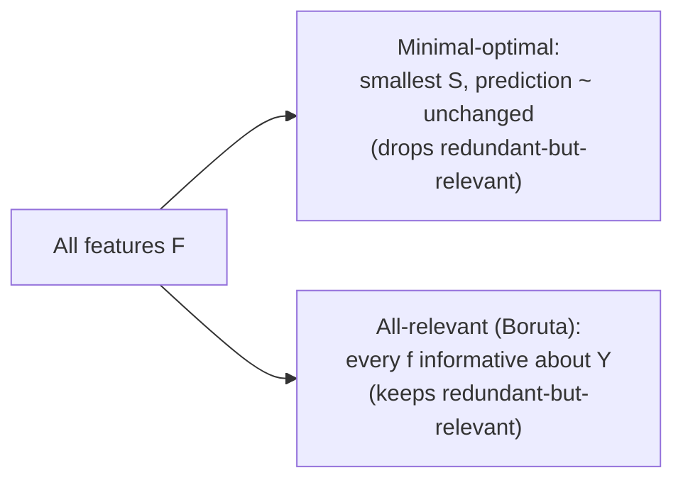
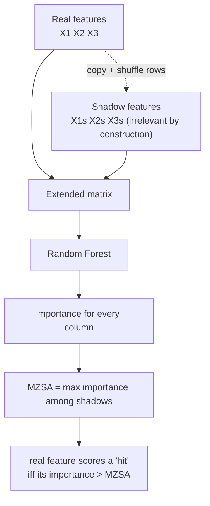

> **Learning artifact — not canonical, not a report.** This is the process record of a teaching session.
> Every number is cited to its source by code; nothing here is a source of truth. When this disagrees
> with an owning E record or the extended manuscript, those authorities win.

# The Boruta feature selector

Boruta is a wrapper feature-selection algorithm built on top of a Random Forest. Its one distinctive goal: find **every** feature that carries information about the target — the *all-relevant* set — not just the smallest subset that predicts well. It does this with a trick called **shadow features**: it builds randomized copies of your features that are guaranteed to be irrelevant, then keeps only the real features that beat the best of those copies, repeatedly, until the decision is statistically stable.

Caveat up front: Boruta is not in this thesis's repo or brain — this lesson grounds in the original paper (Kursa & Rudnicki 2010). A canonical note does not exist yet (`\gap`); if it becomes load-bearing for the thesis, route it through `/scout` → `paper-digest`.

The three pieces we'll build, simple-first:

1. **The goal** — *minimal-optimal* vs *all-relevant* selection. Why "the best predictor set" and "every informative feature" are different questions.
2. **The mechanism** — shadow features as a built-in null. How you manufacture a reference for "how important does a feature look by pure chance?"
3. **The decision rule** — comparing each real feature to the best shadow, iterating, and the binomial test that confirms/rejects.

---

## Part 1 — The goal: minimal-optimal vs all-relevant

Most feature selection you've met answers a *minimal-optimal* question: **what is the smallest set of features that gives (near-)best predictive accuracy?** Lasso, recursive feature elimination, forward/backward stepwise — all of these try to throw away as much as possible while keeping prediction high.

That objective has a built-in blind spot. Suppose two features are strongly correlated and both genuinely informative — say two voxels that both track the same brain signal. A minimal-optimal method picks **one** of them and discards the other, because once you have one, the second adds little *predictive* value. The discarded one looks redundant to the predictor, even though it is genuinely related to the target.

Boruta asks a different question — the *all-relevant* one: **which features carry any information about the target at all**, whether or not a leaner model could do without them? It will keep *both* correlated voxels, because both are truly related to the signal. This is the right question when the goal is understanding the system (which features matter, mechanistically) rather than building the most compact predictor.

$$\text{minimal-optimal} \;=\; \underset{S \subseteq F}{\arg\min}\; |S| \quad\text{s.t.}\quad \mathrm{acc}(S) \approx \mathrm{acc}(F)$$
$$\text{all-relevant} \;=\; \{\, f \in F : f \text{ carries information about } Y \,\}$$

**Question.** Two correlated, genuinely-informative voxels A and B. Lasso keeps one, Boruta keeps both. Why does each make its choice — what is each optimizing for?

**Your answer.** Minimal-optimal = smallest set that still carries the information → leaner model. Boruta keeps both because the goal is to find which features relate to Y at all, not the compact set. Initially framed Boruta as "test whether the task is achievable with all the data," and conflated *unrelated* with *adds no extra information*.

**Where it landed.** Minimal-optimal: correct. Correction that stuck: when Lasso drops B it is saying "B adds no predictive value **given A**," NOT "B is unrelated to Y." Redundant-for-prediction ≠ unrelated-to-target. All-relevant exists precisely so a redundant-but-real feature is not falsely declared irrelevant. Final framing (his own): all-relevant is for "many features, don't know which relate to Y"; minimal-optimal is for "known-relevant features, want the smallest subset." Derived with one hint.

---

## Part 2 — The mechanism: shadow features as a built-in null

Now the real problem. A Random Forest hands every feature an **importance score** (e.g. mean decrease in accuracy when that feature's values are permuted, often standardized to a Z-score). But importance is only meaningful *relative to something*. A feature that is pure noise still gets a nonzero importance just by chance — with enough features, some junk feature will look impressive on a given run. So a raw score of, say, 4.2 tells you nothing on its own. You need to know: **how high does importance climb for a feature that is definitely irrelevant?**

Boruta manufactures that reference. For every real feature it adds a **shadow feature**: a copy of that column whose values are **randomly permuted across the samples**. Permuting destroys any relationship between that column and the target $Y$ (the pairing of feature-value to outcome is scrambled), while keeping the column's *marginal distribution* identical — same values, same range, same histogram. So a shadow is, by construction, a feature with zero true relevance but the exact same "shape" as a real one.

Then it trains the Random Forest on the **extended set** (all real features + all shadows) and reads off importances for everyone. The shadows give you an empirical answer to "what does importance look like under no real relationship?" The single most important number is the **maximum importance among all shadows**, $\mathrm{MZSA}$ (max Z-score of a shadow attribute) — the highest bar that *known-irrelevant* features cleared by luck this run. A real feature only counts as a "hit" this round if its importance **exceeds** that bar:

$$\text{hit}(f) \;\Longleftrightarrow\; \mathrm{imp}(f) \;>\; \mathrm{MZSA} \;=\; \max_{s \in \text{shadows}} \mathrm{imp}(s)$$

Why permute the real columns instead of just adding Gaussian noise columns? Because the null must be a *fair* one — same distribution, same scale, same interaction potential with the forest as the real features. A Gaussian-noise column might be easier or harder for trees to exploit by chance than your actual features; a permuted copy of feature $f$ is the honest "what if $f$ had no link to $Y$" counterfactual.

**Question.** *(asked in the terminal)*

**Your answer.** *(recorded at the part boundary)*

**Where it landed.** *(recorded at the part boundary)*
