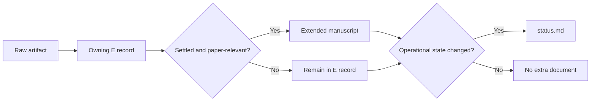

> **Learning artifact — not canonical, not a report.** This is the process record of a teaching session.
> Every number is cited to its source by code; nothing here is a source of truth. When this disagrees
> with an E record or the extended manuscript, those authorities win.

# The cleaned repository pipeline

The cleanup did not remove rigor; it removed duplicated ownership and compulsory documentation churn.
The repository now has four authorities, a single evidence transaction, lightweight interaction stances, and a selective close step.
The governing sources are [the methodology contract](../../03-methodology.md), [current status](../../status.md), and [decision D056](../../decisions/decisions.md#d056--usage-evidenced-source-of-truth-cutover--2026-07-13-s100-meta).

## Part 1 — The four authorities

Each fact has one proper owner.

| Question | Owner |
|---|---|
| What was run, how, and what did it produce? | The owning E record and retained load-bearing artifacts |
| What does the thesis currently conclude? | The extended manuscript |
| Where are we and what happens next? | `docs/status.md` |
| Why did the project change? | Decisions, learnings, selected consequential timelines, and Git |

The old ladder, upspeed file, task board, reports, checkpoint log, and writing orchestration were removed because they copied or competed with these owners.
Public manuscript cuts remain immutable snapshots; the extended manuscript is the live scientific interpretation.

## Part 2 — The scientific transaction

The important direction is upstream first.
A result is recorded in its E record before it becomes prose.
If writing exposes a contradiction, the manuscript is marked `manuscript-sync-pending` and the claim returns to `/interpret`; writing may not silently repair the science.
Only manuscript-load-bearing artifacts receive stable paths and checksums in their owning E records.

## Part 3 — The stances

Stances describe the job being done; they are not separate pipelines or databases.

| Stance | Job | Output boundary |
|---|---|---|
| `/work` | Lock and run an experiment | Produces recorded evidence; explicit-only |
| `/interpret` | Recompute and adjudicate evidence | Proposes a verdict for user confirmation |
| `/write` | Integrate settled findings | Edits the extended manuscript directly |
| `/review` | Stress-test design, result, code, or prose | Critique only |
| `/plan` | Choose the next direction | No new scientific result |
| `/scout` | Retrieve papers or datasets | External evidence and canonical notes |
| `/teach` | Transfer understanding | Non-authoritative learning artifacts |
| `/meta` | Simplify or repair the apparatus | Method/tool changes, not science |

Before new compute, `/work` uses `/precheck` to lock controls and obtain a design PASS.
After a run, `/interpret` independently recomputes the load-bearing contrast, attacks it with fresh review, and asks Erfan to confirm the verdict.
`/write` then moves only settled, paper-relevant conclusions into the manuscript and runs the deterministic manuscript checker plus one fresh independent review.

## Part 4 — Opening and closing a session

`/orient` is deliberately narrow: read `status.md`, check Git, follow only the evidence or manuscript links needed for the first next action, and wait for direction.
It does not reconstruct the present from timelines.

`/wrap` still exists, but the old wrap swarm and board synchronization are gone.
The close procedure asks what actually changed and updates only the proper owner:

1. Evidence or adjudication changed: update the E record.
2. Current thesis interpretation changed: update the extended manuscript.
3. Active work, blocker, or next action changed: update `status.md`.
4. A durable rationale or reusable lesson emerged: update decisions or learnings.
5. A consequential result, correction, milestone, decision, learning, or lasting failure occurred: optionally add one timeline.
6. A folder contract changed: update its nearest `AGENTS.md`.
7. Run relevant checks, stage explicit files, commit atomically, and push by default.

A monitoring, orientation, formatting, continuation, or no-change session may close with no documentation edit and no commit.
This is the central cleanup principle: reflection remains, but reflection must earn a durable owner.

## Part 5 — The practical mental model

At any point, ask four questions:

1. Am I producing evidence, interpreting evidence, writing settled evidence, or doing support work?
2. Which single authority owns the thing that changed?
3. Does this change affect the thesis or only operations?
4. Is there a durable reason to preserve, or would Git already tell the whole story?

The desired end state is not “every session leaves documents.”
It is “every durable change reaches exactly one correct owner, and nothing is copied merely to prove the session happened.”

**Check question.** If a session only reads the share-ready manuscript and finds no problem, what should `/wrap` change?

