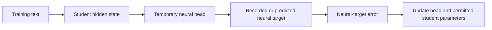
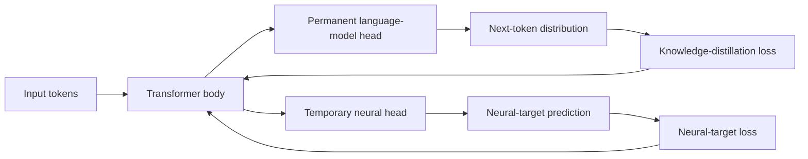

> **Learning artifact — not canonical, not a report.** This is the process record of a teaching session.
> Every number is cited to its source by code; nothing here is a source of truth. When this disagrees
> with an E record or the canonical rewrite manuscript, those authorities win.

# Training target versus brain-alignment evaluation

The simplest distinction is **lesson versus exam**. During training, the student receives feedback from a recorded or predicted neural target. During evaluation, that feedback mechanism is removed and a new readout tests what information remains accessible inside the frozen student on held-out stimuli. The two procedures use related brain-response data, but they play different experimental roles.

---

## Part 1 — What updates the student, and what only measures it?

### What the thesis actually trained

For each training stimulus, a selected student layer feeds a temporary neural prediction head. The head predicts a recorded or predicted neural-response target. Its prediction error is added to the ordinary knowledge-distillation loss. Gradients from that auxiliary error update the permitted student parameters and the temporary head.

After training, the temporary head is discarded. This is defined in the Introduction's pipeline caption and the Methods subsection on intervention objectives ([Introduction](../../manuscript/rewrite/sections/01_introduction.tex), [Methods](../../manuscript/rewrite/sections/03_experimental_framework.tex)).

### What the thesis evaluated

The retained student is frozen. A fresh ridge encoding model is then fitted from its hidden representations to recorded brain responses using only the training portion of an evaluation split. The fitted readout predicts responses for held-out stimuli, and the alignment statistic summarizes that held-out prediction beyond the declared controls. This evaluation does not update the student ([Methods](../../manuscript/rewrite/sections/03_experimental_framework.tex)).

### The two scientific questions

The experiment performed by the thesis asks:

> Does neural-target supervision change the retained student in a way that transfers to a fresh, held-out brain-response evaluation beyond matched controls?

A different, unperformed experiment would ask:

> Can the student be trained by directly maximizing the same brain-alignment statistic later used to judge it?

Both are scientific questions. Only the first matches the intervention that was run. The second would require a different differentiable training procedure and a separate untouched evaluation to determine whether the model learned transferable structure rather than merely optimizing the chosen score.

### Why the governing question is aligned

A clear governing question is:

> Can supervision from recorded or predicted neural responses give a distilled student a reliable, brain-specific advantage over matched non-neural training?

“Supervision from neural responses” names what enters training. “Advantage over matched non-neural training” names the controlled comparison. “Reliable and brain-specific” requires the effect to survive an independent evaluation and the correct inference unit. The brain-alignment score is therefore evidence used to answer the governing question, not the object directly optimized by the reported experiments.

**Question.** Which component is discarded before evaluation, and why does discarding it make the held-out alignment test more informative?

**Your answer.** The temporary neural head is discarded. Its removal prevents evaluation from depending on the same fitted component used to predict the neural target during training.

**Where it landed.** The discarded component was identified correctly. The point to re-check was the loss routing: the language-model loss flows through the permanent language-model head, while the neural-target loss flows through the temporary neural head. Both can update permitted transformer parameters, but the neural head is not trained by the language-model loss. A fresh evaluation readout tests information retained in the student rather than skill retained only in the temporary head.

---

## Part 2 — What is a head?

A **head** is a translator from a model's general hidden representation into the output required by one task. The transformer body produces hidden vectors. A head gives those vectors a task-specific meaning by mapping them into an output space.

The student's permanent **language-model head** maps the final hidden vector into one score, called a logit, for every vocabulary token. After normalization, those scores form the next-token probability distribution. Knowledge distillation compares this student distribution with the teacher's distribution. The language-model head remains attached because generating text is the student's main job.

The temporary **neural head** taps a selected hidden layer and maps its vector into the neural-target space, such as ROI responses or a dense response vector. Its prediction error supplies an auxiliary training signal. It is discarded because neural-target prediction is a training instrument, not the deployed student's output task.

The heads do different jobs but can shape the same transformer body through their gradients. The permanent head asks the body to preserve language behavior. The temporary head asks a selected representation to expose information useful for predicting the neural target. The scientific test is whether anything useful from that auxiliary pressure remains in the body after the temporary head is removed.

**Question.** If the language-model head and temporary neural head both read from the student, what different output does each head produce?
