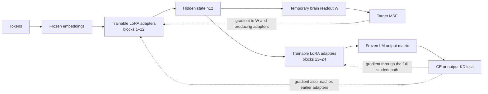

> **Learning artifact — not canonical, not a report.** This is the process record of a teaching session.
> Every number is cited to its source by code; nothing here is a source of truth. When this disagrees
> with an E record or the extended manuscript, those authorities win.

# Layer 12 is the attachment point, not the only layer trained

The short answer is that the recorded-response loss is **measured at** the student’s layer-12 hidden
state, but its gradient updates every trainable adapter that helped produce that state. In the primary
Qwen intervention, that means the target-loss branch can update the adapters through layer 12. It does
not update adapters in later blocks, because those blocks are downstream of the point where that branch
leaves the model. The ordinary text loss, cross-entropy or output knowledge distillation, is still
computed at the output and updates adapters across the whole network
([training appendix](../../manuscript/rewrite/sections/C_training_architecture.tex);
[`run_brain_lever.py`](../../../scripts/run_brain_lever.py)).

---

## Part 1 — Separate loss attachment from gradient reach

Let the student be a chain of hidden states:

$$
h_0 \longrightarrow h_1 \longrightarrow \cdots \longrightarrow h_{12}
\longrightarrow \cdots \longrightarrow h_{24}
\longrightarrow z_{\mathrm{LM}}.
$$

The primary recorded-response branch is:

$$
\widehat y = W h_{12},
\qquad
\mathcal L_{\mathrm{target}} =
\operatorname{MSE}(\widehat y,y),
$$

and the joint objective is:

$$
\mathcal L =
\lambda_{\mathrm{text}}\mathcal L_{\mathrm{text}}
+
\lambda_{\mathrm{target}}\mathcal L_{\mathrm{target}}.
$$

For a trainable parameter in an early block, the target gradient follows the chain rule through
$h_{12}$:

$$
\frac{\partial \mathcal L_{\mathrm{target}}}{\partial \theta_j}
=
\frac{\partial \mathcal L_{\mathrm{target}}}{\partial h_{12}}
\frac{\partial h_{12}}{\partial \theta_j},
\qquad j\leq 12.
$$

For a parameter that appears only after $h_{12}$, there is no path from the target loss to that
parameter:

$$
\frac{\partial \mathcal L_{\mathrm{target}}}{\partial \theta_j}=0,
\qquad j>12.
$$

That later parameter can still receive a nonzero gradient from $\mathcal L_{\mathrm{text}}$.
The implementation constructs the target prediction from `out.hidden_states[layer]`, adds the weighted
target loss to the text loss, and calls one `backward()` on the sum. The manuscript’s training appendix
states the same parameter path explicitly
([`run_brain_lever.py`](../../../scripts/run_brain_lever.py);
[training appendix](../../manuscript/rewrite/sections/C_training_architecture.tex)).

### Why layer 12 was used

This was a locked measurement-to-intervention choice, not proof that layer 12 is universally optimal.
The preceding feasibility experiment tested a fixed layer grid and found the Qwen student’s controlled
alignment to peak at its middle-layer verdict point, layer 12. The intervention then attached the target
head at that already validated representation instead of searching layers again after seeing intervention
outcomes ([E002](../../experiments/E002_tuckute-encoding-feasibility.md);
[E004](../../experiments/E004_brain-loss-lever-test.md)).

This choice has three defensible properties:

1. It trains the representation in the same space in which the neural signal had already been measured.
2. It avoids a broad post hoc layer sweep and its winner’s-curse risk.
3. It leaves later blocks free to reconcile the shaped middle representation with the language objective.

The third point is a mechanistic rationale, not an experimentally established advantage of middle-layer
attachment.

### Would final-layer attachment work?

Yes, if “final layer” means the **final hidden state before the vocabulary output head**. A temporary
brain projection attached there would send its gradient through all preceding trainable blocks. That is
a legitimate alternative intervention.

It should not normally mean applying brain MSE directly to vocabulary logits. Logits live in a
token-vocabulary prediction space, not the neural-response space, so a separate biological projection is
still needed. Moving the projection to the final hidden state also changes the hypothesis: it forces the
representation closest to next-token prediction to serve both objectives, which may increase conflict
with CE or KD and removes the late-block “reconciliation” slack.

The repository has **not** run a prospective layer-placement comparison, so it cannot claim that layer
12 is better than the final hidden state. The current prospective proposal is a small nested comparison
of an upper-middle layer, a late hidden layer, and a learned mixture, with matched gradient scale and
untouched evaluation data
([H002](../../hypotheses/H002_repeat-stable-biological-supervision.md)).

**Question.** If the target head stays at layer 12, which adapters receive both the text-loss and
target-loss gradients, and which receive only the text-loss gradient?
