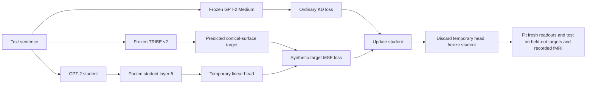

> **Learning artifact — not canonical, not a report.** This is the process record of a teaching session.
> Every number is cited to its source by code; nothing here is a source of truth. When this disagrees
> with an E record or the canonical rewrite manuscript, those authorities win.

# Synthetic TRIBE targets in knowledge distillation

The experiment does not treat TRIBE output as newly recorded fMRI. TRIBE is a frozen generator that
predicts an fMRI-like response on a standardized cortical surface from each text sentence. That predicted
response becomes an auxiliary training target for a smaller language-model student. Actual recorded fMRI
enters only later, in the independent biological-transfer evaluation. The experiment therefore tests
whether learning a synthetic neural target changes the student's retained representation and whether any
change transfers to real measurements.

---

## Part 1 — What is generated, what is trained, and what is later tested

Three roles must be kept separate:

1. **Language teacher:** frozen GPT-2 Medium supplies softened next-token outputs for ordinary knowledge
   distillation.
2. **Synthetic-target generator:** frozen TRIBE v2 maps a sentence to predicted activity at the full
   fsaverage5 cortical-surface locations. These are predicted surface-vertex responses, not a participant's
   recorded voxel or ROI responses.
3. **Student:** GPT-2 is trained with the ordinary distillation loss and, in the synthetic-response arm,
   an additional loss that asks its pooled layer-6 representation to predict the standardized TRIBE vector
   through a temporary linear head.

The training objective is therefore:

$$
\mathcal L_{\mathrm{train}}
=
\mathcal L_{\mathrm{KD}}
+
\lambda_{\mathrm{target}}\mathcal L_{\mathrm{TRIBE}}.
$$

The temporary target head is discarded after training. This prevents success of that head by itself from
being mistaken for a lasting change in the student. Fresh readouts are then fitted to the frozen retained
student. The sources for this mechanism are Section 3.4 of the canonical rewrite manuscript, Appendix B's
“Synthetic brain-response and text-derived control targets,” Appendix C's training graph, and E016.

The student is already smaller than the language teacher: the recorded pair is
`gpt2-medium` to `gpt2` (E016 and Appendix C). “All student parameters are trained” means full-parameter
optimization of the smaller student, not that the student has the teacher's architecture or size.
The student architecture is held fixed across experimental arms so that the estimated difference is caused
by adding the synthetic target under the same capacity and training budget, rather than by changing model
size. This experiment estimates the effect of the auxiliary target at one fixed compression setting; it
does not estimate a scaling curve over several student sizes.

**Question.** In one sentence, where does actual recorded fMRI enter this synthetic-response experiment:
during student training, during downstream evaluation, or both?
