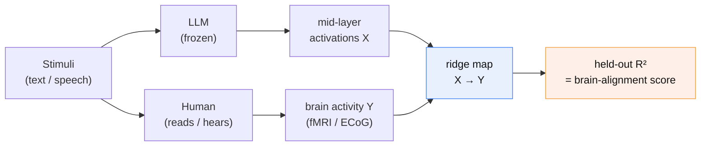
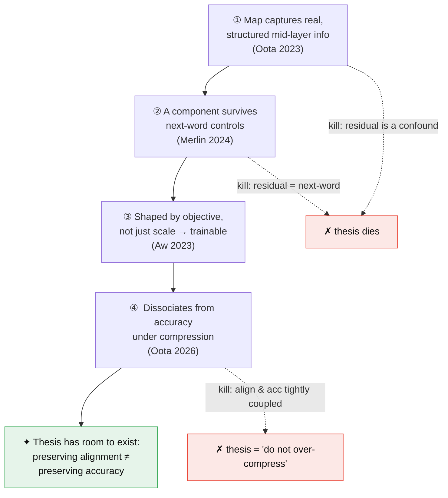

# R01 — The mapping between LLM internals and brain activation

**Last updated:** 2026-06-09

**Status:** First synthesis from existing canonical notes. Gaps flagged inline (§7).

**Sources:** synthesized from `docs/literature/canonical/` + `docs/01-research-landscape.md`. No new

search this pass (per analysis-session decision). Every claim is cited to its note.

**Scope:** what the mapping *is*, what *drives* it, how it *behaves* under scale/compression, and how

to *measure* it honestly. This is the foundation our thesis stands on; the distillation use case is

out of scope here (see `00-charter.md`).

---

## 1. What "the mapping" is, in one paragraph

Take a fixed, pretrained LLM. Run text/speech stimuli through it and pull out the hidden activations

of some layer. Separately, record human brain activity (fMRI/ECoG) while a person reads or hears the

*same* stimuli. Fit a **linear encoding model** — a ridge regression — from LLM activations to each

brain voxel. The held-out predictive accuracy of that regression is the **brain-alignment score**

(a.k.a. brain score / neural predictivity). The whole research program is about what that linear map

captures, when it is real versus an artifact, and whether it is load-bearing rather than incidental.

### 1.1 The map, formally

Let $X \in \mathbb{R}^{n \times d}$ be LLM layer activations over $n$ stimuli ($d$ hidden units) and

$Y \in \mathbb{R}^{n \times v}$ the recorded response of $v$ voxels. The encoding model is ridge

regression

$$
\hat{W} = \arg\min_{W}\; \lVert Y - XW \rVert_F^2 + \lambda \lVert W \rVert_F^2 ,
$$

and the **alignment score** is the held-out predictivity, per voxel and then aggregated,

$$
r_j = \mathrm{corr}\!\left(Y_j^{\text{test}},\, X^{\text{test}}\hat{W}_{\cdot j}\right),
\qquad \text{score} = \tfrac{1}{v}\textstyle\sum_j r_j \;\; (\text{or } R^2).
$$

The honest version never reports $\text{score}$ raw. It reports the **unique** variance the LLM adds

over a nuisance set $Z$ (length, position, static embeddings) — a banded/partitioned regression:

$$
\Delta R^2_{\text{unique}} = R^2(\,[X\;Z]\,) - R^2(\,Z\,).
$$

This $\Delta R^2_{\text{unique}}$ on **contiguous** splits is the only quantity that survives Feghhi

2024 (§4). It is exactly what our E001 harness computes (`unique_r2`).

Two things to keep straight:

- It is a **correlational, linear readout**, not a claim that the brain *is* the LLM. A high score

  means an LLM layer's geometry is linearly informative about brain activity — nothing more on its own

  (Kornblith 2019 makes the analogous point for representation-similarity metrics generally:

  geometry ≠ shared computation).
- The score lives in the **middle layers**. Alignment peaks in mid-depth and varies systematically

  with layer (Oota 2023), which is exactly why a compression that mangles mid-layer structure should

  be *detectable* through this map — the hook our thesis hangs on.

---

## 2. What the map actually captures (the drivers)

The literature has worked hard to decompose the score into *what kind* of information drives it. The

honest summary: it is mostly **structure**, the structure is **mostly syntactic with region-specific**

**semantics**, and there is a **residual that next-word prediction does not explain**.

- **Syntactic structure dominates the layer trend.** Removing probed properties from LLM

  representations lowers alignment; syntactic ones (Top Constituents, Tree Depth) drive the strongest

  layerwise effect, with semantics more region-specific (Oota 2023, `oota-2023`). A substantial

  residual remains after removing all tested properties → the feature set is incomplete.
- **There is a real residual beyond next-word prediction.** With a two-perturbation contrast

  (input scrambling + stimulus-tuning), positive alignment survives in IFG and AG even after

  controlling for word-level info *and* next-word prediction (Merlin &amp; Toneva 2024, `merlin-2024`).

  This is the **non-trivial target**: standard perplexity-only distillation has no reason to preserve

  it.
- **Training objective shapes it, not just scale.** Fine-tuning long-context models to summarize

  narratives raises alignment broadly, and the gain is *not* reducible to better LM loss — some models

  align better while their LM loss gets *worse* (Aw &amp; Toneva 2023, `aw-2023`). So the brain-relevant

  structure is at least partly **learnable / injectable through an objective**, which is the

  in-principle license for using it as a training signal.
- **Modality matters — raw scores can be hollow.** Text models keep above-chance late-language-region

  alignment after low-level feature removal; speech models collapse to chance there, their apparent

  "semantics" being mostly low-level phonology (Oota 2024, `oota-2024`). Lesson: a number is not a

  mechanism until you subtract the cheap explanations.

---

## 3. How the map behaves under scale and compression

This is the part most directly load-bearing for the thesis, because distillation *is* a scale/

compression intervention.

- **Alignment rises with scale, then saturates ~3B.** ~3B models match 7B–14B on brain alignment;

  ~1–1.5B models degrade consistently (Oota 2026, `oota-2026`, C1). Larger models can even *outgrow*

  the language network — alignment peaks early in training, tracks **formal** linguistic competence,

  and later decouples from next-word prediction and behavior, sometimes reversing in big models

  (AlKhamissi 2025, `alkhamissi-2025`).
- **Scale, not instruction-tuning, is what moves it.** At matched parameter count, instruction-tuning

  buys no naturalistic-reading alignment gain (Gao 2024, `gao-2024`). → for a naturalistic-alignment

  teacher, use a **base** model, not an instruct model.
- **Compression mostly preserves it, but not uniformly.** Most quantization + moderate pruning keep

  alignment; GPTQ and aggressive compression of small models degrade it more (Oota 2026, C2).
- **★ The key falsifiability anchor: benchmark competence and brain alignment partially**

  **dissociate under compression** (Oota 2026, C3). Linguistic-benchmark drops do not always produce

  proportional alignment drops. If they were perfectly coupled, "preserve alignment" would be a

  redundant way of saying "preserve accuracy" and the thesis would be empty. The *gap* between the two

  curves is the room our contribution needs to exist in.

---

## 4. The measurement traps (mandatory, not optional)

Half this literature is about how easy it is to fool yourself. Our protocol (L003) is built from

these.

- **Shuffled splits inflate everything.** On Pereira, random train/test splits are contaminated by

  temporal autocorrelation; **untrained** GPT2-XL "explains" the data via sentence length and

  position alone, and most trained-model explainable variance is simple non-contextual features

  (Feghhi 2024, `feghhi-2024`). → **contiguous splits**, nuisance baselines (length/position/static

  embeddings), and report gains **after confound subtraction**. Non-negotiable.
- **Aggregate scores mask mechanism.** The speech-model result (Oota 2024) is the cautionary twin:

  the same headline number can be semantics in one model and phonology in another. → decompose the

  feature space; never report a raw score as if it were understanding.

---

## 5. The measurement tools we have

- **Linear encoding model (ridge):** the standard map; predictivity = score. The workhorse.
- **Feature removal / residualization:** remove a probed property, re-fit, measure the alignment

  drop = that property's contribution (Oota 2023, 2024). Linear, so conservative (also removes

  correlated info).
- **Perturbation contrasts:** scramble input / stimulus-tune to control next-word vs word-level

  effects (Merlin 2024). The closest thing to a causal-style test in this literature.
- **CKA (representation similarity):** rotation/scale-invariant geometry comparison; recovers

  corresponding layers near-perfectly where CCA-family metrics fail (Kornblith 2019, `kornblith-2019`).

  Candidate **differentiable-ish alignment proxy** for a training loss — but it measures geometry, not

  function, and is sensitive to kernel/bandwidth choice. Relevant to the open

  $\mathcal{L}_{\text{brain}}$ design decision (D010).

---

## 6. What this means for our thesis (the through-line)

The pieces fit into one argument — and each link is also a place it can die:

1. The map captures real, structured, **mid-layer** information (Oota 2023) —
2. with a component that **survives next-word controls** (Merlin 2024) —
3. that is **shaped by training objective, not just scale** (Aw 2023), so it can in principle be a

   training target —
4. and that **partially dissociates from benchmark accuracy under compression** (Oota 2026), so

   preserving it is not trivially the same as preserving accuracy.

That conjunction is the thesis's reason to exist. If any link breaks — e.g. the residual turns out to

be a confound, or alignment and accuracy turn out tightly coupled — the contribution shrinks or dies.

The measurement traps (§4) are exactly the ways link (1)–(2) could be illusory, which is why the

anti-confound protocol is load-bearing, not bureaucratic.

---

## 7. What we are missing (gaps — flagged for the next search/run)

- **G1 — The 2026 reframe is not yet folded in here.** `upspeed.md` flags **Merlin &amp; Toneva 2026**

  ("When LMs Lose Their Mind" / fine-tuning shows alignment is functionally load-bearing). If that

  paper already proves alignment is causally useful via fine-tuning, our differentiation must be

  sharp: **compression/distillation at matched budget**, not "alignment matters." This report should

  be updated the moment that paper is digested. (Not in canonical/ yet.)
- **G2 — No quantitative own-data anchor.** Every number here is from the literature. We have **no**

  **real-data brain-alignment number of our own** — E001 ran on synthetic fMRI (plumbing only). Until a

  working session runs `--backend pereira`/lebel, this report cannot state *our* effect size.
- **G3 — The **$\mathcal{L}_{\text{brain}}$** form is undecided.** Frozen encoding-map loss vs CKA proxy

  vs trainable head (D010, head overfits). §5 lists the tools; the literature does not pick for us.
- **G4 — Decoding (brain→text) direction not covered.** This report is encoding-only (LLM→brain).

  Whether the inverse map adds anything for our purpose is unsurveyed.
- **G5 — Dataset-specificity of every claim.** Drivers are largely from Harry Potter / Pereira /

  one naturalistic set each. Cross-dataset generalization of the *drivers* (not just the scores) is

  thinly evidenced. Narratives/LeBel generalization runs would address this.
- **G6 — Nonlinear maps.** The whole program is linear-readout. Whether a nonlinear map changes the

  attribution story is an explicit open question in multiple notes (Oota 2023/2024) and unaddressed

  here.

---

## Source table

| Claim area                          | Paper                    | Note                                                       |
| ----------------------------------- | ------------------------ | ---------------------------------------------------------- |
| Layer trend / syntax drives it      | Oota 2023                | `oota-2023_joint-linguistic-processing-brain-lms`          |
| Residual beyond next-word           | Merlin &amp; Toneva 2024 | `merlin-2024_beyond-next-word-brain-alignment`             |
| Objective shapes alignment          | Aw &amp; Toneva 2023     | `aw-2023_narrative-summarization-improves-brain-alignment` |
| Raw scores can be hollow (modality) | Oota 2024                | `oota-2024_speech-lms-lack-brain-semantics`                |
| Scale↑, saturates ~3B, dissociation | Oota 2026                | `oota-2026_brain-encoding-scale-compression`               |
| Outgrows LN; formal&gt;functional   | AlKhamissi 2025          | `alkhamissi-2025_llms-outgrow-human-language-network`      |
| Scale not instruction-tuning        | Gao 2024                 | `gao-2024_scaling-not-instruction-brain-alignment`         |
| Confounds / split contamination     | Feghhi 2024              | `feghhi-2024_case-against-over-reliance-brain-scores`      |
| Similarity metric (CKA)             | Kornblith 2019           | `kornblith-2019_cka-similarity-representations`            |

**Not yet in canonical/ (must digest, then update this report):** Merlin &amp; Toneva 2026; LeBel 2023.

</content>

