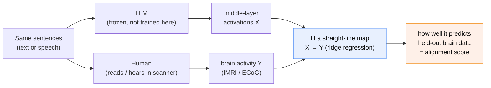
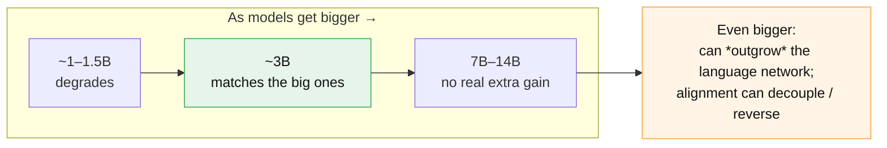
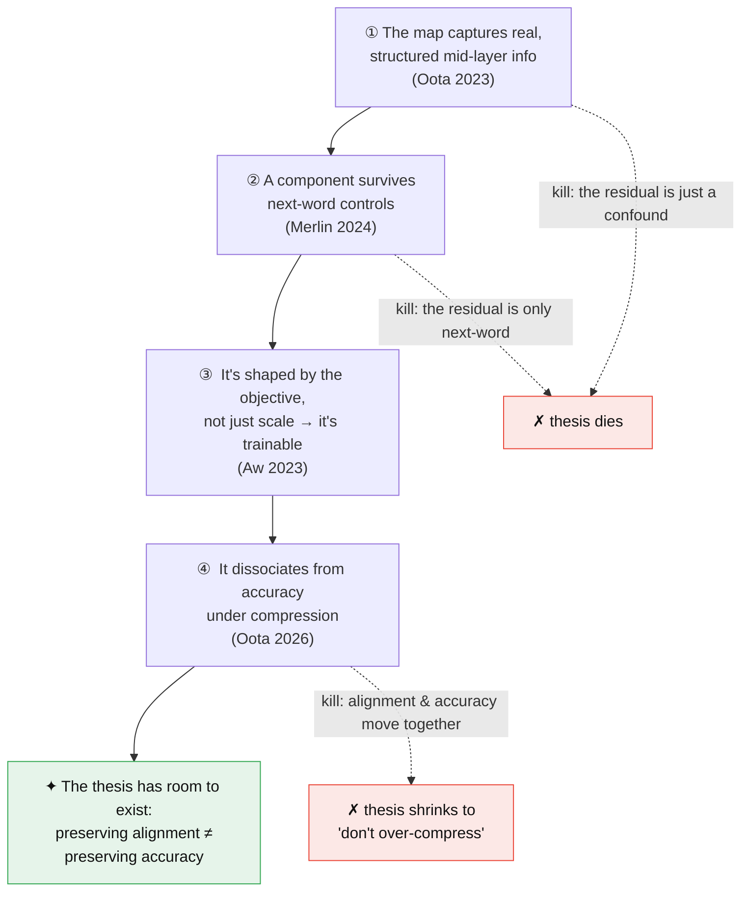

# R01 — The mapping between LLM internals and brain activation

**Last updated:** 2026-06-10
**Status:** Synthesis from existing canonical notes, written to be read and understood end-to-end. Gaps flagged inline (§7). No new search or numbers this pass — every claim is cited to its canonical note.
**Sources:** synthesized from `docs/literature/canonical/` + `docs/01-research-landscape.md`.
**Scope:** what the mapping *is*, what *drives* it, how it *behaves* under scale/compression, and how to *measure* it honestly. This is the foundation the thesis stands on; the distillation use case itself is out of scope here (see `00-charter.md` and `R03`).
**Who this is for:** you (now, or in three months), a committee member, or a collaborator who wants to understand *what we are standing on* before touching the experiments.

> **One-line version.** There is a simple linear ruler that measures how much an LLM's internal activity resembles a human brain's activity on the same text. This report explains what that ruler measures, when the number is real versus a mirage, and why the whole thesis lives or dies on four specific facts about it.

---

## 0. The 30-second mental model

Imagine you sit a person and a language model in front of the *same* sentences.

- The **person** reads them in an MRI scanner; we record which bits of their brain light up.
- The **model** reads them too; we record the numbers flowing through one of its middle layers.

Now ask a blunt question: *can I predict the brain from the model?* If a simple straight-line formula turns the model's numbers into the brain's numbers — on sentences it has never seen — then the model and the brain are, in some measurable sense, organizing language the same way. **How well that straight-line prediction works is the "brain-alignment score."**

That is the whole object. Everything below is about (a) doing this honestly, (b) understanding what the score is really made of, and (c) why a *compressed* model that loses this alignment is the opening our thesis needs.

---

## 1. What "the mapping" is

Take a **frozen, pretrained LLM** — we do not train it, we just run text through it and read off the activations at one layer. Separately, record human brain activity (fMRI or ECoG) while a person reads or hears the *same* stimuli. Then fit a **linear encoding model** — a ridge regression — that turns LLM activations into predicted brain activity. The accuracy of that prediction on **held-out** data is the **brain-alignment score** (also called brain score or neural predictivity).

The entire research program is one question asked carefully: *what does that linear map capture, when is it real rather than an artifact, and is it load-bearing rather than incidental?*

### 1.1 The same thing, in math

Let $X \in \mathbb{R}^{n \times d}$ be the LLM layer's activations over $n$ stimuli ($d$ hidden units), and $Y \in \mathbb{R}^{n \times v}$ the recorded response of $v$ brain voxels. The encoding model is ridge regression:

$$\hat{W} = \arg\min_{W}\; \lVert Y - XW \rVert_F^2 + \lambda \lVert W \rVert_F^2 .$$

In words: find the weight matrix $W$ that best turns model activations into brain activity, with a penalty ($\lambda$) that stops the weights from blowing up — that penalty is what makes it *ridge* regression, and it is what keeps the fit honest when $d$ is large.

The **alignment score** is how well that fitted map predicts brain data it was *not* trained on, measured per voxel and then averaged:

$$r_j = \mathrm{corr}\!\left(Y_j^{\text{test}},\, X^{\text{test}}\hat{W}_{\cdot j}\right), \qquad \text{score} = \tfrac{1}{v}\textstyle\sum_j r_j \;\;(\text{or } R^2).$$

### 1.2 The honest score (read this twice)

You must **never report that raw score**. A model can "predict" the brain for boring reasons — longer sentences, word position, generic word embeddings — that have nothing to do with deep language understanding. So the real quantity is the **extra** predictive power the LLM adds *on top of* those boring nuisance features $Z$:

$$\Delta R^2_{\text{unique}} = R^2(\,[X\;Z]\,) - R^2(\,Z\,).$$

Read it as: "how much better can I predict the brain when I am allowed the model's activations **and** the nuisance features, versus the nuisance features alone?" That gap — measured on **contiguous** (not shuffled) splits — is the only number that survives the field's harshest critique (Feghhi 2024, see §4). It is exactly what our own E001/E002 harness computes and calls `unique_r2`.

### 1.3 Two things to never forget

- **It is a correlation, not an identity.** A high score means *one LLM layer's geometry is linearly informative about brain activity*. It does **not** mean "the brain is the LLM." Geometry lining up is not the same as shared computation (Kornblith 2019 makes this point for similarity metrics generally).
- **The action is in the middle.** Alignment peaks in the model's *mid-depth* layers and changes systematically with depth (Oota 2023). That is not a footnote — it is the hook the thesis hangs on. If a compression technique mangles mid-layer structure, this map is the instrument that should *detect* it.

---

## 2. What the score is actually made of (the drivers)

A number is useless until you know what is inside it. The field has spent years prying the score apart. The honest one-line summary: it is mostly **structure**, the structure is **mostly syntactic with region-specific semantics**, and there is a **residual that next-word prediction does not explain**. In four beats:

| Driver | What the evidence says | Source |
|---|---|---|
| **Syntax dominates the layer trend** | Strip out probed properties and alignment drops; *syntactic* ones (constituent structure, tree depth) drive the strongest layerwise effect. Semantics is more region-specific. A residual remains after removing everything tested → our feature list is incomplete. | Oota 2023 |
| **A piece survives "it's just next-word prediction"** | Using two perturbations (scrambling the input, tuning to the stimulus), positive alignment *survives* in language regions (IFG, AG) even after controlling for word-level info **and** next-word prediction. | Merlin & Toneva 2024 |
| **The objective shapes it, not just size** | Fine-tuning long-context models to *summarize narratives* raises alignment — and the gain is **not** explained by better language-model loss. Some models align *better* while their LM loss gets *worse*. | Aw & Toneva 2023 |
| **Raw scores can be hollow** | Text models keep above-chance alignment in late language regions after low-level features are removed; *speech* models collapse to chance — their apparent "semantics" was mostly low-level phonology. | Oota 2024 |

Two of these are doing heavy lifting for us, so here is *why* in plain terms:

- **Merlin & Toneva 2024 is the "non-trivial target."** If the only thing the brain-alignment signal captured were next-word prediction, then ordinary distillation (which already trains a student to copy a teacher's next-word probabilities) would preserve it *for free*, and we would have nothing to add. The fact that a *residual* survives next-word controls is what gives our signal something real to protect.
- **Aw & Toneva 2023 is the "it's trainable" license.** If brain-relevant structure can be *injected* by choosing a training objective, then in principle it can be a training target — which is the in-principle license for the entire premise of using alignment as a signal.

---

## 3. How the map behaves under scale and compression

This section is the most load-bearing one for the thesis, because **distillation is a compression intervention** — we shrink a model and ask what survives.

- **Alignment rises with scale, then saturates around ~3B.** Roughly-3B models match 7B–14B on brain alignment; ~1–1.5B models degrade consistently (Oota 2026, finding C1). Past a point, bigger models can even *outgrow* the human language network — alignment peaks early in training, tracks **formal** linguistic competence, and later decouples from next-word prediction and behavior, sometimes reversing in the largest models (AlKhamissi 2025).
- **It is scale that moves the needle, not instruction-tuning.** At matched parameter count, instruction-tuning buys no naturalistic-reading alignment gain (Gao 2024). **Practical consequence: for a naturalistic-alignment teacher, use a *base* model, not an instruct model.**
- **Compression mostly preserves alignment — but not uniformly.** Most quantization and moderate pruning keep it; GPTQ and aggressive compression of *small* models hurt it more (Oota 2026, C2).
- **★ The falsifiability anchor — the single most important fact in this report.** Benchmark competence and brain alignment **partially dissociate** under compression (Oota 2026, C3). When you compress a model, its linguistic-benchmark score and its brain-alignment score do **not** fall in lockstep. That *gap between the two curves* is the room our thesis needs to exist. If they were perfectly coupled, "preserve alignment" would just be a fancy way of saying "preserve accuracy," and the thesis would be empty. (Why this is existential is spelled out in §6.)

---

## 4. The traps (how to avoid fooling yourself)

Half of this literature is about how *easy* it is to report a beautiful number that means nothing. Our protocol (learnings L003) is built directly from these warnings, and they are **non-negotiable**, not bureaucracy.

- **Shuffled splits inflate everything.** On the Pereira dataset, random train/test splits leak information through temporal autocorrelation. The proof is brutal: an **untrained** GPT2-XL can "explain" the data using sentence length and position alone, and most of a *trained* model's explainable variance turns out to be simple non-contextual features (Feghhi 2024).
  → **Always:** contiguous splits; nuisance baselines (length, position, static embeddings); report gains **after** subtracting those confounds.
- **Aggregate scores hide the mechanism.** The speech-model result (Oota 2024) is the cautionary twin of the text result: the *same headline number* can be genuine semantics in one model and shallow phonology in another.
  → **Always:** decompose the feature space; never present a raw score as if it were "understanding."

> Rule of thumb: **a number is not a mechanism until you have subtracted the cheap explanations.**

---

## 5. The instruments in our toolbox

| Tool | What it does | Caveat |
|---|---|---|
| **Linear encoding model (ridge)** | The workhorse. Predicts brain from model; predictivity = score. | Linear by design — conservative. |
| **Feature removal / residualization** | Remove a probed property, refit, measure the alignment drop = that property's contribution (Oota 2023/2024). | Removes *correlated* info too, so it under-credits. |
| **Perturbation contrasts** | Scramble input / tune to stimulus to separate next-word effects from word-level effects (Merlin 2024). | Closest thing to a causal test the field has. |
| **CKA (representation similarity)** | Rotation/scale-invariant geometry comparison; recovers matching layers where CCA-family metrics fail (Kornblith 2019). | Measures *geometry, not function*; sensitive to kernel/bandwidth choice. A candidate for a differentiable training loss — see open decision D010. |

---

## 6. Why this all matters — the thesis through-line

Here is the argument as a chain. Each link is also a way the thesis could **die** — which is exactly why we measure so carefully.

Read top to bottom:

1. The map captures **real, structured, mid-layer** information (Oota 2023) —
2. with a part that **survives next-word controls** (Merlin 2024), so it is not trivially what distillation already copies —
3. that is **shaped by the training objective, not just scale** (Aw 2023), so it *can* in principle be a training target —
4. and that **partially dissociates from benchmark accuracy under compression** (Oota 2026), so preserving it is **not** secretly the same as preserving accuracy.

That conjunction is the thesis's reason to exist. Break any link and the contribution shrinks or dies:

- If the surviving residual (links 1–2) turns out to be a measurement confound, the signal was never real — and §4's anti-confound protocol is precisely how we keep checking that it is not. (This is the question E002 answered on real data — see §7, G2.)
- If alignment and accuracy turn out *tightly* coupled under compression (link 4), then "preserve alignment" is just a fancy way of saying "preserve accuracy," and the thesis collapses to the trivial advice *do not over-compress*.

---

## 7. What we don't yet know (honest gaps)

These are flagged so the next working session knows where to dig. Nothing here is a number to invent — each is a hole to fill with a real run or a real paper.

| # | Gap | Why it matters |
|---|---|---|
| **G1** | **The 2026 reframe isn't folded in.** Merlin & Toneva 2026 ("When LMs Lose Their Mind") reportedly shows alignment is *functionally load-bearing* via fine-tuning. Not yet in `canonical/`. | If alignment is already proven causally useful, our differentiation must sharpen to **compression/distillation at matched budget** — not the weaker claim "alignment matters." |
| **G2** | **Own-data anchor.** Every number in this report is from the literature. E001 ran on *synthetic* fMRI (plumbing only). | Until a working session runs real data, we cannot state **our** effect size. *(Update: E002 has since run the real-data feasibility probe on Tuckute 2024 — see `experiments/E002`. This gap is now largely resolved; fold the result into this report on the next pass.)* |
| **G3** | **The loss form $\mathcal{L}_{\text{brain}}$ is undecided.** Frozen encoding-map loss vs. CKA proxy vs. trainable head (which overfits). See decision D010. | The literature lists the tools (§5) but does not pick one for us. |
| **G4** | **Decoding (brain→text) not covered.** This report is encoding-only (LLM→brain). | Whether the inverse map adds anything for our purpose is unsurveyed. |
| **G5** | **Dataset-specificity.** Drivers come largely from the Narratives "21st year" *listening* set (Oota 2023) / Pereira / one naturalistic set each. | Cross-dataset generalization of the *drivers* (not just scores) is thinly evidenced. Narratives/LeBel runs would address this. (Oota 2023 is a *listening* dataset, **not** Harry Potter — corrected 2026-06-10, L009.) |
| **G6** | **Linearity.** The whole program uses a *linear* readout. | Whether a nonlinear map changes the attribution story is an open question in several notes. |

---

## 8. Glossary (plain definitions)

- **Encoding model** — a model that predicts *brain activity from stimulus features* (here: from LLM activations). The opposite direction (brain → stimulus) is *decoding*.
- **Ridge regression** — linear regression with a penalty on large weights; the standard, stable way to fit the map when there are many input features.
- **Voxel** — a single 3D pixel of an fMRI scan; one measurement location in the brain.
- **fMRI / ECoG** — two ways to record brain activity: fMRI is non-invasive and slow (blood flow); ECoG is electrodes on the cortex, fast and precise but rare (surgical).
- **Brain-alignment / brain score / neural predictivity** — three names for the same thing: held-out prediction accuracy of the encoding map.
- **Nuisance / confound features ($Z$)** — boring properties (sentence length, word position, static embeddings) that can predict the brain *without* deep understanding. Must be subtracted out.
- **Contiguous split** — train/test split that keeps time-adjacent samples together, instead of shuffling them. Shuffling leaks information and inflates scores.
- **$\Delta R^2_{\text{unique}}$** — the *extra* predictive power the LLM adds beyond the nuisance features. The only score we trust.
- **CKA** — Centered Kernel Alignment, a way to compare the *geometry* of two representations regardless of rotation/scale.
- **Distillation** — training a smaller "student" model to imitate a bigger "teacher." Our use case: do it while *preserving brain alignment*.
- **Mid-layer** — the middle depth of the network, where brain alignment peaks.

---

## 9. Source table

| Claim area | Paper | Canonical note |
|---|---|---|
| Layer trend / syntax drives it | Oota 2023 | `oota-2023_joint-linguistic-processing-brain-lms` |
| Residual beyond next-word | Merlin & Toneva 2024 | `merlin-2024_beyond-next-word-brain-alignment` |
| Objective shapes alignment | Aw & Toneva 2023 | `aw-2023_narrative-summarization-improves-brain-alignment` |
| Raw scores can be hollow (modality) | Oota 2024 | `oota-2024_speech-lms-lack-brain-semantics` |
| Scale↑, saturates ~3B, dissociation | Oota 2026 | `oota-2026_brain-encoding-scale-compression` |
| Outgrows LN; formal > functional | AlKhamissi 2025 | `alkhamissi-2025_llms-outgrow-human-language-network` |
| Scale, not instruction-tuning | Gao 2024 | `gao-2024_scaling-not-instruction-brain-alignment` |
| Confounds / split contamination | Feghhi 2024 | `feghhi-2024_case-against-over-reliance-brain-scores` |
| Similarity metric (CKA) | Kornblith 2019 | `kornblith-2019_cka-similarity-representations` |

**Not yet in `canonical/` (digest, then update this report):** Merlin & Toneva 2026; LeBel 2023.
